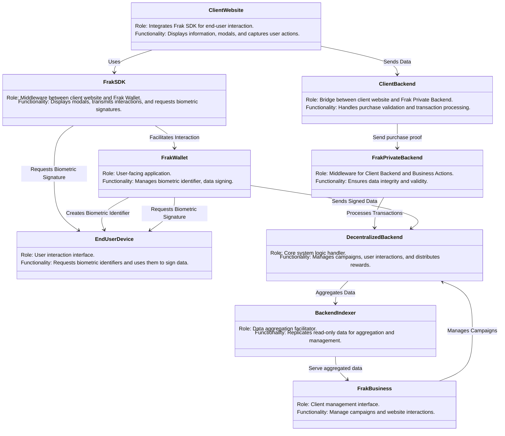

# Class diagram

```mermaid
classDiagram
    class ClientWebsite {
        Role: Integrates Frak SDK for end-user interaction.
        Functionality: Displays information, modals, and captures user actions.
    }
    
    class ClientBackend {
        Role: Bridge between client website and Frak Private Backend.
        Functionality: Handles purchase validation and transaction processing.
    }

    class FrakPrivateBackend {
        Role: Middleware for Client Backend and Business Actions.
        Functionality: Ensures data integrity and validity.
    }

    class EndUserDevice {
        Role: User interaction interface.
        Functionality: Requests biometric identifiers and uses them to sign data.
    }
    
    class FrakSDK {
        Role: Middleware between client website and Frak Wallet.
        Functionality: Displays modals, transmits interactions, and requests biometric signatures.
    }
    
    class FrakWallet {
        Role: User-facing application.
        Functionality: Manages biometric identifier, data signing.
    }
    
    class FrakBusiness {
        Role: Client management interface.
        Functionality: Manage campaigns and website interactions.
    }
    
    class DecentralizedBackend {
        Role: Core system logic handler.
        Functionality: Manages campaigns, user interactions, and distributes rewards.
    }
    
    class BackendIndexer {
        Role: Data aggregation facilitator.
        Functionality: Replicates read-only data for aggregation and management.
    }

    ClientWebsite --> FrakSDK : Uses
    FrakSDK --> FrakWallet : Facilitates Interaction
    FrakSDK --> EndUserDevice : Requests Biometric Signature
    ClientWebsite --> ClientBackend : Sends Data
    ClientBackend --> FrakPrivateBackend : Send purchase proof
    FrakPrivateBackend --> DecentralizedBackend : Processes Transactions
    FrakWallet --> EndUserDevice : Creates Biometric Identifier
    FrakWallet --> EndUserDevice : Requests Biometric Signature
    FrakWallet --> DecentralizedBackend : Sends Signed Data
    DecentralizedBackend --> BackendIndexer : Aggregates Data
    FrakBusiness --> DecentralizedBackend : Manages Campaigns
    BackendIndexer --> FrakBusiness : Serve aggregated data
```