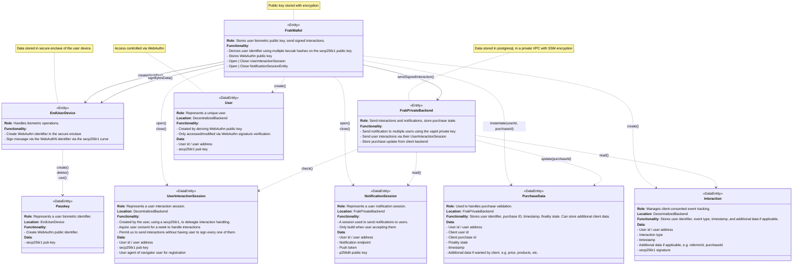

# Data

```mermaid
classDiagram
    class EndUserDevice {
        <<Entity>>
        **Role**: Handles biometric operations.
        **Functionality**:
         - Create WebAuthn identifier in the secure enclave
         - Sign message via the WebAuthN identifier via the secp256r1 curve
    }

    class FrakWallet {
        <<Entity>>
        **Role**: Stores user biometric public key, send signed interactions.
        **Functionality**: 
         - Derives user identifier using multiple keccak hashes on the secp256r1 public key
         - Stores WebAuthn public key
         - Open | Close UserInteractionSession
         - Open | Close NotificationSessionEntity
    }

    class FrakPrivateBackend {
        <<Entity>>
        **Role**: Send interactions and notifications, store purchase state.
        **Functionality**: 
         - Send notification to multiple users using the vapid private key
         - Send user interactions via their UserInteractionSession
         - Store purchase update from client backend
    }

    class Passkey {
         <<DataEntity>>
        **Role**: Represents a user biometric identifier.
        **Location**: EndUserDevice
        **Functionality**: 
        - Create WebAuthn public identifier. 
        **Data**:
        - secp256r1 pub key
    }

    class User {
         <<DataEntity>>
        **Role**: Represents a unique user.
        **Location**: DecentralizedBackend
        **Functionality**: 
        - Created by deriving WebAuthn public key. 
        - Only accessed/modified via WebAuthn signature verification.
        **Data**:
        - User id / user address
        - secp256r1 pub key
    }

    class UserInteractionSession {
         <<DataEntity>>
        **Role**: Represents a user interaction session.
        **Location**: DecentralizedBackend
        **Functionality**: 
        - Created by the user, using a secp256r1, to deleagte interaction handling. 
        - Aquire user consent for a week to handle interactions
        - Permit us to send interactions without having user to sign every one of them.
        **Data**:
        - User id / user address
        - secp256r1 pub key
        - User agent of navigator user for registration
    }

    class NotificationSession {
         <<DataEntity>>
        **Role**: Represents a user notification session.
        **Location**: FrakPrivateBackend
        **Functionality**: 
        - A session used to send notifications to users.
        - Only build when user accepting them
        **Data**:
        - User id / user address
        - Notification endpoint
        - Push token
        - p256dh public key
    }

    class Interaction { 
         <<DataEntity>>
        **Role**: Manages client-consented event tracking.
        **Location**: DecentralizedBackend
        **Functionality**: Stores user identifier, event type, timestamp, and additional data if applicable.
        **Data**:
        - User id / user address
        - Interaction type
        - timestamp
        - Additional data if applicable, e.g. referrerId, purchaseId
        - secp256r1 signature
    }

    class PurchaseData {
         <<DataEntity>>
        **Role**: Used to handles purchase validation.
        **Location**: FrakPrivateBackend
        **Functionality**: Stores user identifier, purchase ID, timestamp, finality state. Can store additional client data.
        **Data**:
         - User id / user address
         - Client user id
         - Client purchase id
         - Finality state
         - timestamp
         - Additional data if wanted by client. e.g. price, products, etc.
    }

    EndUserDevice ..> Passkey : create() <br> delete() <br> use()

    FrakWallet --> EndUserDevice : createIdentifier()
    FrakWallet --> EndUserDevice : signBytesData()
    FrakWallet ..> User : create()
    FrakWallet ..> UserInteractionSession : open() <br> close()
    FrakWallet ..> NotificationSession : open() <br> close()
    FrakWallet ..> PurchaseData: instantiate(userId, purchaseId)
    FrakWallet ..> Interaction: create()

    FrakWallet --> FrakPrivateBackend : sendSignedInteraction()
    FrakPrivateBackend ..> PurchaseData : update(purchaseId)
    FrakPrivateBackend ..> NotificationSession : read()
    FrakPrivateBackend ..> UserInteractionSession : check()
    FrakPrivateBackend ..> Interaction : read()

    %% Include some annotations for each data entity about storage and protection
    note for EndUserDevice "Data stored in secure enclave of the user device."
    note for FrakWallet "Public key stored with encryption"
    note for FrakPrivateBackend "Data stored in postgresql, in a private VPC with SSM encryption"
    note for User "Access controlled via WebAuthn"

```