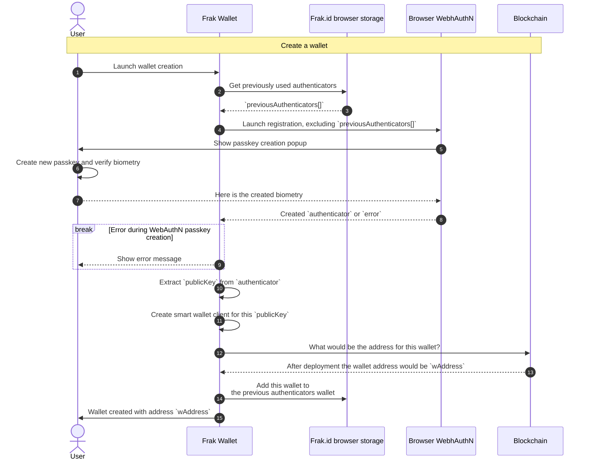
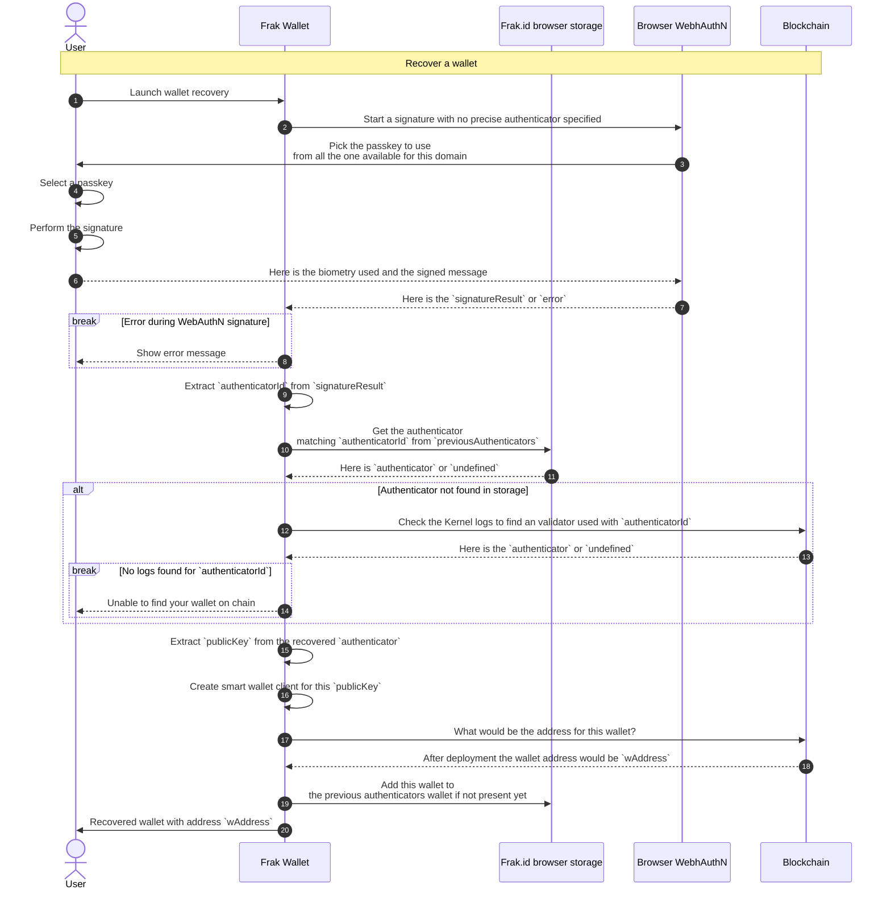
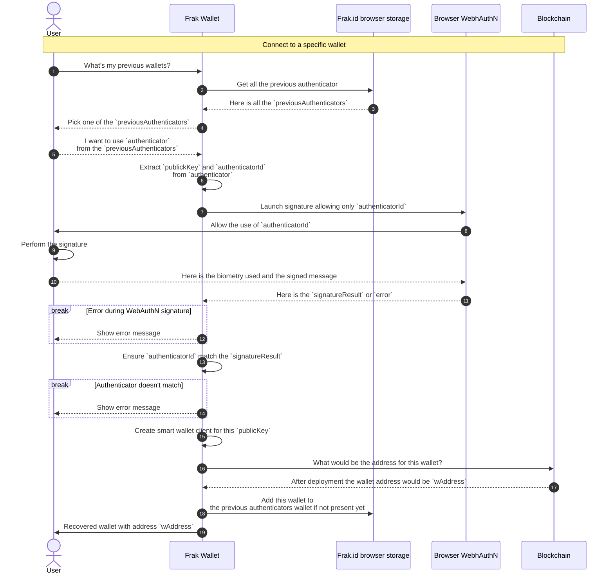
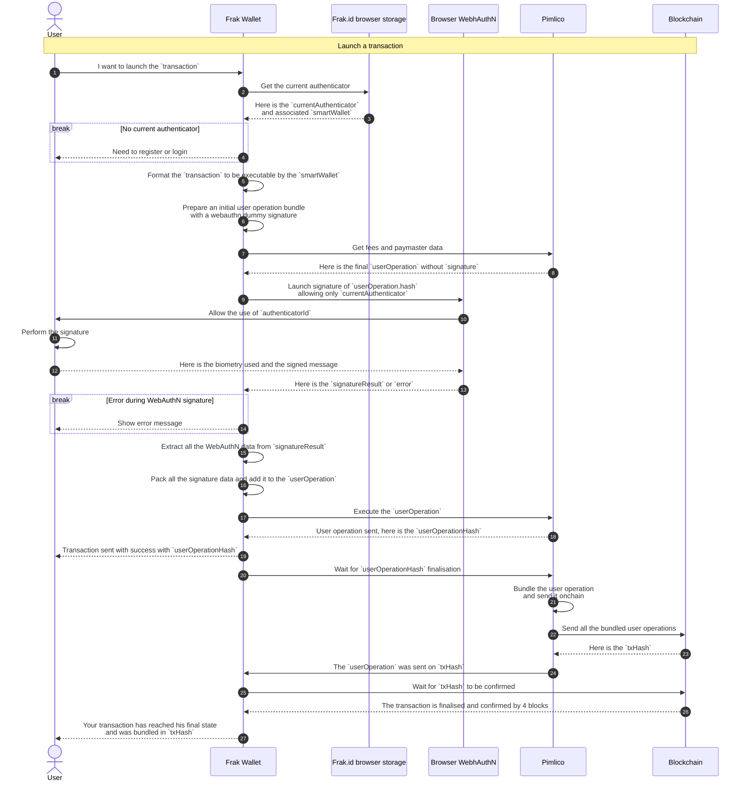
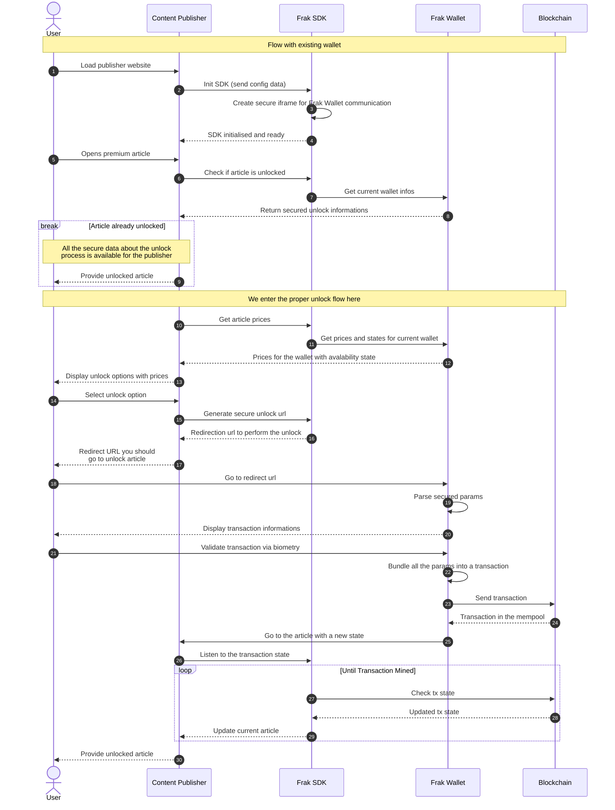

# Graphs

This md file contain different flow representing interaction between User, content publisher, the Frak SDK and the Frak Wallet.

### Sequence flow of  registration process

This graph show how the registration process is done with the Frak Wallet

### Sequence flow of a wallet recovery process

This graph show how the recovery process is done with the Frak Wallet

### Sequence flow of a wallet login process

This graph show how the login on a given authenticator is done with the Frak Wallet

### Sequence flow of a transaction

This graph show how a transaction is performed with the Frak Wallet

### Sequence flow of an article unlock

This diagram represent the sequence flow during an article unlock from a content provider

