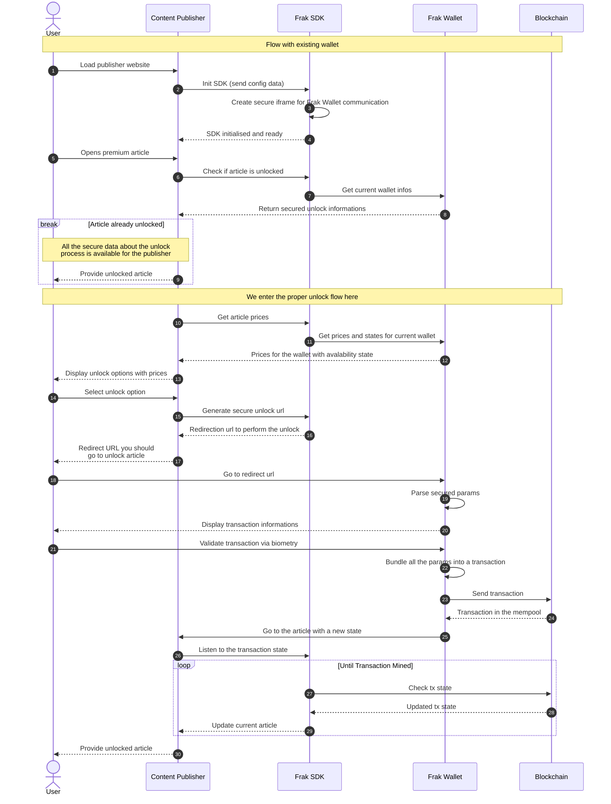

# Graphs

This md file contain different flow representing interaction between User, content publisher, the Frak SDK and the Frak Wallet.

### Sequence flow of an article unlock

This diagram represent the sequence flow during an article unlock from a content provider

