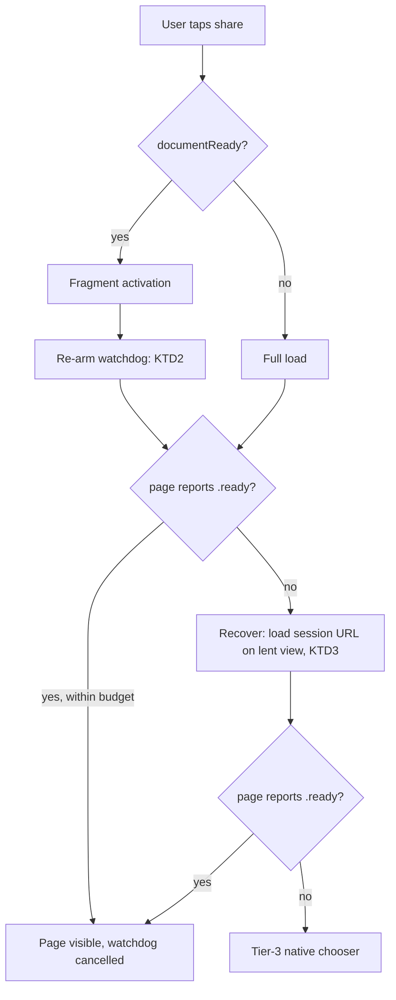

# iOS Sharing Sheet Recovers From A Dead Warm Document - Plan

## Goal Capsule

- **Objective:** A second share on iPad, after the install flow has been through an App Store card, opens a working sharing page instead of a permanently grey sheet.
- **Product authority:** The iOS sharing sheet in `sdk/ios/Sources/FrakSDKUI/`, on branch `feat/native-share-payload-integration`. The merchant-facing sharing-copy editor in `apps/business` is not active scope.
- **Execution profile:** Swift 6 strict concurrency, `@MainActor`, Swift Testing. Work lands on `feat/native-share-payload-integration`.
- **Stop conditions:** Stop and ask if the fix requires a JavaScript bridge, a change to the `sid` filter, or removing the `onPageReady()` call on activation — each contradicts a Key Decision.
- **Open blockers:** None. All three planning forks are resolved in Key Technical Decisions.
- **Product Contract preservation:** Product Contract unchanged. R1–R9 and their `Governs`/`Covers` links carry forward as written.

---

## Product Contract

### Summary

Give the sharing sheet a watchdog that survives activation onto a warm document, so a document whose renderer died silently is detected within 1.0s and recovered by reloading the page. Recovery preserves the reward affordance rather than dropping to the OS share chooser.

### Problem Frame

An iPad share opens the wallet sharing page in a pooled `WKWebView` that is never in a window. When the install flow puts an `SKStoreProductViewController` in front, WebKit reclaims that off-screen content process. It does so **silently** — `webViewWebContentProcessDidTerminate` does not fire — so nothing in the SDK learns the document is gone.

The pool then reclaims the view and reloads it. `didFinish` arrives and sets `documentReady = true`, but Safari Web Inspector on the device shows the resulting document is `<body></body>` with no `
`, so React never mounts. `didFinish` is proof a navigation completed, not proof a DOM exists.

The next share reads `documentReady == true`, chooses a fragment activation over a full load, and `navigateNow` calls `onPageReady()` for every activation — which cancels the only 5s watchdog. From there `sharingDecision` returns `.doNothing` forever. The sheet is grey, no fallback is reachable, and the state persists across both pool reclaim paths.

The cost is specific and commercial: tier-3 keeps the link, the tracking and the rich preview metadata, but it has no surface for the seeded reward. The user shares without seeing the offer that motivates sharing.

### Key Decisions

- Recovery must attempt to restore the wallet page rather than silently downgrading to the OS chooser. (session-settled: user-directed — chosen over accepting tier-3 as the outcome: the seeded reward has no tier-3 surface, and the page is what carries it.) Governs R1, R3.
- Detect absence of a rendered page, not the specific cause. The same symptom already has a second known cause in `docs/plans/native-sdk/open.md` §2.4, and WebKit reclaim behaviour changes between iOS releases. Governs R1, R2.
- No JavaScript bridge. `docs/audits/2026-08-15-native-sdk.md:305` records the absence of `WKScriptMessageHandler`, `userContentController` and `evaluateJavaScript` as an audited posture; a liveness probe must not be the first breach of it. Governs R2.
- Do not remove the `onPageReady()` call on activation. It was added by fix commit `a08dfdbbb` to stop the fastest path timing out and raising a chooser over a page already on screen. The budget must be re-armed, not abandoned. Governs R2, R4.
- `rendererGone` is not the signal. `load(_:baseURL:)` clears it at `sdk/ios/Sources/FrakSDKUI/SharingWebView.swift:152`, and the pool's own reclaim path is what triggers that load, so it reads `false` at the next share.

### Requirements

**Recovery behaviour**

- R1. When an activation is performed onto a document that never reports itself ready, the sheet recovers by loading the sharing page fresh rather than remaining on the dead document.
- R2. Readiness after an activation is established by the page's own report over the existing `returnScheme://result` channel, not by `didFinish` and not by evaluating JavaScript in the document.
- R3. Recovery preserves the seeded reward affordance, the post-share confirmation state, and the sharing page's own share payload.
- R4. Tier-3 remains reachable as the final fallback when recovery itself fails.

**Preserved behaviour**

- R5. A healthy activation onto a live warm document raises no chooser over the page and shows no additional latency attributable to the watchdog.
- R6. The `sid` filter keeps rejecting actions from a session other than the one the sheet holds.
- R7. A single share never raises two choosers, and never bills two reward-bearing interactions.

**Diagnosability**

- R8. `example/native-ios` exposes a `logs` script that streams SDK trace output at `debug` from a device, giving iOS the log-capture affordance `example/native-android` has.

**Coverage**

- R9. `SharingSheetModel`'s activation path is covered by tests that fail when an activation onto a never-ready document leaves the sheet with no live watchdog.

### Key Flows

- F1. Second share after the install flow, renderer silently reclaimed
  - **Trigger:** User taps share; the pooled view holds a document whose content process was reclaimed while off-screen.
  - **Steps:** Session builds and seeds the reward; the sheet activates onto the warm document; the page never reports ready; the watchdog fires; the page is loaded fresh; the page reports ready and draws.
  - **Outcome:** Sharing page visible with its reward affordance, inside the tap-to-content budget.
  - **Covers R1, R2, R3.**

- F2. Healthy second share
  - **Trigger:** User taps share; the pooled document is live.
  - **Steps:** The sheet activates; the page reports ready once the view is on screen; the watchdog is cancelled.
  - **Outcome:** Page visible, no reload, no chooser.
  - **Covers R5.**

- F3. Recovery fails
  - **Trigger:** The watchdog fires, the fresh load also fails or never reports ready.
  - **Steps:** The single recovery attempt fails; tier-3 raises the OS chooser on the local link.
  - **Outcome:** Share still completes and still attributes; the reward affordance is lost.
  - **Covers R4.**

### Acceptance Examples

- AE1. **Covers R1, R3.** Given a warm document whose renderer was silently reclaimed, when the user shares, then the sharing page renders with its seeded reward visible.
- AE2. **Covers R5.** Given a live warm document, when the user shares, then no reload occurs and no chooser is raised over the page.
- AE3. **Covers R4.** Given recovery that fails, when the second expiry fires, then the OS chooser opens on the local link and a sharing interaction is recorded only if the chooser succeeded.
- AE4. **Covers R7.** Given a watchdog that fires in the same turn as a page action arriving, when both are processed, then exactly one chooser is raised and one interaction is billed.
- AE5. **Covers R2.** Given the document is a 200 OK response whose JS never boots, when the user shares, then the sheet recovers by the same path as AE1.

### Scope Boundaries

- The merchant-facing sharing title / description / image editor in `apps/business`, including the four suggestions and the product-name placeholder. Separate owner, no dependency on this work.
- The precedence question for a product-name placeholder recorded in `docs/plans/native-sdk/decisions.md` §4.9.
- Moving the canonical share copy into `@frak-labs/components` to end the three hand-maintained copies.
- Android. The reclaim behaviour is WebKit-specific and Android was verified working on device.
- Rebasing `feat/native-share-payload-integration` onto `dev`, and the FRA-307 flake observed while testing.

### Dependencies / Assumptions

- The fix lands on `feat/native-share-payload-integration`, which is already merged with `dev`.
- Recovery cost rides on `websiteDataStore` being `.default()` (persistent). The Planning Contract's Assumptions section owns the caveat and the fallback.
- Assumed: the page's `ready` report is reliable on a live document once the sheet mounts the view. `apps/wallet/app/module/sharing/host/useHostBridge.test.tsx` pins it firing after two `rAF` frames, and pinging again on each new activation.

### Outstanding Questions

All three questions the Product Contract deferred to planning are resolved in Key Technical Decisions: O1 (the watchdog budget) in KTD2, O2 (the recovery route) in KTD3, and O3 (the log-attach mechanism) in KTD5. No blocking or deferred question remains.

<!-- ce-section: work-relationships -->
### How This Work Fits Together

This plan owns the iOS recovery defect only. The breakdown below is the current understanding of FRA-295, not a committed roadmap.

- Merchant sharing-copy editor in `apps/business`
  - Can proceed independently of this plan.
  - Shares the `sharing.title` / `sharing.text` keys with the wallet read path.
  - Depends on `feat/native-share-payload-integration` for its effect to be observable, since the read half lives there.
- Canonical share copy in `@frak-labs/components`
  - Enables removing the duplicated preset literals in `apps/business` and the tier-3 native fallback copy.
  - Still to decide: whether it moves before or after the editor ships.
- Product-name placeholder precedence
  - Still to decide, per `docs/plans/native-sdk/decisions.md` §4.9.
  - Blocks the editor's token UI, not this plan.

### Sources / Research

- `sdk/ios/Sources/FrakSDKUI/SharingPresentation.swift:94-96` — the activate-vs-load decision, frozen at `:106`.
- `sdk/ios/Sources/FrakSDKUI/SharingSheetModel.swift:477-487` — `navigateNow` and the comment recording why activation reports ready.
- `sdk/ios/Sources/FrakSDKUI/SharingSheetModel.swift:183` — the only site arming the deadline, behind `guard !started`.
- `sdk/ios/Sources/FrakSDKUI/SharingSheetModel.swift:727-730` — `settleContent` cancelling and nilling it.
- `sdk/ios/Sources/FrakSDKUI/SharingSheetLogic.swift:306-319` — `sharingDecision`; `.doNothing` at `:314`.
- `sdk/ios/Sources/FrakSDKUI/SharingWebView.swift:148-155` — `load` clearing `rendererGone` and `documentReady`.
- `sdk/ios/Sources/FrakSDKUI/SharingWebView.swift:425-436` — the terminate delegate that did not fire.
- `sdk/ios/Sources/FrakSDKUI/SharingSheetModel.swift:680-697` — what tier-3 keeps: title, text, image, tracking on success.
- `docs/audits/2026-08-15-native-sdk.md:305` — the no-JavaScript-bridge posture.
- `docs/plans/native-sdk/open.md` §2.4 — the same symptom from a different cause.
- Linear FRA-295, comments of 2026-08-31 — the device traces and the Web Inspector capture showing an empty `<body>`.
- `sdk/ios/Sources/FrakSDKUI/SharingSheetModel.swift:371` — `.ready` handled in `onPageAction`, over the return-scheme channel.
- `sdk/ios/Sources/FrakSDKUI/SharingSheetLogic.swift:14` — `SharingPageAction`, including `.ready`.
- `sdk/ios/Sources/FrakSDKUI/SharingSheetModel.swift:107-170` — the init; behavioural dependencies are injected closures with defaults, `detectInstall` required.
- `sdk/ios/Sources/FrakSDKUI/InstallProbe.swift:26-38` — the `now:` injection this plan's budget seam mirrors.
- `sdk/android/frak-sdk-ui/src/main/kotlin/id/frak/sdk/ui/SharingSheetState.kt:155-166` — Android's `awaitLoadDeadline` + `contentSettled`, the pattern this fix mirrors.
- `apps/wallet/app/module/sharing/host/useHostBridge.ts:24-36` — the page emitting `ready` after two `rAF` frames.
- `apps/wallet/app/entry/shared/bootstrap.tsx:147` — the `Root element not found` throw.
- `example/native-android/scripts/run.sh:117-123` — `do_logs()`, the affordance iOS lacks.

---

## Planning Contract

### Key Technical Decisions

- KTD1. Treat the page's `.ready` action as the only proof a document is alive. It already rides the existing `returnScheme://result` channel (`SharingSheetLogic.swift:14` for the enum, handled at `SharingSheetModel.swift:371`), so no new channel is introduced. `didFinish` stays what it is — proof a navigation completed. Governs R1, R2.
- KTD2. Re-arm the existing `deadline` Task on activation with a 1.0s activation budget, and give `onDeadline()` an explicit activation branch. One timer keeps cancellation on the existing settle paths. The 5s `pageLoadDeadline` cannot be reused: its own comment sizes it for "a full load, not a warm activation" (`SharingSheetModel.swift:16-18`), and spending it before recovery starts would blow tap-to-content. 1.0s sits above the existing 0.4s `skeletonGrace` tolerance for a finished-but-unpainted document and above a mounted page's two `rAF` frames, while leaving ~4s for the recovery load. Resolves O1. Governs R1, R4, R7.
- KTD3. Recover by loading the session URL on the lent view, not by routing through the pool. The model already holds the web view via `attach(_:)` and already performs a full load on the install path (`SharingSheetModel.swift:345` `webView?.load(url)`). The pool is not involved in a live session. Resolves O2. Governs R1, R3.
- KTD4. Seam the web view and the activation budget so tests can drive activation and expiry without WebKit or wall-clock waiting. Every behavioural dependency is already an injected closure with a default (`SharingSheetModel.swift:107-170`, except `detectInstall`, which is required on purpose); the web view and the timer are the two hard edges. Governs R9.
- KTD5. Implement the iOS `logs` verb as launch-with-console, reusing `devicectl device process launch --console` from `do_device`. Apple's stock tooling cannot attach to an already-running process: `devicectl` has no log verb, and `log stream` has `--level`/`--predicate` but no `--device` — only `log collect` targets a device, and it writes an archive rather than a stream. True attach needs a third-party dependency (`idevicesyslog`, `pymobiledevice3`), which this plan does not take. Resolves O3. Governs R8.
- KTD6. Mirror Android's shape rather than inventing one. `SharingSheetState.kt:155-166` already implements this exact recovery with `awaitLoadDeadline` + `contentSettled`, settled by the same `Ready` action. Parity lowers the cost of reasoning about both platforms.

### High-Level Technical Design

The defect is a state machine that treats two different facts as one. `didFinish` proves a navigation completed; `.ready` proves a DOM exists and painted. Today both write `documentReady`.

The only new edge is `F -> W -> REC`. Every other path already exists.

### Assumptions

- A healthy activation reports `.ready` well inside the re-armed budget. The page fires it after two `rAF` frames once the sheet mounts the view; `useHostBridge.test.tsx` drains both in 64ms of fake time. Real-device latency is dominated by sheet presentation, not the frames.
- `xcrun devicectl` covers the harness's target devices. It requires iOS 17+.
- The recovery load is cheap because the failing case is a second share against a warm HTTP cache. Treat this as unverified under real conditions: the memory pressure that reclaims the content process can also purge WebKit's caches, so recovery may cost more than the measured 121ms. The 1.0s budget leaves ~4s for it, and R4's tier-3 fallback absorbs the case where that is not enough.

### Sequencing

U1 establishes the seam; U2 depends on it. U4 is independent of all other units. U3 depends on U2 for the fix under test and on U4 for log capture, so it runs last.

---

## Implementation Units

### U1. Test seams on the sharing sheet model

- **Goal:** Let a test drive activation, watchdog expiry, and recovery without a `WKWebView` and without wall-clock waiting.
- **Requirements:** R9. Implements KTD4.
- **Files:** `sdk/ios/Sources/FrakSDKUI/SharingSheetModel.swift`, `sdk/ios/Sources/FrakSDKUI/SharingSheetLogic.swift`, `sdk/ios/Sources/FrakSDKUI/SharingWebView.swift`, `sdk/ios/Tests/FrakSDKUITests/SharingSheetLogicTests.swift`, `sdk/ios/Tests/FrakSDKUITests/SharingSheetModelTests.swift` (new).
- **Approach:**
  1. Extract the surface `SharingSheetModel` calls on its web view — `navigate(_:)`, `load(_:baseURL:)`, `stopLoading()` — into a `@MainActor` protocol.
  2. Conform `SharingWebView` to it without changing its behaviour.
  3. Widen `attach(_:)` to take the protocol. Keep the stored property optional; it is nil until attach.
  4. Inject the activation budget as an init parameter defaulting to the 1.0s of KTD2, so a test can set it near zero. Time must be a seam for the same reason the web view is: the deadline is a real `Task.sleep`, and a test that waits it out is slow and flaky.
  5. Extract the expiry routing — recover, fall back, or do nothing — as a pure function in `SharingSheetLogic.swift`, outside `#if canImport(UIKit)`. This is what makes R9 real rather than nominal: `sdk/ios/scripts/run.sh:84-94` documents that UIKit-guarded suites are compiled by stage 1 and executed by neither stage, so a test placed inside the guard is type-checked and never run. `SharingSheetLogicTests.swift` carries no guard, which is why its suites execute.
- **Patterns to follow:** `InstallProbe` (`sdk/ios/Sources/FrakSDKUI/InstallProbe.swift:26-38`) already injects `now:` alongside its behavioural closures. For the pure predicate, follow `sharingDecision` / `sharingReclaim` in `SharingSheetLogic.swift` — same file, same host-executable placement, same table-driven test shape as `SharingSheetLogicTests.swift`.
- **Test scenarios:**
  - The expiry predicate returns recover on a first expiry with no page-reported `.ready`, fall back on a second, and do nothing once settled. Host-executable, table-driven.
  - A model constructed with a fake web view reaches `.loading` without touching WebKit. `detectInstall` has no default and must be passed.
  - The fake records `navigate(.activate(...))` when the model is given an `activationBaseURL`.
  - The fake records a full `load` when `activationBaseURL` is nil.
  - A near-zero injected budget expires within the test's own await, with no wall-clock sleep.
  - Covers R6 indirectly. The recovery watchdog settles only on a `.ready` that reached the model, so an activation whose page reports a stale `sid` must still expire and recover. The filter itself is unchanged code inside `#if canImport(UIKit)` (`SharingWebView.swift:347-363`, using a `private queryValue`); extracting it to make it host-testable would refactor working code this fix does not touch. R6 is a preserved-behavior invariant, verified by U3 on device.
- **Verification:** `bun run --cwd sdk/ios test` passes; the new suite constructs the model without a `WKWebView` and completes in well under a second.

### U2. Re-arm the watchdog on activation and recover

- **Goal:** An activation onto a document that never reports `.ready` recovers by loading the page fresh.
- **Requirements:** R1, R2, R3, R4, R5, R7. Implements KTD1, KTD2, KTD3.
- **Dependencies:** U1.
- **Files:** `sdk/ios/Sources/FrakSDKUI/SharingSheetModel.swift`, `sdk/ios/Tests/FrakSDKUITests/SharingSheetModelTests.swift`.
- **Approach:**
  1. In `navigateNow`, keep the `onPageReady()` call on `.activate` — it satisfies tap-to-content and is load-bearing per the Key Decisions. Re-arm the watchdog at the tail of the `.activate` branch, strictly after `onPageReady()` has run. Ordering is load-bearing: `onPageReady()` calls `settleContent()`, which cancels and nils `deadline`, so a re-arm placed earlier is destroyed by the activation's own settle.
  2. Give `onDeadline()` an explicit activation branch. It cannot delegate to `sharingDecision` for this case: an activation sets `page = .documentReady`, so `pageLoaded` is true, and `sharingDecision` returns `.doNothing` for every `pageLoaded` input. Left as-is the re-armed timer reaches neither recovery nor tier-3.
  3. On expiry with a page that reported no `.ready` of its own and no recovery yet attempted, load the session URL on the attached view and record the attempt.
  4. On expiry with recovery already attempted, take the existing tier-3 path.
  5. Cancel the re-armed watchdog only on proof the page is alive: the `.ready` page action, another page action, a fallback, or a close. `didFinish` must not cancel it. `SharingWebView.swift:408` routes `didFinish` into `binding.onPageReady()`, which calls `settleContent()`, so cancelling on every `settleContent()` would let the recovery load's own `didFinish` settle the watchdog over an empty document — reproducing the original defect one layer down and leaving tier-3 unreachable. Give the recovery watchdog its own cancellation, driven by `.ready` rather than by document state.
- **Execution note:** Write the never-ready activation test first; it should fail against the branch before the change.
- **Test scenarios:**
  - Covers AE1. Given an activation and no `.ready`, when the watchdog expires, then a full load of the session URL is issued on the view.
  - Covers AE2. Given an activation followed by `.ready` inside the budget, when the budget would have expired, then no recovery load is issued.
  - Covers AE5. Given recovery that also never reports `.ready`, when the second expiry fires, then the tier-3 chooser is raised exactly once.
  - Given a recovery load whose `didFinish` fires but whose page never reports `.ready`, when the second expiry fires, then tier-3 is raised — `didFinish` alone must not settle the recovery watchdog.
  - Covers AE4. Given a `.ready` and a watchdog expiry in the same turn, when both are processed, then exactly one chooser is raised and one interaction is recorded.
  - Covers AE3. Given recovery that fails, when tier-3 raises the chooser and the user completes the share, then a sharing interaction is recorded; when the chooser is cancelled, then none is.
  - Given an activation, when the re-arm runs, then the watchdog survives the activation's own `settleContent()`.
  - Given a session that closes before the budget elapses, when the model is released, then no recovery load is issued.
  - Given the install page is showing, when the watchdog fires, then no sharing-page recovery load is issued.
- **Verification:** The new suite fails without the change and passes with it; the AE-linked scenarios above are covered.

### U3. Device reproduction of the recovery path

- **Goal:** Confirm on hardware that the reported sequence now renders the sharing page.
- **Requirements:** R1, R3, R5, R6.
- **Dependencies:** U2, and U4 for log capture.
- **Files:** None — this unit changes no code.
- **Approach:**
  1. Run the `example/native-ios` harness on an iPad, capturing the trace with the `logs` verb from U4.
  2. Force the recovery path deterministically first: set the activation budget to zero in a local debug build so every activation expires. Confirm the recovery load runs, the page reports ready, the sheet renders with its reward, and a stale-`sid` report never settles the watchdog. This proves the mechanism without waiting on WebKit.
  3. Restore the real budget and confirm a healthy second share activates with no recovery load — the R5 regression check.
  4. Then attempt the organic reproduction: share, take "Récupérer mes 10 €", close the App Store card, share again, and repeat for a third share. Memory pressure cannot be summoned on demand, so treat this as best-effort confirmation rather than the unit's gate.
- **Execution note:** Step 2 is the gate; step 4 is corroboration. Sequencing it the other way makes the unit hostage to a reclaim that may not happen during the session.
- **Test scenarios:** `Test expectation: none -- device verification, not automated coverage.`
- **Verification:** The forced-expiry pass shows a recovery load followed by `page reported ready`, with the reward affordance visible; the healthy pass shows no recovery load.

### U4. `logs` verb for the iOS harness

- **Goal:** Stream SDK logs at `debug` from a device build of the harness.
- **Requirements:** R8. Implements KTD5.
- **Dependencies:** None.
- **Files:** `example/native-ios/scripts/run.sh`, `example/native-ios/package.json`.
- **Approach:**
  1. Add `do_logs()` that resolves a connected device and relaunches the harness with `devicectl device process launch --console`, reusing `do_device`'s device resolution. Stock tooling cannot attach to a running process, so the verb relaunches; say so in the usage text.
  2. Add `logs` to the dispatch `case` and the usage text at `example/native-ios/scripts/run.sh:254`.
  3. Add the `logs` script to `example/native-ios/package.json`, matching Android's entry.
  4. Fail with a clear message when no device is attached, mirroring Android's `die "No device attached."`.
- **Patterns to follow:** `example/native-android/scripts/run.sh:117-123` for the shape; the existing iOS device resolution in `do_device`.
- **Test scenarios:** `Test expectation: none -- shell tooling with no behavioral surface; proven by U3 using it.`
- **Verification:** `bun run --cwd example/native-ios logs` streams `FrakSharing` trace lines from a device. Confirm `SharingTrace` debug lines actually appear before declaring the unit done — if the console does not carry `debug` level, add an `OSLogPreferences` entry for `id.frak.sdk` to the harness `Info.plist`.

---

## Verification Contract

| Gate | Command | Applies to |
|---|---|---|
| iOS tests | `bun run --cwd sdk/ios test` | U1, U2 |
| iOS strict-concurrency build | `bun run --cwd sdk/ios build` | U1, U2 |
| iOS lint | `bun run --cwd sdk/ios lint` | U1, U2 |
| Harness lint | `bun run --filter '*/native-*' lint` | U4 |
| Comment budget | `bun run lint:comments` | U1, U2 |
| Device pass | `example/native-ios` on iPad, per U3 | U3 |

The comment budget is the gate this work is most likely to trip: the touched files carry dense explanatory comments, and `scripts/comment-budget-baseline.json` allows a file to improve but never regress.

## Definition of Done

- A forced-expiry pass on an iPad renders the sharing page with its reward affordance, and the trace shows the recovery load. The organic FRA-295 sequence is attempted and recorded, but is corroboration rather than the gate — the silent reclaim cannot be summoned on demand.
- A healthy second share still activates with no reload and no chooser over the page.
- The expiry routing is covered by host-executable tests that run under `bun run --cwd sdk/ios test`, not only type-checked inside `#if canImport(UIKit)`.
- A test fails when an activation onto a never-ready document leaves no live watchdog.
- `bun run --cwd example/native-ios logs` streams `FrakSharing` debug lines from a device.
- Every gate in the Verification Contract passes.
- No JavaScript bridge was added, the `sid` filter is unchanged, and `navigateNow` still reports ready on activation.
- Abandoned experimental code from the recovery work is removed before the change is declared done.
