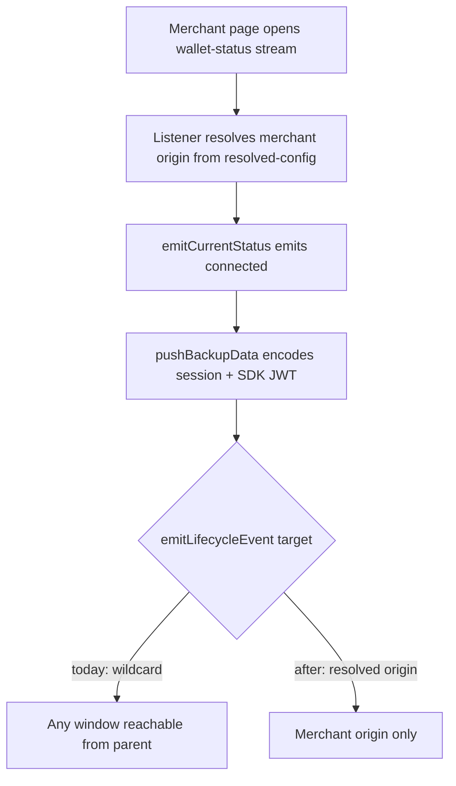

# Listener Lifecycle Origin Leak - Plan

## Goal Capsule

- **Objective:** Frak session credentials leave the listener iframe only when the page that embeds it is the merchant origin it was configured for — a page on any other origin receives nothing — and the origin rules that protect the listener stop being silently changeable.
- **Product authority:** Closes P1-3 and P1-7 from `docs/audit/findings-ranked-by-gain.md` §6.1, and downgrades P1-2 there to a hygiene change. Trust-level establishment (P1-1) is not active scope.
- **Means:** Thread the resolved merchant origin from each credential-bearing call site into the lifecycle emitter (KTD1), and register `packages/rpc` as a vitest project so its origin guard executes (KTD3).
- **Stop conditions:** Stop and ask if narrowing a target would break a legitimate merchant path, or if a credential-free event turns out to carry session material.
- **Open blockers:** None.

---

## Product Contract

### Summary

Credential-bearing lifecycle messages from the listener iframe address the resolved merchant origin instead of whatever page happens to embed it. `packages/rpc` gains executing tests so its origin guard cannot be disabled with the suite staying green.

### Problem Frame

The listener is an iframe embedded on merchant sites. It reports wallet status over a stream, and on every status emit it also pushes a session backup to the parent page so the merchant's domain can restore a returning user without a round trip. That backup carries the live wallet session token and the SDK JWT.

Every one of those messages is posted with a wildcard target. The browser delivers it only to the parent window — sibling frames never see it — but it delivers it to that window whatever its origin is. A backup meant for one merchant reaches the page when the listener is embedded on a different origin, when the parent has navigated, or when a poisoned config named an origin the parent is not. The listener already knows which origin it is talking to by the time a backup is pushed; it just never uses it. Narrowing the target makes delivery fail closed in each of those cases. It does not, and cannot, protect the backup from a script already running on the merchant page: that script shares the parent's origin and is the recipient.

Nothing would catch a regression here. `packages/rpc` owns the origin check that admits messages at all, and it has no test files, no test runner, and no test script. Every downstream suite replaces the package with a mock, so its guard never executes under test. Planning research previously found that disabling an origin guard left the full suite green.

The audit filed a third item alongside these, P1-1, calling for lifecycle messages to be routed through origin validation. That is not implementable as written: the listener cannot know a merchant's allowed origins until the lifecycle message that carries them arrives, so the allowlist would have to exist before the message that delivers it. The wildcard admission in the listener bootstrap is structural, and the real weakness it leaves — a merchant origin self-asserting its own allowed-domain list — is a separate decision about trust establishment.

### Key Decisions

- KD1. **Narrow the message audience, not the admission rule.** (session-settled: user-directed — chosen over backend-attested config, signed config, and lazy backend confirmation: each changes which merchants are trusted, and none of that risk buys a fix for the credential leak.) Governs R1, R2.
- KD2. **Origin targeting is decided per event, not once globally.** The connection handshake fires before any merchant origin is known and must stay wildcard; only credential-bearing events can be narrowed. Governs R1, R2.
- KD3. **Trust establishment stays as-is.** The self-asserted allowed-domain list and the interaction-attribution exposure it permits remain open, recorded in the audit rather than fixed here. The resolved origin R1 targets is derived from the same self-asserted config message, so R1's guarantee is bounded by that trust level: a forged config cannot redirect credentials anywhere, since the target is always the parent window, but it can make delivery fail. Governs no requirement; it bounds scope.
- KD4. **The build-time environment flag is a hygiene change, not a fix.** The stage value is inlined at build time and folds to a constant in deployed listeners, so the audit's "runtime misconfiguration" scenario cannot occur. The swap makes the intent unmistakable and removes a build-environment dependency. Governs R3.

### Requirements

**Message targeting**

- R1. A lifecycle message carrying session state or authentication credentials — the session backup, and the in-app-browser redirect when the listener sends it, since its merge token is a short-lived bearer — is delivered only to the resolved merchant origin.
- R2. A lifecycle message sent before the merchant origin is known continues to reach the parent window, and carries no credentials.

**Origin-rule hygiene**

- R3. The origin-mismatch bypass in the listener's request middleware is gated on the build-time development flag rather than a deployment-stage value.

**Executing coverage**

- R4. `packages/rpc` runs tests as part of the monorepo suite.
- R5. A test fails when the origin check in `packages/rpc` admits a message it should reject, or rejects one it should admit.
- R6. A test fails when a credential-bearing lifecycle message is broadcast to an unrestricted target.
- R7. A test fails when lifecycle routing stops bypassing middleware, or when RPC messages stop passing through it.

### Key Flows

- F1. Authenticated status emit
  - **Trigger:** A merchant page opens a wallet-status stream and the visitor has a live session.
  - **Steps:** The listener resolves the merchant origin from the config message; emits connected status; pushes the session backup.
  - **Outcome:** The backup reaches the merchant origin and no other window.
  - **Covered by:** R1, R6

- F2. Pre-handshake connection signal
  - **Trigger:** The listener finishes wiring its handlers, before any merchant config has arrived.
  - **Steps:** The listener announces readiness to whatever embedded it.
  - **Outcome:** The SDK receives the signal; no credentials are in it.
  - **Covered by:** R2

### Acceptance Examples

- AE1. **Covers R1, R6.** Given a resolved merchant origin, when the listener pushes a session backup, then the message targets that origin and a listener on a different origin receives nothing.
- AE2. **Covers R2.** Given no merchant origin has been resolved, when the listener announces readiness, then the message still reaches the parent and contains no session or token payload.
- AE3. **Covers R1.** Given a session backup whose stored tokens have expired, when the listener signals removal of the backup, then that message is also addressed to the resolved origin.
- AE4. **Covers R5.** Given a listener configured with a specific allowed origin, when a message arrives from a different origin, then no handler runs and no response is posted.
- AE5. **Covers R7.** Given a listener with middleware registered, when a lifecycle message arrives, then the lifecycle handler runs and the middleware does not.
- AE6. **Covers R1.** Given the in-app-browser toast rendered inside the listener with a resolved merchant origin, when it emits the redirect carrying a merge token, then the message targets that origin; the same toast rendered in the wallet app still posts to the wildcard.

### Scope Boundaries

- Trust-level establishment — how `verified`, `dev-override`, and `unverified` are decided, and the interaction-attribution exposure a self-asserted domain list permits. Recorded in `docs/audit/findings-ranked-by-gain.md` §6.1 as P1-1.
- The wildcard origin admission in the listener bootstrap. It is structurally required and stays.
- The remaining open audit items — the uninstallable components package, the dead dark theme, the wallet focus ring, dead modules.

### Dependencies / Assumptions

- The listener resolves the merchant origin before any credential-bearing message is sent. The request middleware already relies on this, and the backup path already requires a domain derived from it.
- `packages/rpc` has no test runner today. Adding one registers a new project in the monorepo suite, which the root config discovers by glob.

### Outstanding Questions

None. Both items previously deferred to planning are resolved in the Planning Contract: the origin is passed by the caller (KTD1), and the credential-free events are enumerated (KTD2).

### Sources / Research

- `docs/audit/findings-ranked-by-gain.md` §6.1 — P1 findings, including the P1-1 framing this plan rejects.
- `docs/audit/findings-resolved.md` — prior remediation passes on the same audit.
- `packages/wallet-shared/src/common/utils/lifecycleEvents.ts` — the two wildcard sends.
- `apps/listener/app/module/hooks/useWalletStatusListener.ts` — the status path that pushes a backup on every emit.
- `apps/listener/app/module/utils/backup.ts` — what the backup payload contains.
- `apps/listener/app/bootstrap.ts` — the wildcard admission and the comment explaining why it is structural.
- `apps/listener/app/module/middleware/walletContext.ts` — the origin-mismatch bypass.
- `packages/app-essentials/src/utils/env.ts` and `apps/listener/vite.config.ts` — the build-time inlining that makes the stage flag a constant.
- `vitest.config.ts` and `packages/app-essentials/vitest.config.ts` — how a package registers with the monorepo suite.
- `packages/wallet-shared/src/common/component/InAppBrowserToast/index.tsx:66-72` — the emitter's second consumer, in the wallet app, where no listener store exists.
- `packages/wallet-shared/src/common/utils/lifecycleEvents.test.ts:24-39` — the existing test that pins the wildcard target.
- `packages/wallet-shared/vitest.config.ts` and `packages/test-foundation/src/vitest.shared.ts` — the config pattern a new package project follows.
- `apps/listener/app/ui/ListenerUiProvider.tsx` — the `show` / `hide` iframe signals, payload-free and left on the wildcard default.
- `apps/listener/app/module/hooks/useSdkCleanup.ts` — the `remove-backup` send outside `backup.ts`.

---

## Planning Contract

Product Contract preservation: restructured, no scope change. Outstanding Questions emptied — both deferred items are answered by KTD1 and KTD2. No R-ID changed.

### Key Technical Decisions

- KTD1. **The caller passes the target origin; the emitter never reads a store.** `emitLifecycleEvent` lives in `packages/wallet-shared` and has two consumers: the listener, and `InAppBrowserToast` rendered by `apps/wallet` through `AppShell`. `resolvingContextStore` is listener-only, so an emitter that read it would break the wallet consumer. The signature takes an explicit target instead. Governs R1, R2.
- KTD2. **Default stays wildcard; credential-bearing calls opt in.** Inverting the default would force every call site in both consumers to supply an origin that only one of them can know. The credential-free events — the readiness signal, the SSO and deep-link redirect requests, and the iframe `show` / `hide` signals — keep the current behavior untouched. The in-app-browser redirect is credential-bearing when the listener sends it: its merge token is a 60-minute bearer the codebase already refuses to persist. The toast takes an optional target origin as a prop; the listener's `Modal` supplies it from `resolvingContextStore`, and the wallet consumer omits it. Governs R1, R2.
- KTD3. **`packages/rpc` gets its own vitest project, matching the existing package pattern.** The root config already globs `packages/*/vitest.config.ts`, so a config file plus a `test` script and the vitest dev dependency registers it. No root change. Governs R4.
- KTD4. **Origin-guard tests drive the real `createRpcListener`, dispatching a hand-built `MessageEvent` with an explicit `origin`.** Mocking the transport would re-create the gap the audit found, where the guard never executes. `window.postMessage` cannot be used: jsdom delivers `event.origin` as `""` regardless of `location.origin` (verified against this repo's jsdom), so a guard comparing origins would match empty against empty and the tests would pass whether or not the guard works. Tests therefore call `window.dispatchEvent(new MessageEvent("message", { origin, data, source }))`. Governs R5, R7.

### High-Level Technical Design

The leak and its fix sit on one path:

The listener already holds the origin at step B — `walletContextMiddleware` rejects requests by comparing against it, and `pushBackupData` already requires a domain derived from it. The fix threads that value from the call site into the send.

### Assumptions

- The credential-free events carry no session material. Verified by reading each sender: the readiness signal and the `show` / `hide` signals have no payload, and the SSO and deep-link redirects carry a URL only.
- `apps/wallet`'s `InAppBrowserToast` cannot resolve a merchant origin and does not need one — it is not inside a merchant iframe on that path. Its redirect keeps the wildcard target and still carries a merge token; that path is the wallet's own window, not a merchant page.

### Sequencing

U1 changes the emitter signature and must land before U2 and U3, which pass the new argument. U4 is independent. U5 lands last, once the four gates pass.

---

## Implementation Units

### U1. Origin-targeted lifecycle emitter

- **Goal:** `emitLifecycleEvent` addresses a caller-supplied origin, defaulting to the current wildcard.
- **Requirements:** R1, R2
- **Files:** `packages/wallet-shared/src/common/utils/lifecycleEvents.ts`, `packages/wallet-shared/src/common/utils/lifecycleEvents.test.ts`
- **Approach:** Extend the existing options object with a target-origin field. Both branches — plain and the `includeUserActivation` one — use it. Per KTD2 the default is unchanged, so no existing caller breaks.
- **Test Scenarios:**
  - A supplied origin is used as the `postMessage` target.
  - No supplied origin keeps the wildcard target (pins KTD2's default).
  - A supplied origin is honored on the `includeUserActivation` branch.
  - The existing throw-handling test still passes.
- **Verification:** `bun run --cwd packages/wallet-shared test`. Because the emitter is shared, also run `bun run --cwd apps/listener test` and `bun run --cwd apps/wallet test` to confirm the unchanged default still reaches the parent from both consumers.

### U2. Address the backup pushes

- **Goal:** Every `do-backup` and `remove-backup` send, and the listener-rendered in-app-browser redirect, targets the resolved merchant origin.
- **Requirements:** R1
- **Files:** `apps/listener/app/module/utils/backup.ts`, `apps/listener/app/module/utils/backup.test.ts`, `apps/listener/app/module/hooks/useSdkCleanup.ts`, `packages/wallet-shared/src/common/component/InAppBrowserToast/index.tsx`, `apps/listener/app/module/modal/component/Modal/index.tsx`
- **Approach:** Read the origin from `resolvingContextStore` and pass it per KTD1. Both credential-bearing sends are inside `pushBackupData`; `restoreBackupData` has one `remove-backup` send on the expiry branch and `useSdkCleanup` has another, both of which carry no credentials but are addressed for consistency. When no origin is resolved, do not send a `do-backup` — a credential payload with no known recipient has no correct target. A `remove-backup` still sends, since it clears state and carries nothing. Remove the `console.log` in `pushBackupData` that prints the full backup object: console stripping is gated on `isProd` in `apps/listener/vite.config.ts`, so every non-prod deployed listener prints live session and SDK tokens on each push. P1-3 names this leak alongside the wildcard target, and cannot be marked resolved while the log remains.
  Add an optional target-origin prop to `InAppBrowserToast` and forward it into the redirect send; `Modal` reads `resolvingContextStore` and passes it. The wallet's `AppShell` passes nothing and keeps the wildcard.
- **Test Scenarios:**
  - A `do-backup` send with a resolved origin targets it (covers AE1).
  - A `remove-backup` send on expired tokens targets it (covers AE3).
  - No resolved origin suppresses the `do-backup` but still sends `remove-backup`.
  - The existing round-trip encode/decode assertions still pass.
  - The toast's redirect targets the supplied origin when one is given, and the wildcard when none is (covers AE6).
- **Verification:** `bun run --cwd apps/listener test` and `bun run --cwd packages/wallet-shared test` — the toast lives in the shared package.
- **Dependencies:** U1

### U3. Build-time gate on the origin-mismatch bypass

- **Goal:** The mismatch bypass is gated on the development flag, not the deployment stage.
- **Requirements:** R3
- **Files:** `apps/listener/app/module/middleware/walletContext.ts`, `apps/listener/app/module/middleware/walletContext.test.ts`
- **Approach:** Replace the `isRunningLocally` import with `import.meta.env.DEV`. Behavior in deployed builds is unchanged — the stage value already folds to a constant there. The existing test mocks the env module as a getter; that mock is removed and the flag is controlled with `vi.stubEnv("DEV", …)`, so the two mismatch cases keep working.
- **Test Scenarios:**
  - A mismatched origin throws when the development flag is false.
  - A mismatched origin passes through when it is true.
  - A matching origin still augments the context.
- **Verification:** `bun run --cwd apps/listener test`

### U4. First executing tests for the RPC listener

- **Goal:** `packages/rpc` runs in the monorepo suite and its origin guard executes under test.
- **Requirements:** R4, R5, R6, R7
- **Files:** `packages/rpc/vitest.config.ts`, `packages/rpc/package.json`, `packages/rpc/src/listener.test.ts`
- **Approach:** Add a config merging `@frak-labs/test-foundation/vitest.shared` with the project name `frame-connector-unit`, matching the package name `@frak-labs/frame-connector`, and following `packages/app-essentials/vitest.config.ts`. Add the `test` script (`vitest run`) plus the `vitest` and `@frak-labs/test-foundation` (`workspace:*`) dev dependencies — Bun links workspace packages only from a declared dependency, so without the second one the config cannot resolve its own import. Per KTD4 the tests build a real listener over `window` and dispatch hand-built `MessageEvent`s carrying an explicit `origin`, asserting on handler calls and posted responses rather than on internals. The `source` on each constructed event is a spy object exposing `postMessage`; response assertions read from that spy, since the listener replies through `event.source`. Each test calls the listener's `cleanup()` in `afterEach` — the listener registers on the shared jsdom `window`, and a leaked registration from an earlier test would re-fire on later dispatches.
- **Test Scenarios:**
  - A message from a disallowed origin runs no handler and posts no response (covers AE4).
  - A message from an allowed origin reaches its handler.
  - A wildcard allow-list admits any origin (pins the structural behavior the plan preserves).
  - A lifecycle message reaches the lifecycle handler and skips middleware (covers AE5).
  - An RPC message passes through middleware before its handler.
  - Middleware that throws produces an error response, not a silent drop.
- **Verification:** `bun run --cwd packages/rpc test`

### U5. Record the audit outcome

- **Goal:** `docs/audit/findings-ranked-by-gain.md` reflects what this plan closed, downgraded, rejected, and found already fixed.
- **Requirements:** None; satisfies the Definition of Done's audit-record clause.
- **Files:** `docs/audit/findings-ranked-by-gain.md`
- **Approach:** In §6.1, mark P1-3 and P1-7 resolved by this plan; mark P1-2 downgraded to hygiene, citing the build-time inlining that folds the stage value to a constant; mark P1-1 rejected, citing the circularity that the allowlist arrives in the message it would have to validate. Strike the embedded-wallet z-index collision (#8) and the `ButtonWallet` accessible name (#9) as fixed upstream by the embedded-wallet removal, and strike the §7 "this week" line that repeats #9. Leave the `GlassButton` focus ring untouched.
- **Verification:** Read the edited sections back against this list.
- **Dependencies:** U1, U2, U3, U4

---

## Verification Contract

| Gate | Command | Applies to |
|---|---|---|
| Unit tests | `bun run test` | All units |
| Types | `bun run typecheck` | All units |
| Lint and format | `bun run format && bun run lint` | All units |
| Listener eager budget | `bun run --cwd apps/listener build` | U1, U2 — prints the boot-JS gzip total against the 32 KB hard-fail limit |

`bun run typecheck` needs `bun run build:sdk` and a generated `apps/wallet/app/routeTree.gen.ts` first, or it reports phantom errors. Never run `bun test` — it bypasses vitest.

A regression check for the leak itself: U1's default-target scenario and U2's targeting scenarios fail if the wildcard returns.

---

## Definition of Done

- Every credential-bearing lifecycle send targets the resolved merchant origin; the credential-free events are unchanged.
- `packages/rpc` appears as a project in `bun run test` output, and its origin-guard tests fail when the guard is removed.
- The four gates above pass.
- `docs/audit/findings-ranked-by-gain.md` records P1-3 and P1-7 as resolved, P1-2 as downgraded with the build-time-inlining reason, and P1-1 as rejected with the circularity reason. Two §6.1 entries are struck as already fixed upstream by the embedded-wallet removal: the embedded-wallet z-index collision (#8) and the `ButtonWallet` accessible name (#9), along with the §7 "this week" line that repeats the latter. The `GlassButton` focus ring stays open and untouched — it is a separate wallet finding, not one of these two.
- No scaffolding or abandoned-approach code remains in the diff.
