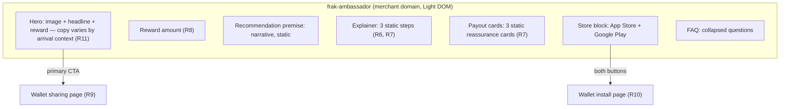

# Merchant Ambassador Page - Plan

## Goal Capsule

- **Objective:** a merchant can publish a referral page on their own domain that explains the program to any visitor and sends them into sharing and wallet install, without building the flow themselves.
- **Means:** one full-width web component in `sdk/components` that renders an explainer landing and hands off to the existing wallet sharing and install pages (KTD2).
- **Product authority:** sharing and install continue to happen only on the wallet-hosted pages. The merchant page owns presentation and entry, never the transaction.
- **Authority hierarchy:** R-IDs own product behaviour, KTD-IDs own implementation mechanism within those constraints, units override neither.
- **Execution profile:** frontend-only, across `sdk/components` and two additive re-exports (`getWalletUrl`, `signProof`) through both `sdk/core` barrels. No backend, no `apps/wallet`, no `packages/wallet-shared` change.
- **Stop conditions:** stop and ask before implementing share or install logic on the merchant domain, before importing `packages/wallet-shared` into the SDK, before adding a runtime dependency to the CDN bundle, or before changing what any R states.
- **Who finishes:** `ce-work` or a human implementer, against the Verification Contract below.
- **Open blockers:** none.

---

## Product Contract

### Summary

A full-width SDK element the merchant drops onto a permanent page they own — a `/parrainage` page they can link from a footer, a homepage block, a nav item, a newsletter or an order confirmation. It explains the referral program with a hero, a three-step explainer, and app store buttons, then routes the visitor into the existing wallet sharing and install flows.

### Problem Frame

Every entry point Frak offers a merchant today is interstitial. `frak-banner` appears after a referral link resolves, `frak-post-purchase` appears after checkout, `frak-button-wallet` floats over the page, and `frak-button-share` sits inline next to a product. All of them assume the visitor is already mid-journey.

A merchant who wants to *promote* the program has nowhere to send people. They cannot put "Parrainage" in their footer, because there is no page behind it. The wallet-hosted sharing page is not that page either: it opens straight into a share sheet and assumes the visitor already intends to share, so it converts intent rather than creating it.

The cost lands on the merchant's own marketing. A newsletter, a nav link, or a post-purchase email has no destination that explains what the program is, what it pays, and what the visitor has to do.

### Key Decisions

- **Explainer landing, not a live progress tracker.** *(session-settled: user-directed — chosen over a stepper that ticks steps off as the visitor progresses: a web page on the merchant domain cannot observe a native app install, so step 2 could never tick honestly.)* Governs R6, R7.
- **The explainer and the payout cards both stay.** *(session-settled: user-directed — chosen over letting the payout cards replace the three-step explainer: the three steps explain the mechanism to a cold visitor arriving from a footer link, while the payout cards answer the money objection — when the money arrives, that it reaches a real bank account, and that no bank details are needed to start; they do different jobs.)* Governs R5.
- **The merchant page is a shell; share and install hand off.** *(session-settled: user-directed — chosen over a self-contained implementation on the merchant domain: the install code and Play Store referrer logic live in `packages/wallet-shared`, which the SDK cannot import, and the CDN bundle inlines every dependency so the weight lands on every merchant page.)* Governs R9, R10.
- **One element covering three arrival contexts.** *(session-settled: user-directed — chosen over three separate components: the contexts differ in copy, not in structure.)* Governs R11, R12.
- **A drop-in element; the merchant builds the page.** *(session-settled: user-directed — chosen over shipping prebuilt pages in the platform plugins: keeps v1 to a single component surface.)* Governs R1.
- **Arrival context is supplied by the merchant, never inferred from the entry point.** The page is a permanent destination reachable from any surface, so where the visitor came from carries no signal; a merchant linking from a confirmation surface passes order data through the same optional attributes `frak-post-purchase` already accepts. Governs R11, R12.
- **The composition is K's six regions, not five.** *(session-settled 2026-09-21: user-directed — chosen over the original five-region set after directions A to L were built and reviewed as demo pages. K adds a reward-amount region and an FAQ, and restores the payout cards this plan already required but the code never implemented. K ends on the FAQ, so the component's existing closing-CTA region is removed — a deletion of working code, recorded here deliberately. Supersedes the region list R5 previously carried.)* Governs R5, R12.
- **The composition is seven regions, not six.** *(session-settled 2026-09-22: user-directed — the canon snippet carries a narrative region between the reward amount and the explainer, "Vous recommandez déjà {BRAND}. Il manque juste le lien.", added in `8374beba7` after the six-region list was recorded. It is the least boilerplate-like copy on the page and the one uniqueness vector that does not repeat across merchants, so it is kept rather than cut. Supersedes the six-region list recorded above.)* Governs R5, R12.
- **The component ships the finished look.** *(session-settled 2026-09-21: user-directed — chosen over shipping layout only and leaving every colour to the merchant, the "K min" thesis: `Ambassador.css.ts` is extended to carry K's composition rather than reduced to structure.)* Governs R16.
- **Two override surfaces, with the knobs as the supported path.** *(session-settled 2026-09-21: user-directed — chosen over keeping the class hooks alone: CSS custom properties do not participate in specificity, so a merchant cascade cannot outrank them, which is exactly how the store badges broke. The stable `frak-ambassador__*` classes stay for structural tweaks.)* Governs R16, R17.
- **Auto-theme (tier 3a) ships, and applies silently.** *(session-settled 2026-09-22: user-directed — chosen over shipping it as a suggestion a human confirms, which was the standing recommendation and is explicitly overruled here.)* The theming ladder is: tier 1, the merchant writes the nine knobs; tier 2, shipped defaults; tier 3a, `autoTheme()` samples the host's computed styles and writes the knobs; tier 3b, `cloneClasses()`/`undoClone()`, opt-in. Tier 3a is wired at two sites in the demo (`example/vanilla-js/src/ambassador.ts:703` on startup, `:680` re-running 200 ms after a viewport change) and the component carries that behaviour over: sample and apply on mount, no confirmation step. The accepted cost is recorded under Risks — do not treat the abstention rate as a defect to be silently "fixed" by loosening the sampler. Governs R18.
- **Revive the existing branch rather than restart.** *(session-settled 2026-09-21: evidence — `feat/ambassador-page-component` has a tree byte-identical to its pre-squash backup, so the squash lost nothing; every import still resolves against a dev 64 commits ahead; and a read-only trial merge conflicts only in `example/vanilla-js/vite.config.ts`.)*

### Requirements

**Placement and integration**

- R1. A merchant embeds the page as a single custom element on a permanent page they create and route themselves, linkable from any merchant surface.
- R2. The element renders in Light DOM so it inherits the merchant's theme, consistent with every other full-width component in `sdk/components`. Inheritance is not free: the same cascade can outrank the component's own declarations, so R17 bounds what it may override.
- R3. The element renders its full content with no wallet session, no prior referral, and no purchase context.
- R4. The element occupies the full width of its container and needs no wrapper markup from the merchant.

**Page content**

- R5. The page presents seven regions in order: hero, reward amount, recommendation premise, three-step explainer, payout reassurance cards, store download block, FAQ.
- R6. The three explainer steps read as "je partage", "j'installe", "je récupère mon argent" and are static illustration.
- R7. No region reflects what the visitor has already done.
- R8. The page displays the merchant's configured referral reward for the visitor's audience, resolved the same way `frak-post-purchase` resolves it.

**Handoffs**

- R9. The share call to action opens the existing wallet sharing page.
- R10. The store buttons route through the existing wallet install flow, so the install code and install attribution are preserved.
- R15. Both store buttons lead to the same destination; which one the visitor taps does not change where they land.

**Arrival context**

- R11. The page adapts its hero headline and primary call-to-action label to three contexts: cold, referred, post-purchase.
- R12. Arrival context changes copy only; the seven regions and their order are identical in all three.

**Merchant configuration**

- R13. Every headline, body text, step label, call-to-action label and image on the page is overridable by the merchant.
- R14. Any text or image the merchant leaves unset falls back to a built-in default in the page's resolved language.

**Theming and cascade**

- R16. The component exposes the nine `--frak-amb-*` custom properties as its supported theming surface, and retains the stable `frak-ambassador__*` class hooks for structural overrides.
- R17. Declarations the merchant must not be able to break — the store badge lockups above all — survive a hostile host cascade, including reboot stylesheets whose selectors outrank a single class.
- R18. The component samples the host page's computed styles on mount and writes the `--frak-amb-*` knobs from what it finds, with no confirmation step. Where sampling yields nothing it writes nothing, and the shipped defaults show through.

#### Region composition

### Key Flows

- F1. Cold visitor from the merchant's nav
  - **Trigger:** Visitor clicks a link to the page from the merchant's footer, homepage, menu or newsletter.
  - **Steps:** Page renders the default hero with the reward amount; visitor reads the three steps and the payout cards; visitor taps the share CTA and lands on the wallet sharing page.
  - **Covered by:** R3, R5, R8, R9, R11

- F2. Referred visitor
  - **Trigger:** Visitor arrives on the merchant site through a friend's share link and later opens the ambassador page.
  - **Steps:** Hero headline and CTA switch to the referred wording; the rest of the page is unchanged; visitor taps a store button and lands on the wallet install flow.
  - **Covered by:** R10, R11, R12

- F3. Post-purchase visitor
  - **Trigger:** Merchant links the ambassador page from an order confirmation.
  - **Steps:** Hero headline and CTA switch to the post-purchase wording; visitor taps the share CTA and the purchased products travel to the wallet sharing page.
  - **Covered by:** R9, R11, R12

### Acceptance Examples

- AE1. **Covers R8.** Given a merchant with an active referral campaign paying 10 €, when a cold visitor opens the page, then the hero states the 10 € amount.
- AE2. **Covers R8, R3.** Given a merchant with no resolvable referral reward, when a visitor opens the page, then the page still renders all seven regions with reward-free wording instead of hiding itself or showing an empty amount.
- AE3. **Covers R11, R12.** Given a referred visitor, when the page renders, then the hero headline and CTA use the referred wording and the amount, explainer, payout cards, store block and FAQ are byte-identical to the cold state.
- AE6. **Covers R17.** Given a host page whose stylesheet forces `color: inherit` on anchors carrying no `href`, when the store block renders before an install URL resolves, then the badge lockups still paint white on black rather than inheriting the host's text colour.
- AE4. **Covers R7.** Given a visitor who already shared and already installed the wallet app, when they return to the page, then no step is marked complete and no region claims to know their progress.
- AE5. **Covers R13, R14.** Given a merchant who overrides only the hero headline, when the page renders, then the hero uses their headline and every other string uses the built-in default for the resolved language.

### Scope Boundaries

**Deferred for later**

- Prebuilt ambassador pages or templates in `plugins/shopify`, `plugins/wordpress` and `plugins/prestashop`.
- Sub-elements that let a merchant place the hero, explainer, payout cards or store block independently.
- Any display of the visitor's own earnings, payouts or referral history on the merchant page.
- Backend placement and global-component config for `frak-ambassador`. `ResolvedPlacement["components"]` (`sdk/core/src/types/resolvedConfig.ts:23`) is a closed record with no `ambassador` key, so reaching it needs a core type change plus the backend resolve service, the merchant schema and the dashboard editor. Prop overrides satisfy R13 without any of that.

**Outside this work's identity**

- Implementing share or install on the merchant domain. The handoff is the design, not a stopgap.
- Tracking whether a visitor has shared or installed. Install state is unobservable from a web page on the merchant's domain, which is the reason R7 exists.
- Changes to `packages/wallet-shared`, `apps/wallet`, or the standalone `sharing.html` / `install.html` entrypoints.

### Dependencies / Assumptions

- Assumes the standalone sharing and install entrypoints in `apps/wallet` remain the handoff target and keep their current URL contract.
- Assumes reward resolution is reachable from `sdk/core` without pulling in wallet-only code, as `frak-post-purchase` already does.
- Assumes the merchant is willing to create and route the page themselves, since no plugin ships one in this scope.

### Sources / Research

- `sdk/components/src/components/` — the five existing components; all are inline widgets, none is full-page.
- `sdk/components/AGENTS.md` — Light DOM vs Shadow DOM matrix; full-width merchant content is Light DOM.
- `sdk/components/src/actions/sharingPage.ts` — `openSharingPage`, the existing handoff into the wallet sharing page.
- `apps/wallet/app/module/sharing/component/SharingView.tsx` and `apps/wallet/app/module/install/component/InstallView.tsx` — the share and install flows this page hands off to.
- `apps/wallet/app/entry/sharing/` and `apps/wallet/app/entry/install/` — the standalone full-page builds those views ship as.
- `sdk/components/src/components/PostPurchase/PostPurchase.tsx` — `selectDisplayCampaign` audience resolution, the pattern R8 follows.
- `docs/plans/2026-09-14-1217-fix-sharing-page-no-reward-state-plan.md` — prior art for the no-reward state behind AE2.
- `AGENTS.md` — the CDN `deps.alwaysBundle` constraint and the `wallet-shared` import ban, both behind the handoff decision.
- `sdk/core/src/config/environment.ts:153` — `getWalletUrl()`, the wallet origin the install link is composed from (KTD2).
- `packages/wallet-shared/src/sharing/buildInstallUrl.ts` — the `/install?m=…` shape and the `allowCredentialless` contract this work mirrors without importing.
- `sdk/components/tsdown.config.ts` — `assertComponentRegistrations`, which reads expected tags from `src/components/*/index.ts` and so covers a new component with no edit.
- `apps/wallet/app/module/install/component/InstallView.tsx:466,556` — the `codeless` condition and the Play Store referrer fallback that together make a credential-free install link unattributed (KTD2).
- `apps/listener/app/module/sharing/component/SharingPage/index.tsx:68-77` — the credentialed install link this work mirrors, including which credential travels and when.
- `sdk/core/src/types/resolvedConfig.ts:21-60` — `ResolvedPlacement["components"]`, the closed per-component record behind the deferred placement-config boundary.
- `sdk/core/src/config/index.ts` and `sdk/core/src/index.ts` — the two barrels a new core export must pass through.

---

## Planning Contract

### Key Technical Decisions

- KTD1. **Two store buttons, one destination.** Both badges are links to the same wallet `/install` URL. *(session-settled: user-directed — chosen over a single download CTA with non-clickable badges: it matches the sketch the team already agreed on, and the badge pair is the affordance visitors recognise.)* The tradeoff is that `/install` re-derives the platform from the user agent, so the tapped badge does not select the store. Governs R5, R10, R15.
- KTD2. **Build the install link locally in `sdk/components`, carrying the page's own credential.** The destination mirrors what the listener's sharing page already builds — `${getWalletUrl()}/install?m=<merchantId>&a=<clientId>#p=<frak-install-v1 proof>` — falling back to a bare `?m=` link when no credential can be produced. **The two credentials degrade differently, and only one of them is what R10 depends on.** `a=<clientId>` is load-bearing: `codeless` tests `anonymousId` (`apps/wallet/app/module/install/component/InstallView.tsx:466`) and the Play Store referrer is built only `if (merchantId && anonymousId)` (`:556`), so losing the client id is what makes the destination codeless and drops the referrer — what R10 forbids. `#p=<proof>` is additive authenticity on top: `buildPlayStoreInstallUrl` appends it only when present, and the install-code mint takes it as optional. A proof-less but client-id-bearing link still mints a code and still carries the referrer; it is merely unproven.

  **A cold visitor can carry both.** `getClientIdAsync()` mints a P-256 key and derives the id on first call — `ensureIdentityKey` "generat[es] a fresh key when neither exists" (`sdk/core/src/config/clientId.ts`, `sdk/core/src/identity/sign.ts:179-232`). Deriving the id *is* establishing the identity; there is no prior wallet, referral or purchase precondition. Credentials are genuinely unproducible only where `localStorage` or `crypto.getRandomValues` is unavailable, which is what the bare `?m=` branch exists for. `packages/wallet-shared` is closed to the SDK, so the URL is rebuilt rather than imported. Governs R10.
- KTD3. **Light DOM, vanilla-extract, mirroring `PostPurchase`.** Register with `{ shadow: false }` and inject styles through `useLightDomStyles(tag, placementId, placementCss, baseCss, sharedBaseCss)`. Light DOM buys theme inheritance and costs cascade exposure in the same move — KTD7 and KTD8 bound what the host may reach. Governs R2, R4.
- KTD4. **Arrival context is a discriminated value resolved once, not inferred from the URL.** Post-purchase comes from props the merchant supplies, referred from `getUserReferralStatus`, cold is the fallback. Governs R11, R12.
- KTD5. **Copy defaults extend `ComponentCopy` in `src/i18n/defaults.ts`.** The type forces both `en` and `fr`, so a missing translation is a type error rather than a silent fallback, and no i18n runtime enters the CDN bundle. Governs R13, R14.
- KTD6. **Reward text comes from the existing `useReward` hook.** It already returns `undefined` for percentage payouts and on fetch failure, which is exactly the no-reward path. Governs R8.
- KTD7. **The theming surface is custom properties; the class hooks are structural only.** The nine `--frak-amb-*` properties are declared with their defaults on the component root in `Ambassador.css.ts` and consumed through `var()` at each use site. Custom properties do not participate in specificity, so a merchant cascade cannot outrank them, whereas the stable `frak-ambassador__*` classes are a single class (0,1,0) and are outrankable by construction. Document the knobs as the supported path and the classes as best-effort. Governs R16.
- KTD8. **Brand-locked declarations carry `!important`; nothing else does.** The store badge's `background` and `color` are the only declarations a merchant may not override, because Apple and Google require the lockups verbatim. Escalating specificity instead only defers the problem — a hashed vanilla-extract class is also 0,1,0, and the next host stylesheet reaches for an id. Measured on a live PrestaShop storefront 2026-09-21: `a:not([href]):not([tabindex])` at 0,2,1 forced `color: inherit` and rendered the badges at about 1.2:1. Governs R17.

### Implementation Constraints

A new component is wired at seven edit sites across five files, and the build catches four of them. `assertComponentRegistrations` fails whenever the tag is absent from an emitted bundle, which covers the registration call itself, the `package.json` `sideEffects` entry, the `tsdown` `dist` entry, and the `loader.ts` `COMPONENTS_MAP` entry. Three fail silently: the `src/index.ts` barrel export, the `package.json` `exports` entry, and the `loader.ts` FOUCE selector, which leaves the element visible-but-unstyled until it registers. U5 owns the full list.

The CDN bundle is `deps.alwaysBundle: [/.*/]`, so everything this component imports ships to every merchant page that loads Frak — including pages that never render it. Prefer existing hooks and design-system tokens over anything new.

### Assumptions

- The merchant page can produce a client id and sign a `frak-install-v1` proof, because `getClientIdAsync()` mints the key on demand rather than requiring a pre-existing identity. The assumption that actually needs stating is one of **ordering, not availability**: both credentials exist only *after* derivation resolves. Where `localStorage` or `crypto.getRandomValues` is unavailable the badges degrade to the credential-free link and that install goes unattributed (KTD2).
- `merchantId` is resolvable client-side from the SDK config, as `PostPurchase` already assumes.

### Sequencing

U1, U2 and U3 are independent and all unblock U4. U6 follows U4, because the knobs and the cascade lock are applied to classes U4 has already created. U7 follows U6, because it writes over the knobs U6 declares and cannot be written against defaults that do not exist yet. U5 is last, after U7, because the build guard runs against a component that already exists.

U4 and U6 land on a branch that already exists: `feat/ambassador-page-component`, whose tree is byte-identical to `backup/pre-squash-ambassador`. Rebase it onto `dev` first — a read-only trial merge conflicts only in `example/vanilla-js/vite.config.ts`, where both sides added demo page entries.

---

## Implementation Units

### U1. Ambassador copy defaults

- **Goal:** built-in `en` and `fr` strings for every string the page renders.
- **Requirements:** R6, R13, R14
- **Dependencies:** none
- **Files:** `sdk/components/src/i18n/defaults.ts`
- **Approach:** add an `ambassador` key to the `ComponentCopy` type, then fill both language entries. Cover the hero (reward and no-reward variants, per KTD6), the three step labels and descriptions, the three payout card headings and descriptions, the store block heading, an accessible name for each of the two store badges, the reward-amount caption, the FAQ question and answer pairs, and the per-context hero headline and CTA label for cold, referred and post-purchase. Follow `banner`'s existing split between `referralTitleReward` and `referralTitle` for the reward/no-reward pair, and carry the `{REWARD}` token in the reward variants.
- **Patterns to follow:** the `banner` and `postPurchase` entries in the same file.
- **Test scenarios:** Test expectation: none — the `Record<Language, ComponentCopy>` type is the check; a missing key fails `bun run typecheck`.
- **Verification:** `bun run --cwd sdk/components typecheck` passes with the new key present in both languages.

### U2. Wallet install link helper

- **Goal:** a function the component can call to get the wallet `/install` URL for a merchant.
- **Requirements:** R10, R15
- **Dependencies:** none
- **Files:** `sdk/core/src/config/index.ts`, `sdk/core/src/index.ts`, `sdk/components/src/actions/installPage.ts`, `sdk/components/src/actions/installPage.test.ts`
- **Approach:**
  1. Export `getWalletUrl` and `signProof` through both core barrels — `sdk/core/src/config/index.ts` re-exports from `./environment` and does not carry `getWalletUrl` today, and `sdk/core/src/index.ts` re-exports that list under `from "./config"`. Editing only the outer barrel names an export that does not exist and fails typecheck. `getClientIdAsync` — the accessor this helper must use, per step 4 — is already exported through both barrels and needs no change. Both additions widen the published `@frak-labs/core-sdk` surface additively.
  2. Add `buildWalletInstallUrl({ merchantId })` in the components `actions/` folder, returning the credentialed URL of KTD2 when a client id and proof are available, the bare `?m=` URL when they are not, and `undefined` when `merchantId` is missing.
  3. The helper issues no RPC and needs no `FrakClient` — it reads the client id and signs the proof through the core helpers directly. It borrows the file shape of `actions/sharingPage.ts`, not its posture: `openSharingPage` does require a live client and does issue an RPC.
  4. **`await getClientIdAsync()`, never the sync `getClientId()`.** This is the one ordering the helper must get right. `getClientId()` returns `undefined` until derivation completes and only schedules it in the background; `signProof` then reads `localStorage` synchronously, finds no key yet, and returns `null`. Reading sync and signing immediately therefore yields an uncredentialed link on a first load that silently self-heals on the next — a flaky attribution bug, not a stable fallback. Awaiting the async accessor guarantees the key is on disk before signing, and yields the `anonymousId` that `signProof` needs as an argument anyway. `clientId.ts`'s own module doc says to prefer it "anywhere an `await` is possible"; this helper is async.
  5. **Treat a `null` proof as a tolerated outcome, not an error.** `signProof` returns `null` on every failure branch and cannot throw, so no `try`/`catch` and no failure logging around it — but after step 4 this is the rare storage/crypto-unavailable case, not the common one.
- **Patterns to follow:** `apps/listener/app/module/sharing/component/SharingPage/index.tsx:68-77` for which credential travels and when; `packages/wallet-shared/src/sharing/buildInstallUrl.ts` for the URL grammar, the `#p=` fragment placement and the `encodeURIComponent` treatment (read it, do not import it — KTD2).
- **Test scenarios:**
  - Builds `https://wallet.frak.id/install?m=0xabc&a=<clientId>#p=<proof>` when both a client id and a proof are available.
  - Falls back to `https://wallet.frak.id/install?m=0xabc` when no client id or no proof can be produced.
  - Covers the cold path. Returns the **fully credentialed** URL when `localStorage` starts empty — asserted against a real `getClientIdAsync` and `signProof`, not mocks, since this is the case a mocked proof hides and the one the page's target audience actually hits.
  - Returns the bare `?m=` URL when `localStorage` is unavailable (not merely empty), which is the genuine no-credential case.
  - Puts the proof in the fragment, never in the query string.
  - Percent-encodes a merchant id containing reserved characters.
  - Returns `undefined` when `merchantId` is absent.
  - Honours a non-default environment by respecting whatever `getWalletUrl()` resolves to after `setEnvironment`.
- **Verification:** `bun run --cwd sdk/components test` passes, and `bun run build:sdk` succeeds with both new core exports resolving through the outer barrel.

### U3. Arrival context and reward resolution

- **Goal:** one hook returning the arrival context and the reward string the page renders from.
- **Requirements:** R8, R11, R12
- **Dependencies:** none
- **Files:** `sdk/components/src/hooks/useAmbassadorContext.ts`, `sdk/components/src/hooks/useAmbassadorContext.test.ts`
- **Approach:** resolve the context once per render pass as `"post-purchase" | "referred" | "cold"` (KTD4) — post-purchase when the merchant supplied order props, referred when `getUserReferralStatus` reports `isReferred`, cold otherwise. Call `useReward` with the `referral` interaction and the audience matching the context. Return the context plus the formatted reward, leaving all copy selection to the component.
- **Patterns to follow:** `resolvePostPurchaseContext` in `sdk/components/src/components/PostPurchase/PostPurchase.tsx` for the audience/variant split; `sdk/components/src/hooks/useReward.ts` for the fetch-and-swallow posture.
- **Test scenarios:**
  - Returns `cold` when no order props are supplied and referral status is `null`.
  - Returns `referred` when referral status reports `isReferred`.
  - Returns `post-purchase` when order props are supplied, even while referral status also reports `isReferred`.
  - Covers AE2. Returns a defined context with no reward when `getMerchantInformation` rejects.
  - Covers AE2. Returns no reward when the only live campaign has a `percentage` payout.
- **Verification:** `bun run --cwd sdk/components test` passes with all five scenarios green.

### U4. Ambassador component and styles

- **Goal:** the seven page regions rendering with merchant overrides, handing off on the hero CTA and the store badges.
- **Requirements:** R3, R4, R5, R6, R7, R9, R10, R13, R14, R15
- **Dependencies:** U1, U2, U3
- **Files:** `sdk/components/src/components/Ambassador/Ambassador.tsx`, `sdk/components/src/components/Ambassador/Ambassador.css.ts`, `sdk/components/src/components/Ambassador/types.ts`, `sdk/components/src/components/Ambassador/assets/`, `sdk/components/src/components/Ambassador/Ambassador.test.tsx`
- **Approach:**
  1. Render hero, reward amount, recommendation premise, explainer, payout cards, store block and FAQ in that fixed order (R5), with the premise, the three steps and the payout cards as static markup carrying no completion state (R7). The amount, premise and FAQ regions are new; the previous closing-CTA region is removed.
  2. Resolve every string as prop override, then `componentDefaults[lang]`, interpolating `{REWARD}` with `applyRewardPlaceholder`. Backend placement config is out of scope (Scope Boundaries), so pass no `placementCss` to `useLightDomStyles`.
  3. Wire the hero CTA to `openSharingPage` and both store badges to the U2 URL (KTD1). When that URL is unavailable, render both badges with no `href` so the block stays visible and inert rather than disappearing — note this is exactly the state R17 must survive, since an anchor with no `href` is what a reboot stylesheet targets to force `color: inherit`.
  4. Keep literal BEM classes (`frak-ambassador__hero` and siblings) alongside the hashed vanilla-extract classes so merchant selectors keep working. The knob surface and the combinator port belong to U6, not to this unit.
  5. Render all seven regions on mount. `isHidden` is the only condition that suppresses rendering, and `isClientReady` only disables the hero CTA until the client is up; the store badges are already inert without an `href`. Do not gate rendering on `shouldRender` the way `Banner` does: R3 requires the page to render with no session, and a blank inline widget is survivable where a blank page is not.
  6. Ship built-in default illustrations — one hero image and three step icons — under `assets/`, used whenever the merchant supplies no image URL, mirroring `PostPurchase`'s `propImageUrl ?? <GiftIcon/>` fallback (R14).
- **Patterns to follow:** `sdk/components/src/components/PostPurchase/PostPurchase.tsx` for override resolution and the dual class list; `PostPurchase.css.ts` for `vars`/`alias` token use.
- **Test scenarios:**
  - Covers AE1. Renders the reward amount in the hero when a fixed-payout campaign resolves.
  - Covers AE2. Renders all seven regions with no-reward copy when no reward resolves.
  - Covers AE3. Renders identical amount, premise, explainer, payout cards, store block and FAQ markup in the cold and referred contexts, differing only in hero headline and CTA label.
  - Covers AE4. Marks no step complete and renders no progress affordance in any context.
  - Covers AE5. Uses a supplied `heroTitle` prop and the default-language string for every other slot.
  - Covers R9. Calls `openSharingPage` when the hero CTA is clicked.
  - Covers R15. Renders both store badges with the same `href`.
  - Covers R3. Renders fully with no wallet session, no referral status and no order props.
  - Covers R3. Renders all seven regions before the backend config resolves, with the hero CTA disabled.
  - Covers R14. Renders the built-in hero illustration and step icons when the merchant supplies no image URLs.
  - Covers R10. Renders both badges visible and inert, with no `href`, when no install URL can be built.
  - Gives each store badge an accessible name from the U1 copy defaults.
  - Renders the seven regions in a single column at a narrow viewport with no horizontal overflow.
- **Verification:** `bun run --cwd sdk/components test` passes; the component renders in isolation with every hook mocked, matching the `PostPurchase.test.tsx` setup.

### U6. Theming surface and cascade defence

- **Goal:** the nine knobs exposed as the supported override path, and the badge lockups proof against a hostile host cascade.
- **Requirements:** R16, R17
- **Dependencies:** U4
- **Files:** `sdk/components/src/components/Ambassador/Ambassador.css.ts`, `sdk/components/src/components/Ambassador/Ambassador.tsx`, `sdk/components/src/components/Ambassador/types.ts`, `sdk/components/src/components/Ambassador/Ambassador.test.tsx`
- **Approach:**
  1. Declare the nine `--frak-amb-*` properties with their defaults on the root style, and consume each through `var()` at its use site (KTD7). The names and defaults are already proven on the demo pages: `accent` (#111), `cta-bg` (defaults to accent), `tag-bg` (#fff), `accent-ink` (#fff), `surface` (4% of accent), `border` (15% of accent), `radius` (12px), `cta-radius` (999px), `image` (none).
  2. Add `!important` to the store badge's `background` and `color` only (KTD8). Do not spread it to any other declaration — every other value stays merchant-overridable by design.
  3. Port K's 20 combinator rules to explicit per-element classes. `globalStyle` is forbidden monorepo-wide and has zero uses in `sdk/components/src`, so a child selector becomes a class on the child.
  4. Document the two surfaces in the component's JSDoc: knobs supported, `frak-ambassador__*` classes best-effort.
- **Patterns to follow:** `PostPurchase.css.ts` for `vars`/`alias` token use; the demo pages `example/vanilla-js/ambassador-k.html` and `ambassador-k-min.html` for the proven knob set and the badge lock.
- **Test scenarios:**
  - Covers AE6. Keeps the badge lockups white-on-black under a host rule forcing `color: inherit` on `a:not([href])`.
  - Covers R16. Setting `--frak-amb-accent` on an ancestor repaints the figures and the CTA fill without touching any class.
  - Covers R16. An unset knob falls back to its documented default.
  - Covers R17. The badge lock does not leak: a merchant class still overrides the hero and card colours.
- **Verification:** `bun run --cwd sdk/components test` passes; the badge assertion fails if the `!important` is removed.

### U7. Host theme sampling

- **Goal:** the component samples the host page once on mount and writes the nine knobs from what it finds, or writes nothing and lets the shipped defaults stand.
- **Requirements:** R18
- **Dependencies:** U6 — the knobs must be declared with their defaults before anything writes over them.
- **Files:** `sdk/components/src/hooks/useHostTheme.ts`, `sdk/components/src/hooks/useHostTheme.test.ts`, `sdk/components/src/components/Ambassador/Ambassador.tsx`
- **Approach:**
  1. Port the sampler from `example/vanilla-js/src/ambassador.ts:240-590` — about 350 lines across 35 functions: the colour helpers (`alphaOf`, `isTransparent`, `rgbOf`, `colourDistance`, `luminance`, `contrastRatio`, `composite`, `pageBackground`), the rejection predicates (`names`, `inCartForm`, `inSignupForm`, `isOverlayBox`, `insideWidget`, `backdropOf`, `isOnScreen`, `isBrandButton`), the selectors (`findPrimaryButton`, `isQuietContainer`, `sampleCardRadius`, `isContentHeading`, `hostElement`, `typographyOf`) and `sampleTheme`/`knobsFrom`/`applyTheme`. Do **not** port `cloneClasses`/`undoClone`: tier 3b is console-only and opt-in, and the field tests found it captured nothing the computed-value sampling had not already taken.
  2. **Sample once, on mount, and never again.** The demo re-samples 200 ms after every resize (`ambassador.ts:680`); that does not carry over. A resize re-theme reads a different host state and repaints the block with no signal — the same silent-nondeterminism failure in a second costume.
  3. **Pin the sample to a settled page.** Await `document.fonts.ready` and one animation frame before sampling. Button `offsetWidth`/`offsetHeight` feed the area sort in `findPrimaryButton`, so sampling before webfonts land can rank a different button and pick a different accent. The demo pins nothing — `autoTheme()` is evaluated at `ambassador.ts:703` after three network awaits, making its sample time a function of latency.
  4. **Abstain when two samples disagree.** Sample twice, one animation frame apart, and write nothing unless they agree. A host carousel moves its slides along the horizontal axis `isOnScreen` tests, so the winning button — and the accent with it — changes between frames; reproduced 2026-09-22 against the real snippet, `rgb(192,57,43)` and `rgb(30,132,73)` from one unchanged page. Disagreement is not a colour to choose between, and routing it to the abstention path makes a coin flip land on an outcome the Risks already accept.
  5. Tighten `isOnScreen` during the port: also reject an element clipped out of view by its nearest scrollable or `overflow:hidden` ancestor, so a parked slide fails on its own geometry rather than on timing. Keep the horizontal test — it is deliberate, and an off-canvas drawer still has to fail it.
  6. Write each knob with `setProperty` on the component root, as `applyTheme` does. Write nothing for a knob that samples empty or transparent, so the U6 default shows through untouched (R18).
  7. **Report the CDN bundle delta.** The components bundle is `deps.alwaysBundle: [/.*/]` and ships to every merchant page that loads Frak, including pages that never render this element. Record `cdn/components.js` before and after this unit. If the sampler costs more than the rest of the component together, say so rather than absorbing it silently — that is a fact the tier 3a decision was taken without.
- **Patterns to follow:** `example/vanilla-js/src/ambassador.ts` for the sampler itself, which is the proven implementation and the only one field-tested against real storefronts; `sdk/components/src/hooks/useReward.ts` for the fetch-and-swallow posture a hook that must never throw needs; `useLightDomStyles.ts` for a hook that writes to the DOM rather than returning state.
- **Test scenarios:**
  - Writes the accent from the host's primary button when one is found.
  - Covers R18. Writes nothing and leaves every U6 default standing when no button passes the predicates.
  - Abstains when two consecutive samples disagree, asserted against a host whose only button moves horizontally between frames.
  - Rejects a button clipped by an `overflow:hidden` ancestor, without the test's own timing deciding the result.
  - Does not re-sample on resize.
  - Never throws on a host with no body background, no headings and no buttons.
- **Verification:** `bun run --cwd sdk/components test` passes; `bun run --cwd sdk/components build` succeeds and the recorded `cdn/components.js` delta is reported.

### U5. Registration and build wiring

- **Goal:** the element resolves and styles correctly from both the CDN loader and the NPM entry.
- **Requirements:** R1, R2
- **Dependencies:** U4
- **Files:** `sdk/components/src/components/Ambassador/index.ts`, `sdk/components/src/index.ts`, `sdk/components/src/bootstrap/loader.ts`, `sdk/components/package.json`, `sdk/components/tsdown.config.ts`
- **Approach:** wire all seven edit sites, in this order:
  1. `Ambassador/index.ts` — declare the `HTMLElementTagNameMap` entry and call `registerWebComponent(Ambassador, "frak-ambassador", [...attributes], { shadow: false })` (KTD3).
  2. `src/index.ts` — add `export * from "./components/Ambassador";` and `export type { AmbassadorProps } from "./components/Ambassador/types";`, alphabetically alongside the five existing pairs. This is the NPM barrel; `src/components.ts` is the CDN bootstrap and must stay a bare dynamic import.
  3. `loader.ts` — add the `COMPONENTS_MAP` entry **and** append `frak-ambassador:not(:defined)` to the hardcoded FOUCE selector string.
  4. `package.json` — add `./dist/ambassador.js` to `sideEffects` and an `./ambassador` entry to `exports`.
  5. `tsdown.config.ts` — add `ambassador: "./src/components/Ambassador/index.ts"` to the `dist` build's `entry` map.
  No change is needed for `assertComponentRegistrations`: it reads expected tags from `src/components/*/index.ts` at build time.
- **Patterns to follow:** the `banner` entries at each of those seven sites — it is the most recently added component and touches exactly this set.
- **Test scenarios:**
  - The observed-attribute list in `index.ts` covers every prop in `types.ts`, so an HTML attribute reaches the component.
  - Test expectation beyond that: none — the build guard and a manual CDN load are the real checks.
- **Verification:** `bun run --cwd sdk/components build` prints `6 component registrations present` for both the `dist` and `cdn` outputs; a plain HTML page loading the CDN bundle resolves `<frak-ambassador>` and renders it unhidden.

---

## Verification Contract

| Gate | Command | Applies to |
| --- | --- | --- |
| Quality gate (mandatory pre-commit) | `bun run format && bun run lint && bun run typecheck && bun run test` | all units |
| SDK build order | `bun run build:sdk` | U2, U5 — components typecheck against core's `dist` |
| Registration guard | `bun run --cwd sdk/components build` | U5 |
| ES floor on emitted output | `bun run check:es-output` | U5 — components is a `tsdown` package |
| Comment budget | `bun run lint:comments -- sdk/components sdk/core` | all units |

Use `bun run test`, never `bun test` — the latter bypasses Vitest.

No automated size gate covers the components CDN bundle; `assertEagerBundleBudget` is wallet-side only. Record `cdn/components.js` size before and after U5 and report the delta rather than assuming it is free.

---

## Definition of Done

- Every R in the Product Contract is satisfied or explicitly deferred in writing.
- Every AE has at least one test asserting it, linked by its `Covers AE<N>.` prefix.
- The full quality gate passes, and `bun run --cwd sdk/components build` reports the new registration in both outputs.
- `<frak-ambassador>` renders on a plain HTML page against the CDN bundle, in all three arrival contexts, with and without a resolvable reward.
- Both store badges navigate to the wallet `/install` page carrying the merchant id, and that page renders its store CTA.
- The CDN bundle size delta is reported.
- No abandoned or experimental code remains in the diff.

---

## Risks

- **CDN weight.** A full-page component is the largest thing in a bundle that ships to every merchant page. Mitigation: reuse existing hooks and design-system tokens only; report the delta (Verification Contract). If the delta is material, splitting the ambassador chunk out of the eager bundle is the follow-up, not a v1 requirement.
- **Silent wiring failure.** Three of the seven wiring sites in U5 fail silently rather than at build time — the `src/index.ts` barrel export, the `package.json` `exports` entry, and the FOUCE selector. Mitigation: U5's verification requires an actual CDN page load and an NPM-entry import, not just a green build.
- **`/install` contract drift.** The component hardcodes the `?m=` grammar rather than importing the builder, so a change to `buildInstallUrl` would not propagate. Mitigation: KTD2 records the duplication; the U2 tests pin the expected shape so a drift shows up as a failing test rather than a dead link.
- **The host cascade outranking the component.** Measured 2026-09-21 on a live PrestaShop storefront: the store badges rendered at about 1.2:1, dark grey on their own black fill, because a Bootstrap reboot's `a:not([href]):not([tabindex])` (0,2,1) beat the badge's single class (0,1,0) and forced `color:inherit`. The component is exposed identically and unshipped: `href={installUrl}` is omitted until an async resolve, and a vanilla-extract hashed class is also 0,1,0. Mitigation: R17; the fix already proven on the demo pages — `!important` on the badge's two brand colours — ports verbatim.
- **Reading the credential too early degrades attribution silently.** Neither `getClientId()` nor `signProof` throws when derivation has not finished — one returns `undefined`, the other `null` — so a helper that reads synchronously emits a valid-looking bare `?m=` link, a codeless destination and no Play Store referrer, on first load only, self-healing on the next. That intermittency is what makes it expensive to diagnose later, and mocked credentials keep tests green through it. Mitigation: U2 step 4 mandates `await getClientIdAsync()`; U2's cold-path test asserts a credentialed URL from an empty `localStorage` against the real helpers, so a regression to the sync read fails the suite.
- **Silent auto-theme abstains on roughly a third of stores, invisibly — accepted.** On the final six-store re-run, 4 themed and 2 abstained. An abstention writes nothing, so the accent falls back to the shipped `#111`, and on screen "sampled this brand's black correctly" and "found nothing and gave up" are the same picture: jecosmetique genuinely is black, saintlazare and comblee abstained to black. The only signal is a console line no one reads on a storefront. Tier 1 held 17/17 by contrast, so the explicit knobs remain the reliable path. This cost is accepted by the user-directed decision to apply tier 3a silently; it is recorded rather than mitigated. What would reduce it, if it is ever revisited: make abstention visible in the artifact rather than the console, so "gave up" is distinguishable from "chose black". Two traps for whoever touches the sampler: comblee's correct olive previously came from reading an invisible skip link via a vendor-name registry, and the vendor-neutral rewrite abstains instead **on purpose** — do not restore that source to raise the hit rate; and the measured contrast failures (loulenn 2.94, harmo 2.79, divineharmonie 2.37) are faithful copies of the merchants' own palettes, not defects the sampler introduced.
- **Abstention depends on the page type, not only the store — all 11 brands swept 2026-09-22.** 22 runs (every brand on `frak.id/brands`, product page and homepage) against the snippet: 17/22 themed, 77%, against the 4/6 of the earlier six-store re-run. The split is the new information: **10/11 product pages themed, but only 7/11 homepages**, abstaining on comblee, care-by-claudette, saint-lazare and accalmie. A product page reliably carries one large filled add-to-cart button, which is exactly what `findPrimaryButton` ranks by area; a homepage often carries only ghost or text CTAs over imagery. So the merchant-facing guidance follows the surface: a `/parrainage` page linked from the footer is homepage-like and should expect the shipped defaults, which makes tier 1 (the explicit knobs) the recommendation for anyone who cares what it looks like — not a fallback. Same run: site chrome survived 22/22, badge lockups held 22/22, and `{BRAND}` never reached its hostname tier because every Frak merchant carries the SDK and `FrakSetup.config.metadata.name` resolves first.
- **A third abstention cause: the store has no styled button at all — measured on accalmie 2026-09-22.** Distinct from "the brand genuinely is black" and from the carousel non-determinism below, and benign. On `accalmie-lab.fr` (WooCommerce + Elementor/Hello) the eight `findPrimaryButton` candidates were: six PhotoSwipe overlay buttons (rejected by `isOverlayBox`, correct), one Elementor contact button (rejected by `inSignupForm`, correct), and `.single_add_to_cart_button` itself — `rgb(239,239,239)` at 174×21, which is Chrome's `ButtonFace` default, rejected as flat fill at `d=28` against `FLAT_FILL = 30`. Confirmed not a load-timing artifact: re-measured at `readyState: "complete"` with 58 stylesheets after a 12 s settle, unchanged. The theme simply never styles its add-to-cart button, so there is no brand colour on the page and abstention is the right answer. Recorded because the near-miss margin invites a threshold tweak: lowering `FLAT_FILL` to catch `d=28` would adopt a **browser default** as the merchant's accent on every such store, which is worse than abstaining.
- **Auto-theme is non-deterministic because the sample is not pinned to a page state — mechanism reproduced 2026-09-22.** `isOnScreen` (`example/vanilla-js/src/ambassador.ts:377`) tests the horizontal axis only, `return r.right > 0 && r.left < window.innerWidth`, deliberately, so an off-canvas drawer's parked CTA is rejected. A slide carousel moves on that same axis, and nothing else rejects one: `WIDGET_WORDS` is `/cookie|consent|newsletter|popup|modal|sr-only|visually-hidden|skip-to/i` with no slider term, and `isOverlayBox` catches only `dialog`, `aria-modal` and `position:fixed`, while sliders are `position:relative` with transformed children. So `findPrimaryButton` returns whichever slide's CTA happens to be in the viewport when sampling runs. Reproduced against the real snippet on a synthetic two-slide host: identical page and URL, accent `rgb(192,57,43)` with slide A showing and `rgb(30,132,73)` with slide B showing. This explains the symptom fully; it is **not** confirmed as saintlazare's specific cause, because the sweep's store URLs were scrubbed from the repo by the vendor-neutral rewrite and could not be re-checked.
- **Nothing pins when the sample is taken, on either surface.** `autoTheme()` is evaluated inside the final `status(...)` template literal at `ambassador.ts:703`, after three awaits — `waitForClient`, `resolveMerchantId`, `resolveRewards` — so on the demo pages the sample time is a function of network latency. The snippet is better and caches a single `sampleHost()` at mount, but that one sample lands whenever the operator pastes. `watchViewport` then re-samples 200 ms after any resize, so a resize can silently re-theme from a different host state. Nothing awaits `document.fonts.ready`, and button `offsetWidth`/`offsetHeight` feed the area sort, so font loading can reorder the ranking between two samples of the same page. Ruled out as a cause: the sort tiebreak — `Array.prototype.sort` is spec-stable since ES2019, so equal-area buttons keep DOM order. Directions if this is fixed: pin sampling to a defined state (`document.fonts.ready` plus a settled frame), give `isOnScreen` a vertical component or skip transformed slider subtrees, sample once and cache as the snippet does, and consider sampling twice a frame apart and abstaining when the two disagree — that converts a silent coin flip into the abstention path, which is already an accepted outcome.
- **Porting K's CSS into vanilla-extract.** K's shipped stylesheet relies on 20 rules with a descendant or child combinator (`.frak-tag b`, `.frak-hero>div:not(.frak-art)`, `.frak-badge small`). `globalStyle` is forbidden monorepo-wide and genuinely unused in `sdk/components/src`, so each becomes an explicit per-element class. Mitigation: mechanical but not free; size the unit accordingly and expect the props surface to grow from 24 to roughly 36.
