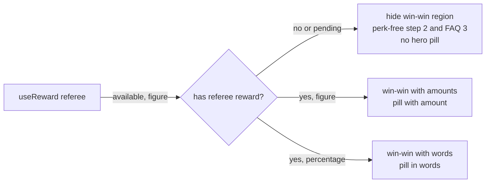

# Ambassador Page L Composition - Plan

## Goal Capsule

- **Objective:** A merchant who drops `<frak-ambassador>` on a page gets the composition their team chose, direction L, and a visitor can go from that page to sharing or installing without meeting a dead link or a promise the campaign does not keep.
- **Means:** Recompose the existing component from direction K to direction L (`example/vanilla-js/ambassador-l.html`), with the referral block reduced to one Share button.
- **Product authority:** Sharing and install continue to happen only on the wallet-hosted pages; the merchant page owns presentation and entry. Everything else in `docs/plans/2026-09-15-1424-feat-ambassador-page-component-plan.md` stands unless a decision below replaces it.
- **Open blockers:** None.
- **ID scope:** R-, AE-, U- and KTD-IDs in this plan are local to it. The earlier plan's IDs are cited with its date, as "2026-09-15 R16"; where the two disagree, this plan wins.
- **Stop conditions:** stop and ask if the QR encoder lands in the eager `cdn/loader.js` or `cdn/components.js`, or if an element attribute a published merchant integration already uses would be removed.

---

## Product Contract

### Summary

`<frak-ambassador>` moves from K's seven regions to L's: hero, reward amount, three steps, "Vos proches y gagnent aussi", referral block, stores, FAQ. The referral block is a heading, one sentence and a Share button. The store block gains a real QR code on wide screens, and every claim about the friend's benefit appears only when the campaign rewards the friend.

### Problem Frame

The component shipped K's composition, and the team has since chosen L. L differs from K in more than looks: it drops the recommendation premise and the payout reassurance cards, and adds the two-sided win-win region, the referral link card and a QR code.

Two parts of L cannot ship as drawn. Its link card shows a hardcoded link and a Copy button that copies a dead URL, because no SDK action returns a visitor's referral link; sharing always goes through the wallet sharing page. Its QR code is a static drawing. L's copy also promises the friend a benefit on every store, but the backend grants a referee reward only when the campaign defines one.

### Key Decisions

- **L replaces K as the composition.** (session-settled: user-directed — chosen over keeping K's seven regions: the merchant team picked direction L.) Supersedes the region decisions in `docs/plans/2026-09-15-1424-feat-ambassador-page-component-plan.md`. Governs R1.
- **The referral block has no link field and no Copy button.** (session-settled: user-directed — chosen over showing the visitor's real link with Copy, which needs a new SDK action returning a raw link and moves part of sharing onto the merchant page, and over a decorative placeholder link shown to real customers.) Governs R5.
- **The payout cards go; "no bank details needed" returns as one line.** (session-settled: user-directed — chosen over following L strictly and over keeping the cards as an eighth region: it is the most blocking objection at sign-up and the only one of the three the FAQ does not answer.) Governs R6.
- **The recommendation premise region goes.** (session-settled: user-directed — chosen over keeping it as its own region or folding "Il manque juste le lien" into the referral block: L's hero line "Vous parlez déjà de nous autour de vous" carries the same idea.) Supersedes the earlier decision to keep it as the page's uniqueness vector. Governs R1.
- **A real QR code, on wide screens only.** (session-settled: user-directed — chosen over dropping it and over showing it on every screen: a phone cannot scan its own screen.) Governs R7, R8.
- **Friend-benefit claims follow the campaign.** (session-settled: user-directed — chosen over neutral wording that promises nothing and over keeping the promise unconditionally: the code shows no friend benefit when the campaign has no referee reward.) Governs R9, R10.
- **Without a referee reward, the win-win region hides.** (session-settled: user-directed — chosen over a referrer-only retitled region, which would repeat the reward-amount region.) Governs R3.
- **No arrival context: every visitor sees the same page.** (session-settled 2026-09-23, after U5: user-directed — chosen over keeping the cold, referred and post-purchase hero wordings: the team wants the page as static content. See the matching decision in the 2026-09-15 plan.) The hero headline and CTA are fixed; only the campaign's rewards change the copy.
- **Both reward lookups read campaigns of any trigger.** (session-settled 2026-09-23, from the code review: user-directed — every live merchant runs purchase-triggered campaigns, so a `referral` trigger filter hid the friend reward and the ambassador amount on every live page.) Governs R3, R9.
- **The layout follows L's shipped CSS, not K's.** (session-settled 2026-09-23, after comparing the component with `ambassador-l.html`: user-directed — "we really want the L version".) Numbered step cards instead of step icons, the app block as a panel, +/- FAQ markers, the figure's currency drawn smaller, em units only, and inherited heading weight and colour. A merchant hero photo sits in a 4:5 frame with the reward card over it; without one the frame collapses, as L's own notes ask. K's closing shop CTA is removed.
- **An unshowable figure becomes words, not a hidden card.** (session-settled: user-directed — chosen over hiding the region and over showing only the referrer card: a percentage campaign still has a reward worth naming.) Governs R4.

### Requirements

**Composition**

- R1. The page presents its regions in this order: hero, reward amount, three-step explainer, "Vos proches y gagnent aussi" (subject to R3), referral block, store block, FAQ.
- R2. The hero invites the visitor to join the brand's ambassadors without an ambassador count or avatar row.

**Win-win region**

- R3. The "Vos proches y gagnent aussi" region renders only when the campaign has a referee reward.
- R4. Each of its two cards shows the reward as a figure when one can be shown, and otherwise as the page's existing no-reward wording.

**Referral block**

- R5. The referral block holds its heading, one sentence and a single Share button that opens the wallet sharing page, like every other share CTA on the page.
- R6. "No bank details needed to start" appears on every store as one line of the page's copy, outside any region that R3 can hide.

**Store block**

- R7. On wide screens the store block shows a scannable QR code encoding the same install link the store badges use.
- R8. On narrow screens the store block shows the badges without the QR code.

**Promises about the friend**

- R9. Every sentence that promises the friend a benefit renders only when the campaign has a referee reward: the hero referee pill, the explainer's second step and the FAQ answer on whether friends pay more.
- R10. When the referee reward is unknown because the fetch failed, the page treats it as absent.

### Acceptance Examples

- AE1. **Covers R3, R4.** Given a campaign rewarding both sides with fixed amounts, when the page renders, then the win-win region shows both cards with their figures.
- AE2. **Covers R3, R9.** Given a campaign with no referee reward, when the page renders, then the win-win region, the hero referee pill and the friend-perk sentences in the explainer and FAQ are absent, and the page shows six regions.
- AE3. **Covers R4.** Given a referee reward expressed as a percentage, when the page renders, then the win-win region shows and its cards carry words instead of a figure.
- AE4. **Covers R10.** Given the reward fetch fails, when the page renders, then it matches AE2.
- AE5. **Covers R6.** Given AE2's campaign, when the page renders, then "no bank details needed to start" is still visible.
- AE6. **Covers R7, R8.** Given a desktop viewport, when the store block renders, then a QR code encoding the badges' install link is visible; given a phone viewport, it is not.

### Scope Boundaries

- Showing, copying or returning the visitor's own referral link on the merchant page.
- Channel-specific share buttons (WhatsApp, SMS, Instagram, e-mail); the wallet sharing sheet chooses the channel.
- A real ambassador count or social-proof avatars.
- The payout cards and the recommendation premise, both removed.

### Dependencies / Assumptions

- The QR code carries the install link's signed proof, valid for 30 days, so a photographed QR code works like a copied link. The visitor who scans still attributes the install to the desktop identity, which is the intent.
- `<frak-ambassador>` has not been published, so its element attributes can still change without a migration.

**Product Contract preservation:** Product Contract unchanged. Its three deferred questions are answered by KTD3 (R6 placement), KTD1 (percentage detection) and KTD6 (encoder and breakpoint).

---

## Planning Contract

### Key Technical Decisions

- KTD1. **`useReward` reports whether a reward exists, not only its figure.** It returns an availability flag beside the formatted string: true when a campaign reward exists for the audience, including a percentage one, false with no campaign, no client or a failed fetch. The change is additive, so the hook's other callers keep their behaviour. Governs R3, R4, R10.
- KTD2. **One referee gate drives every friend-benefit surface.** The component derives "has referee reward" once from KTD1, over campaigns of any trigger, and uses it for the win-win region, the hero pill, and the step 2 and FAQ 3 copy. A merchant override for those slots obeys the same gate, which closes today's path where a custom pill renders with its amount stripped. While the fetch is pending the gate is closed, so gated surfaces appear after the reward resolves, the same as the hero pill today. Governs R3, R9, R10.
- KTD3. **The R6 line joins the reward-amount region's footer caption.** That region renders in every reward state, so the line survives AE2 and AE5, and it sits beside the "Gratuit · sans engagement" caption it extends. Governs R6.
- KTD4. **Gated copy gets perk-free variants instead of disappearing.** (session-settled: user-approved — chosen over dropping step 2 and FAQ 3: keeps "trois gestes" and five FAQ entries.) The exact strings are the table below. Governs R4, R9.
- KTD5. **The referral block reuses the page's share path and CTA style.** (session-settled: user-approved — chosen over L's sentence "Envoyez-le à qui vous voulez", which presumes a visible link.) The button calls the existing share handler and takes the shared filled-CTA style, so it inherits the dual-band focus ring from the 2026-09-15 work. Its strings are in the table below. Governs R5.

  Copy for KTD4 and KTD5 (session-settled: user-directed — chosen over deriving the wording during U2: the user approved these exact strings):

  | Slot | fr | en |
  |---|---|---|
  | Step 2, no referee reward | Votre ami installe l'app Frak en quelques secondes, puis passe commande. | Your friend installs the Frak app in seconds, then places their order. |
  | FAQ 3 answer, no referee reward | Non. Votre lien ne change rien au prix : vos proches paient exactement le même montant que tout le monde. | No. Your link doesn't change the price: your friends pay exactly what everyone else pays. |
  | Hero pill, percentage referee reward | + un avantage pour votre filleul | + a perk for your friend |
  | Referral block sentence | Partagez-le à qui vous voulez : vous êtes payé à chaque commande passée avec. | Share it with anyone you like: you get paid on every order placed with it. |
  | Referral block button | Partager mon lien | Share my link |

- KTD6. **The QR encoder loads only on wide screens.** (session-settled: user-approved — chosen over bundling the encoder for every visitor: phones never render the code.) A `(min-width: 768px)` media query, the design system's `tablet` breakpoint, gates a dynamic import of the `qr` package already pinned in the catalog. The code is rendered from the encoder's module grid as SVG elements, never as an HTML string. A change event keeps a resized window correct in both directions. Governs R7, R8.
- KTD7. **The QR is drawn black on white with a quiet zone, whatever the theme.** Merchant knobs such as `--frak-amb-accent` do not reach it, because a tinted or low-contrast code stops scanning. It carries `role="img"`, a translated label and a visible "Scannez pour installer" caption. It is never focusable, since the two store badges are the keyboard and screen-reader path. With no install URL the QR is absent, like the badges' inert state. Governs R7.
- KTD8. **The test suite is rewritten to L's contract, not patched.** Region-order, heading-list and brand-count tests encode K today and would still pass for the wrong reasons. Tests carrying the earlier plan's AE labels are renamed to this plan's IDs or prefixed "2026-09-15".

### High-Level Technical Design

How the reward state reaches each gated surface:

### Assumptions

- The CDN build splits a dynamic import inside a component chunk into its own lazy chunk, as it already does for `COMPONENTS_MAP`. U4 measures this rather than assuming it.

### Risks

- **Layout shift:** the win-win region inserts after first paint when the referee reward resolves. This is accepted, since it is the same trade the hero pill already makes, and it is noted for the browser check in U5.
- **A photographed QR carries a 30-day proof** (see Dependencies / Assumptions). It dies silently after expiry; the page offers nothing to renew it.

---

## Implementation Units

### U1. Reward availability in useReward

**Goal:** let callers tell a percentage reward from no reward.
**Requirements:** R3, R4, R10; AE3, AE4.
**Dependencies:** none.
**Files:** `sdk/components/src/hooks/useReward.ts`, `sdk/components/src/hooks/useReward.test.ts`.
**Approach:** return the availability flag of KTD1 beside the existing formatted reward; keep the formatted value `undefined` for percentage rewards exactly as today.
**Patterns to follow:** the hook's existing fetch-and-swallow posture.
**Test scenarios:**
- A fixed referee reward yields a figure and available true.
- A percentage referee reward yields no figure and available true.
- No matching campaign yields no figure and available false.
- A rejected `getMerchantInformation` yields available false and no unhandled rejection.
- No `FrakSetup.client` yields available false without a fetch.
**Verification:** existing `useReward` callers' tests still pass unchanged.

### U2. Copy and element surface

**Goal:** the en and fr copy and the element attributes match L.
**Requirements:** R1, R2, R4, R5, R6, R7, R9.
**Dependencies:** none.
**Files:** `sdk/components/src/i18n/defaults.ts`, `sdk/components/src/components/Ambassador/types.ts`, `sdk/components/src/components/Ambassador/index.ts`.
**Approach:** purely additive, so the unit typechecks before U3 removes anything.
1. Add keys for the win-win region (heading, lede, two card labels and descriptions), the referral block (heading, sentence, button label), the R6 clause, the QR label and caption, and the perk-free step 2, FAQ 3 and hero-pill variants of KTD4.
2. Take wording from `example/vanilla-js/ambassador-l.html` wherever L has it, and from the KTD4/KTD5 table where L's wording is changed; the win-win lede's cash-back sentence is gated per KTD2.
3. Expose each new key as an override attribute, following the existing prop-per-key pattern.
**Patterns to follow:** the existing `ambassador` key block and its reward/no-reward pairs.
**Test scenarios:**
- Every new key exists in both en and fr (a key-parity check over the two objects).
- The observed-attributes list and the props type hold the same names.
**Verification:** typecheck passes.

### U3. Recompose the regions

**Goal:** the page renders L's regions in order, with the referee gate applied.
**Requirements:** R1–R6, R9, R10; AE1–AE5.
**Dependencies:** U1, U2.
**Files:** `sdk/components/src/components/Ambassador/Ambassador.tsx`, `sdk/components/src/components/Ambassador/Ambassador.css.ts`, `sdk/components/src/components/Ambassador/Ambassador.test.tsx`, `sdk/components/src/i18n/defaults.ts`, `sdk/components/src/components/Ambassador/types.ts`, `sdk/components/src/components/Ambassador/index.ts`.
**Approach:**
1. Delete the premise and payout regions, their styles, and their copy keys, props and observed attributes.
2. Add the win-win region after the three steps and the referral block after it, per R1, reusing the card and filled-CTA styles.
3. Derive the referee gate once (KTD2) and route every friend-benefit slot through it, overrides included.
4. Append the R6 clause to the reward-amount footer (KTD3).
5. Rewrite the region, heading and FAQ tests to L (KTD8).
**Patterns to follow:** `resolveHeroPill` for override-then-default resolution, moved behind the gate; the `ctaButton` style for every new filled control.
**Test scenarios:**
- Covers AE1. Fixed referrer and referee rewards render seven regions in R1's order, with both win-win figures.
- Covers AE2. No referee reward renders six regions, no hero pill, and perk-free step 2 and FAQ 3.
- Covers AE3. A percentage referee reward renders the win-win region with words and the pill in words.
- Covers AE4. A failed reward fetch renders exactly as AE2.
- Covers AE5. The no-bank-details clause is visible in AE2's state.
- A merchant `heroRewardRefereePill` override does not render when there is no referee reward.
- The referral-block button calls `openSharingPage` and the block has no link text or Copy control.
- The referral-block button carries the dual-band focus ring, like every other filled CTA.
- The reward region is in the page in every reward state.
**Verification:** no source file references a premise or payout key, and the rewritten suite fails when the gate is removed; prove it by deleting the gate once and watching AE2 go red.

### U4. Store QR code

**Goal:** wide screens show a scannable install QR; phones load nothing for it.
**Requirements:** R7, R8; AE6.
**Dependencies:** U2, U3.
**Files:** `sdk/components/package.json`, a new QR component under `sdk/components/src/components/Ambassador/`, its test, `Ambassador.css.ts`, `Ambassador.tsx`.
**Approach:**
1. Add `qr` to `sdk/components` from the catalog.
2. Build the QR component per KTD6 and KTD7, fed with the same install URL state as the badges.
3. Mount it in the store block beside the badges, matching L's layout.
4. Build the CDN bundle and record the chunk sizes.
**Patterns to follow:** `packages/wallet-shared/src/pairing/component/PairingQrCode/index.tsx` for rendering from the raw grid. Do not import it: `wallet-shared` is closed to the SDK, and its `currentColor` modules and stripped quiet zone are wrong here.
**Test scenarios:**
- Covers AE6. With the wide media query matching and an install URL, an SVG QR with its label and caption renders.
- Covers AE6. With the media query not matching, no QR renders and the encoder module is never imported.
- With no install URL, no QR renders on a wide screen.
- The QR is not focusable and its colours ignore a `--frak-amb-accent` set on an ancestor.
- A media-query change from narrow to wide mounts the QR without a remount of the page.
- The encoded payload equals the badges' `href`, fragment included.
**Verification:** `cdn/components.js` is byte-identical, `cdn/loader.js` differs only in the rewritten Ambassador chunk-hash pointer, no encoder code appears in either file, and the encoder sits in its own lazy chunk whose size is recorded.

### U5. Demo page and browser check

**Goal:** the demo reflects L and the real CDN bundle behaves in a browser.
**Requirements:** R1, R5, R7, R8.
**Dependencies:** U3, U4.
**Files:** `example/vanilla-js/ambassador.html`.
**Approach:** drop any premise or payout attributes from the demo, then load the built CDN bundle on a plain page at desktop and phone widths.
**Test expectation:** none — manual browser verification recorded in the commit message, since jsdom does no layout or media queries.
**Verification:**
- At 1280px the QR shows and a phone camera scan opens the wallet `/install` page with the badges' parameters, `#p=` fragment included.
- With a referee reward mocked to resolve late, record how far the win-win region's insertion shifts the page (the Risks entry's layout shift).
- At 390px there is no QR, and the network panel shows no QR chunk requested.
- Tabbing reaches the referral-block Share button with a visible ring on a white page.

---

## Verification Contract

- `bun run --cwd sdk/components test`; every `useReward` caller lives in `sdk/components`.
- `bun run --cwd sdk/components typecheck`, after `bun run build:sdk` if core types changed.
- `bunx biome check` on the changed files, and `bun run lint:comments -- sdk/components/src`.
- `bun run --cwd sdk/components build`: the registration guard reports 6 registrations in `cdn` and `dist`.
- `bun run check:es-output`: every output directory parses at es2022.
- The CDN chunk comparison from U4, and the browser check from U5.

## Definition of Done

- Every R1–R10 is met and AE1–AE6 each have a test named for them.
- No premise, payout, copy-link or channel-button code, style or key remains in `sdk/components`.
- The gates above pass, the tracked tree is clean, and each unit is its own commit.
- The QR encoder is absent from the eager CDN files, with measured sizes recorded in U4's commit message.
