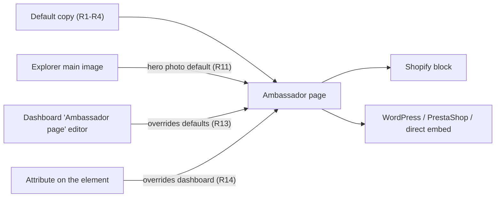
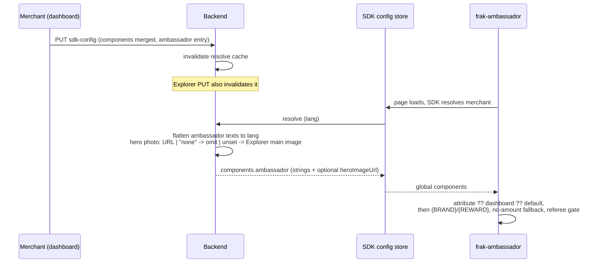

# Ambassador Page Customization - Plan

## Goal Capsule

- **Objective:** Every merchant's ambassador page opens with the new default copy, and a merchant can change its hero photo and key wording from the business dashboard, on every platform where the page is placed.
- **Means:** A fourth "Ambassador page" editor in the dashboard's Customize screen, following the share button, post-purchase and banner editors, which `<frak-ambassador>` reads at runtime.
- **Product authority:** Page behaviour stays governed by `docs/plans/2026-09-15-1424-feat-ambassador-page-component-plan.md` and `docs/plans/2026-09-23-1130-feat-ambassador-page-l-composition-plan.md`. Wording is governed by `docs/plans/ambassador-page/content-spec.md`, except the defaults this plan pins in the Appendix. A one-click page and capturing the page URL (FRA-329) are not active scope.
- **Open blockers:** None. The English copy in the Appendix is a draft for review before merge, not a planning blocker.

---

## Product Contract

### Summary

The ambassador page gets new French default copy and a matching English version. The business dashboard gains an "Ambassador page" editor for the hero photo, headline and intro, reward wording, button labels and FAQ, with a preview of the page's hero. The page picks these settings up wherever it is placed, including the settings-less Shopify block.

### Problem Frame

`<frak-ambassador>` takes its copy and hero photo only from HTML attributes. The Shopify block renders it bare, and no platform gives a merchant a place to set those attributes, so every page shows Frak's built-in text and no photo. The built-in French copy also no longer matches what the team wants to say: new wording was written to be more direct about earnings and about how the program works.

The other storefront components already have a dashboard editor with per-language text, an optional image and a preview. The ambassador page is the only one without.

### Key Decisions

- **Reuse the existing component customization pattern.** The page becomes a fourth customizable component rather than part of the Explorer brand profile, which would mix the wallet's brand listing with page copy. (session-settled: user-approved — chosen over storing the page settings in the Explorer brand profile: the Customize screen already carries per-language text, images and preview for storefront components.) Governs R8, R10.
- **The hero photo defaults to the Explorer main image, and the merchant can pick another or upload one.** (session-settled: user-directed — chosen over requiring an explicit pick and over always using the Explorer image: most Explorer images work at 4:5, but some crop badly and the merchant needs a way out.) Governs R11.
- **The Explorer image is the default whether or not the shop is listed in Explorer.** The listing switch (`explorerEnabledAt`) decides whether the wallet lists the shop, not whether the merchant's own image may appear on their own site; the panel shows the image as the default, and "no photo" is one click away. (session-settled: user-directed, 2026-09-25 — chosen over using it only while the listing is on, which would also need the panel preview to know the listing state.) Governs R11.
- **No pre-set photos for existing merchants at release.** (session-settled: user-directed — chosen over saving the hand-picked demo frames from commit f43b3de22 for the 13 live merchants that have one, and over using the Explorer image only after the merchant saves: bad crops get fixed as merchants report them.) Governs R11.
- **The editable texts are the hero headline and intro, the reward wording, the button labels and the FAQ.** (session-settled: user-directed — chosen as the set merchants have asked about; the "how it works" steps, "your friends win too" and app store sections stay built-in.) Governs R9.
- **The preview shows the page's hero only.** (session-settled: user-directed — chosen over a full-page preview and over a photo-only crop preview: the hero holds the photo and most of the editable text.) Governs R12.
- **The referral section keeps its Share button; there is no "COPIER" button.** (session-settled: user-directed — chosen over showing the visitor's real link with Copy, which needs a new SDK action, and over labelling the Share button "Copier", which would mislead.) Governs R6.
- **One setting for the whole store, not per placement.** A store has one ambassador page. (session-settled: user-approved — chosen over per-placement values like the other components have: placements exist to vary a component across a site.) Governs R8.
- **Payout wording follows the FAQ: credited automatically, transferable after confirmation.** The new step 2 said "instantanément". (session-settled: user-approved — chosen over promising instant payment, which the current FAQ answer contradicts.) Governs R5.
- **The Shopify block keeps no settings.** The dashboard is the only place to customise the page. (session-settled: user-directed — chosen over theme block settings, which would add a second customization surface.) Governs R13.

### Actors

- A1. Merchant: edits the ambassador page in the business dashboard.
- A2. Visitor: reads the ambassador page on the merchant's site.

### Requirements

**Default copy**

- R1. The page's French defaults are the new copy in the Appendix, with the brand name and reward amounts filled in at runtime.
- R2. The page's English defaults are the English column of the Appendix, reviewed before merge.
- R3. Every default that states a reward amount has a wording for when no fixed amount resolves, as the hero headline has today.
- R4. Texts the new copy does not cover keep today's wording: the hero eyebrow, the reward estimate and footer captions, the app store section and the FAQ.
- R5. Step 2 says gains are credited automatically, consistent with the FAQ answer that they become transferable once the brand confirms the purchase.
- R6. The referral section shows the new heading and sentence with its single Share button, which opens the wallet sharing page.
- R7. `docs/plans/ambassador-page/content-spec.md` records the new wording, so the content authority matches the component.

**Dashboard editor**

- R8. The Customize screen offers an "Ambassador page" editor next to the share button, post-purchase and banner editors, with one set of settings for the whole store.
- R9. The editor lets the merchant set the hero headline, hero intro, reward wording (hero reward caption, reward heading, reward intro), the three button labels, and the five FAQ questions and answers.
- R10. Each text field has the same "all languages", English and French tiers as the other editors, and an empty field keeps the default.
- R11. The merchant can choose the hero photo from their Explorer images, upload a new one, or choose no photo. Without a choice, the page uses the Explorer main image.
- R12. The editor previews the page's hero with unsaved edits: the photo in its 4:5 frame, the reward card over it, the headline, intro and button.

**How the page uses the settings**

- R13. The page shows the merchant's saved settings wherever it is placed, including the Shopify block, with no action beyond saving.
- R14. A value set as an attribute on the element wins over the dashboard setting, which wins over the default.
- R15. A dashboard text follows the same rules as an attribute override today: `{BRAND}` and `{REWARD}` placeholders, the fallback when no fixed amount resolves, and the referee gate on friend-benefit text.
- R16. These changes ship in the same components release as the ambassador page, which is still unreleased.

### Key Flows

- F1. Merchant customizes the page
  - **Trigger:** The merchant opens the "Ambassador page" editor in Customize.
  - **Actors:** A1
  - **Steps:** The merchant picks a hero photo or keeps the Explorer default. They edit texts in the "all languages" tier or per language, check the hero preview, and save.
  - **Outcome:** The next visitor to the page sees the new photo and texts, on any platform.
  - **Covered by:** R8-R13

### Acceptance Examples

- AE1. **Covers R1, R11, R13.** Given a merchant with an Explorer main image and no ambassador settings, when a visitor opens a French store's ambassador page, then it shows the Explorer image and the new French defaults.
- AE2. **Covers R11.** Given a merchant who chose no photo, when the page loads, then the hero frame collapses around the reward card even though an Explorer image exists.
- AE3. **Covers R11.** Given a merchant with no Explorer image and no choice, when the page loads, then the hero frame collapses.
- AE4. **Covers R10.** Given a French-only headline saved, when a visitor opens the page in English, then they see the English default headline.
- AE5. **Covers R3, R15.** Given a saved headline containing `{REWARD}` and a campaign with no fixed reward amount, when the page loads, then it shows the default headline, as an attribute override does today.
- AE6. **Covers R14.** Given a hero headline set both as an attribute on the element and in the dashboard, when the page loads, then the attribute's value shows.
- AE7. **Covers R13.** Given a Shopify store with the bare ambassador block, when the merchant saves a new headline, then the Shopify page shows it without any theme change.

### Scope Boundaries

- The "how it works" steps, "your friends win too" section, app store section and step images stay built-in and are not editable.
- Custom CSS for the page, which is hidden for every component today.
- Per-placement values.
- Pre-set photos for existing merchants.
- A full-page preview.
- A copyable referral link on the page.
- A one-click Shopify page and capturing the page URL (FRA-329).

### Dependencies / Assumptions

- Merchants on Shopify still need the release order from `docs/plans/2026-09-24-1005-feat-shopify-ambassador-block-plan.md` (R8 there): the components release must be live before the Shopify extension deploy.
- Some existing merchants' Explorer main images will crop poorly at 4:5 at release. Assumed acceptable, fixed per merchant through R11.

### Outstanding Questions

The three questions deferred to planning are answered in the Planning Contract: the content spec drops the demo snippet's canonical role (KTD6), a dashboard FAQ 5 answer replaces the whole answer (KTD5), and the backend applies the Explorer default (KTD2).

*Product Contract preservation note: planning changed no R, F or AE. It answered the three deferred questions and moved them into KTD2, KTD5 and KTD6.*

---

## Planning Contract

### Key Technical Decisions

- KTD1. **The ambassador settings are a new `ambassador` entry in the merchant's store-wide `sdkConfig.components`, resolved like the banner.** The backend flattens each text to the visitor's language, and the page reads the store-wide entry only, never a placement's. Cites R8, R10, R13.
- KTD2. **The backend decides the hero photo when it resolves the merchant's settings.** A stored URL wins, a stored `"none"` means no photo, and anything else falls back to the Explorer main image. The page receives a URL or nothing and never sees `"none"`. (session-settled: user-approved — chosen over resolving the default in the page: the resolve step already loads the whole merchant row, and the page stays unaware of Explorer.) Cites R11, AE1-AE3.
- KTD3. **Merchants with no saved settings get a settings object that holds only the ambassador photo.** It carries no language, name or other field, so the page's language and brand resolution stay unchanged. It is sent only when an Explorer image exists. (session-settled: user-approved — chosen over leaving these merchants without the Explorer photo until they save once.) Cites R11, R13.
- KTD4. **Saving an editor replaces only its own components.** The components editor and the ambassador panel each merge their entries into the saved components instead of replacing the whole section, which is what the backend's shallow merge does today. The floating wallet and "open in app" entries, which no editor shows, stop being wiped as a side effect. (session-settled: user-approved — chosen over a backend deep merge: the fix stays in the two callers, and the backend contract for other callers is unchanged.) Cites R8, R13.
- KTD5. **A dashboard FAQ 5 answer is one text that replaces the whole answer, inline Frak link included.** Attributes keep their three split slots. The "Program powered by Frak" attribution link stays. (session-settled: user-approved — chosen over three dashboard fields for one sentence.) Cites R9, R14.
- KTD6. **The content spec points to the component's built-in defaults as the canonical wording.** The demo snippet `example/vanilla-js/frak-ambassador-inject.js` is direction K, superseded by L, and keeps its old copy as a historical sketch. Cites R7.
- KTD7. **The editor is its own always-mounted panel above the placement selector, not a fourth component tab.** The tabs repeat per placement, and the ambassador page has one setting per store. (session-settled: user-approved — chosen over adding `ambassador` to the component tabs.) Cites R8.
- KTD8. **The new copy reshapes three slots.** The hero headline no longer carries the amount, which moves into the hero intro, and the intro gains a no-amount variant. Step 2's text stops depending on the referee reward, so its no-reward variant goes. The "You" and "Your referee" cards keep their amount slot, and the Appendix text splits into amount plus description. Cites R1, R3, R5.

### High-Level Technical Design

### Implementation Units

### U1. New default copy

**Goal:** The page's built-in French and English copy matches the Appendix.

**Requirements:** R1-R7, KTD6, KTD8.

**Dependencies:** None.

**Files:**
- `sdk/components/src/i18n/defaults.ts`
- `sdk/components/src/components/Ambassador/Ambassador.tsx`
- `sdk/components/src/components/Ambassador/Ambassador.test.tsx`
- `docs/plans/ambassador-page/content-spec.md`

**Approach:**
1. Replace the ambassador `en` and `fr` defaults with the Appendix copy. Slots the Appendix does not list keep today's text (R4). The hero caption under the button is the existing faces-caption slot.
2. Apply KTD8: one hero headline, a hero intro with reward and no-reward variants, step 2 without its no-reward variant, and cards split into amount plus description.
3. Update the content spec's wording tables and its canonical-source paragraph (KTD6).

**Patterns to follow:** the existing `heroHeadline` / `heroHeadlineReward` pair and `resolveRewardHeading` for amount variants.

**Test scenarios:**
- Covers AE1. French page with a fixed reward: the hero shows "Devenez ambassadeur {brand}" and the intro contains the amount.
- No fixed reward amount: the intro shows "Gagnez une récompense…" and the reward heading shows its no-amount variant.
- A campaign without a referee reward: step 2 shows the same text as with one, and the friends section stays hidden.
- English page: every Appendix slot renders its English text.
- The referral section shows one Share button labelled "Partager mon lien" (R6).

**Verification:** every Appendix slot renders its text in both languages, and the existing attribute-override tests still pass.

### U2. Backend: store and resolve the ambassador settings

**Goal:** The backend stores the ambassador entry and sends the resolved texts and hero photo to the page.

**Requirements:** R9-R11, R13, R15, KTD1-KTD3.

**Dependencies:** None.

**Files:**
- `services/backend/src/domain/merchant/schemas/index.ts`
- `services/backend/src/domain/merchant/services/MerchantResolveService.ts`
- `services/backend/src/domain/merchant/services/MerchantResolveService.test.ts`
- `services/backend/src/api/business/merchant/explorer.ts`

**Approach:**
1. Add an ambassador component schema: the editable texts from R9 as localizable strings, plus `heroImageUrl` accepting an HTTPS URL or `"none"`. Add it to the stored components and to the resolved components schema.
2. In `buildResolvedComponents`, flatten the texts like the banner's and apply the KTD2 hero rule using `merchant.explorerConfig`.
3. For merchants without `sdkConfig`, return the photo-only object from KTD3.
4. Make the Explorer update route also clear the merchant's resolve cache, so a new Explorer image does not wait out the 10-minute resolve cache.

**Patterns to follow:** `resolveLocalizableFields` and the banner entry in `buildResolvedComponents`, and the `invalidateForMerchant` call in `api/business/merchant/sdkConfig.ts`.

**Test scenarios:**
- Covers AE1. No ambassador entry and an Explorer main image: the resolved `heroImageUrl` is the Explorer image.
- Covers AE2. Stored `"none"` and an Explorer image: no `heroImageUrl` is resolved.
- Covers AE3. No Explorer image and no choice: no `heroImageUrl` is resolved.
- A stored URL wins over the Explorer image.
- Covers AE4. A French-only headline resolved for English: the headline is absent, so the page uses its English default.
- An "all languages" headline resolved for French: the headline is that text.
- No `sdkConfig` with an Explorer image: the result holds only the ambassador photo, and the resolved language is unchanged.
- No `sdkConfig` and no Explorer image: no settings object is returned, as today.
- Updating Explorer settings clears that merchant's resolve cache.

**Verification:** the resolve tests pass, and a merchant without saved settings resolves the same language as before.

### U3. The page reads the dashboard settings

**Goal:** `<frak-ambassador>` shows the merchant's dashboard settings below attributes and above defaults.

**Requirements:** R13-R16, KTD1, KTD5.

**Dependencies:** U1, U2.

**Files:**
- `sdk/core/src/types/resolvedConfig.ts`
- `sdk/components/src/components/Ambassador/Ambassador.tsx`
- `sdk/components/src/components/Ambassador/Ambassador.test.tsx`
- `.changeset/ambassador-page-component.md`

**Approach:**
1. Add the resolved ambassador type to the SDK's resolved components.
2. Read the store-wide entry through `useGlobalComponents`. For each editable slot, use the attribute, then the dashboard text, then the default, so dashboard text goes through the same placeholder, no-amount and referee-gate handling as an attribute (R15).
3. The hero photo uses the attribute, then the dashboard URL. The existing failed-image collapse applies to both.
4. A dashboard FAQ 5 answer renders as plain text in place of the split answer (KTD5).
5. Mention dashboard customization in the pending changeset (R16).

**Patterns to follow:** Banner's order of prop, placement, global config, then defaults in `sdk/components/src/components/Banner/Banner.tsx`.

**Test scenarios:**
- Covers AE6. An attribute headline and a dashboard headline: the attribute's text shows.
- A dashboard headline and no attribute: the dashboard text shows, with `{BRAND}` replaced.
- Covers AE5. A dashboard headline containing `{REWARD}` and no fixed reward amount: the default headline shows.
- A dashboard reward heading with `{REWARD}` and a fixed amount: the amount shows in its slot.
- A dashboard hero photo and no attribute: the hero image renders in the 4:5 frame.
- A dashboard hero photo that fails to load: the frame collapses.
- A dashboard FAQ 5 answer: it replaces the whole answer, and the attribution link still renders.
- No dashboard settings: the page renders exactly as U1 defines.

**Verification:** the page tests pass. With the local SDK build on a dev store, a saved headline appears on the ambassador page (AE7).

### U4. Saving one editor keeps the other components

**Goal:** Saving the components editor no longer erases the ambassador entry or the entries no editor shows.

**Requirements:** R8, R13, KTD4.

**Dependencies:** None.

**Files:**
- `apps/business/src/module/merchant/component/Customize/DefaultCustomization.tsx`
- `apps/business/src/module/merchant/component/Customize/fields/fieldDefaults.ts`
- `apps/business/src/module/merchant/component/Customize/fields/fieldDefaults.test.ts`

**Approach:** Build the saved components from the current stored components with the editor's three entries laid over them. Keep the merge in a small pure helper so it can be tested.

**Test scenarios:**
- Stored components with an ambassador entry: saving the share button keeps the ambassador entry unchanged.
- Stored floating wallet and "open in app" entries: they survive a components save.
- No stored components: the save holds only the three editor entries, as today.

**Verification:** the helper tests pass, and a components save in the browser leaves the ambassador settings in the saved config.

### U5. Hero preview in the preview package

**Goal:** The business app can render a preview of the page's hero.

**Requirements:** R12.

**Dependencies:** None.

**Files:**
- `packages/ui-preview/src/sdk-components/index.tsx`
- `packages/ui-preview/src/sdk-components/styles.css.ts`
- `packages/ui-preview/src/sdk-components/index.test.tsx`
- `packages/ui-preview/src/utils/variables.tsx`
- `packages/ui-preview/src/utils/variables.test.tsx`
- `packages/ui-preview/src/index.ts`

**Approach:** Add an ambassador hero preview beside the banner preview. It takes the headline, intro, button label, reward caption, currency, shop name and an optional image URL. It draws the photo in a 4:5 frame with the reward card over it, and collapses the frame around the card when no image is given. `replaceVariables` fills `{REWARD}` with its sample amount but does not know `{BRAND}` today, so it gains a `{BRAND}` → shop name replacement.

**Patterns to follow:** `BannerPreview` and its styles.

**Test scenarios:**
- With an image URL: the image and the reward card render.
- Without an image URL: no image renders and the reward card still shows.
- `{BRAND}` in the headline renders as the shop name, and `{REWARD}` as the sample amount.
- `replaceVariables` replaces `{BRAND}` and still leaves texts without it unchanged.

**Verification:** the preview tests pass and the preview matches the page's hero in the browser.

### U6. The "Ambassador page" panel in Customize

**Goal:** The merchant edits the hero photo and texts in one store-wide panel with a live hero preview.

**Requirements:** R8-R12, KTD4, KTD7, F1.

**Dependencies:** U2, U4, U5.

**Files:**
- `apps/business/src/module/merchant/component/Customize/AmbassadorPagePanel.tsx`
- `apps/business/src/module/merchant/component/Customize/ambassadorForm.ts`
- `apps/business/src/module/merchant/component/Customize/ambassadorForm.test.ts`
- `apps/business/src/module/merchant/component/Customize/index.tsx`
- `apps/business/src/module/merchant/component/Customize/sections.ts`
- `apps/business/src/i18n/locales/en/translation.json`
- `apps/business/src/i18n/locales/fr/translation.json`

**Approach:**
1. Add an always-mounted section key and mount the panel next to the sharing wording panel (KTD7).
2. Form fields: the R9 texts grouped as hero, reward wording, buttons and FAQ, with the "all languages" / English / French tabs of the other editors (R10).
3. Hero photo: the merchant's Explorer images as choices, an upload using the existing hero image upload, and a "no photo" choice. Nothing chosen means the Explorer main image, and the UI labels it as the default (R11).
4. Preview: U5's hero preview with the form's unsaved values over the built-in defaults for the tab's language (R12).
5. Save merges only the ambassador entry into the stored components (KTD4).

**Patterns to follow:** `SharingWordingPanel` for the always-mounted form and section registration, the components editor for language tabs and `resolvePreviewWording`, and `MultiHeroImagesField` / `ImageUploadField` for image choice and upload.

**Test scenarios:**
- Form values to saved entry: empty texts are left out, "no photo" saves `"none"`, and no choice saves no `heroImageUrl`.
- Saved entry to form values: a stored URL that matches an Explorer image selects it, `"none"` selects "no photo", and a missing value selects the default.
- Round trip: a saved entry turned into form values and back is unchanged.
- Saving the panel keeps the other stored components.

**Verification:** the mapping tests pass. In the browser, each photo choice and a French-only headline preview correctly, then save and reload intact.

---

## System-Wide Impact

- **Merchants without saved settings** start receiving a settings object on the page when they have an Explorer image (KTD3). The SDK then marks the config as coming from the backend. U2 tests the language, and the U3 dev-store check covers the page.
- **Every existing merchant** gets the Explorer photo on their ambassador page at release. Poor 4:5 crops are fixed through "no photo" or another image (accepted in the Product Contract).
- **Explorer edits** now also clear the resolve cache, a small extra backend cost on a rare action.
- **Components editor saves** stop wiping the floating wallet and "open in app" entries.

## Risks

- **The dashboard text arrives after the first render.** Every page load shows the built-in text and no photo at first: on a return visit until the listener iframe has loaded (the per-store config cache is only read once `setupClient` has created the iframe), and on a first visit until it has connected and `/resolve` has returned. Reading that cache before creating the iframe would fix return visits, but it changes `sdk/core` for every component, so it is left to a separate change. Unlike the banner and buttons, the page does not wait for the config (2026-09-15 component plan, U5): the config is only applied once the wallet iframe connects, so waiting would leave the page blank for good if it never does. Accepted after code review, 2026-09-25; watch it on the dev store.
- **Stored settings that no longer match the schema.** The sdk-config PUT validates the whole body against `SdkConfigSchema`, and every save now re-sends all stored components. A merchant whose stored `sdk_config` fails the current schema would see every Customize save fail. Check the stored values once against the schema before release.
- **The English copy is a draft.** Merge waits on the user's review of the Appendix's English column.

---

## Verification Contract

- Repo quality gate: format, lint, typecheck and tests, run after `bun run build:sdk` so the business app type-checks against the new SDK types.
- Backend resolve tests (U2), page tests (U1, U3), preview tests (U5) and business mapping tests (U4, U6).
- Browser check of the Customize panel in the local business app: each photo choice, the language tabs, the preview with unsaved edits, save and reload, and a components save that keeps the ambassador entry.
- Dev-store check with the local SDK build (`try:merchant`) against the dev backend: a saved headline and photo appear on the Shopify ambassador page (AE7), and "no photo" collapses the frame (AE2).

## Definition of Done

- U1-U6 are implemented, and their tests pass in the quality gate.
- AE1-AE7 hold, through the tests and checks named in the Verification Contract.
- The user reviewed the English copy.
- The content spec and the pending changeset are updated.
- Nothing is pushed without the user's approval.

---

## Appendix

### New default copy

`{BRAND}` is the merchant name. `{REWARD}` is the referrer's reward, except in the "Your referee" card, where it is the referee's. A slot not listed keeps today's copy (R4).

Corrections to the supplied French text: "Ambassadeur" lowercased, "FRAK" written "Frak", "cash-back" written "cashback" as elsewhere on the page, "sécurisée" corrected to "sécurisé", step 2 aligned on payout timing (R5). The headline drops the supplied "de" before {BRAND}, which would need elision for brands starting with a vowel or mute h (content-spec rule 8; confirmed with the user 2026-09-25). The win-win card texts follow the amount line and avoid agreeing with it, so they read the same under "Une récompense"; "plus des ventes" corrected to "plus de ventes" (both 2026-09-25).

| Slot | French | English (draft) |
|---|---|---|
| Hero headline | Devenez ambassadeur {BRAND} | Become an ambassador for {BRAND} |
| Hero intro | Vous aimez nos produits ? Parlez-en autour de vous ! Gagnez {REWARD} dès qu'un achat est réalisé grâce à vous. | Love our products? Tell the people around you! Earn {REWARD} as soon as someone buys thanks to you. |
| Hero intro, no fixed amount | Vous aimez nos produits ? Parlez-en autour de vous ! Gagnez une récompense dès qu'un achat est réalisé grâce à vous. | Love our products? Tell the people around you! Earn a reward as soon as someone buys thanks to you. |
| Hero caption under the button | Pas de formulaire, pas d'attente : tout le monde peut devenir ambassadeur immédiatement. | No form, no waiting: anyone can become an ambassador right away. |
| Hero reward caption | pour vous, à chaque vente | for you, on every sale |
| Reward heading | {REWARD} pour vous à chaque vente | {REWARD} for you on every sale |
| Reward heading, no fixed amount | Une récompense pour vous à chaque vente | A reward for you on every sale |
| Reward intro | Pas de plafond : plus vous partagez, plus de ventes sont générées grâce à votre lien, plus vous gagnez ! | No cap: the more you share, the more sales your link brings in, and the more you earn! |
| How it works heading | Comment ça marche | How it works |
| Step 1 title | Je partage à mes proches | I share with the people close to me |
| Step 1 text | Via WhatsApp, en story Instagram, sur TikTok… mon lien unique, généré automatiquement. | On WhatsApp, in an Instagram story, on TikTok… my unique link, generated automatically. |
| Step 2 title | Je reçois de l'argent | I get paid |
| Step 2 text | Crédité automatiquement dans mon porte-monnaie à chaque vente générée grâce à mon lien de recommandation. | Credited automatically to my wallet for every sale made through my referral link. |
| Step 3 title | Je récupère mon argent | I collect my money |
| Step 3 text | En téléchargeant l'app Frak, je transfère mes gains sur mon compte bancaire. | With the Frak app, I transfer my earnings to my bank account. |
| Friends section heading | Vos proches y gagnent aussi | Your friends win too |
| Friends section intro | En conseillant {BRAND} à vos proches, non seulement vous leur faites découvrir de super produits, mais en plus, grâce à votre lien, ils bénéficient d'un cashback sur leur première commande : ils peuvent vous dire merci ! | Recommend {BRAND} to the people close to you: they discover great products, and thanks to your link they get cashback on their first order. They can thank you for it! |
| "You" card text, under the amount (or "Une récompense") | sur votre porte-monnaie sécurisé, à chaque vente | to your secure wallet, on every sale |
| "Your referee" card text, under the amount | en cashback sur son porte-monnaie sécurisé, à sa première commande | in cashback to their secure wallet, on their first order |
| Referral heading | Votre lien d'ambassadeur | Your ambassador link |
| Referral sentence | Enfin un vrai programme de parrainage rémunérateur ! | Finally, a referral program that really pays! |
| Referral button | Partager mon lien | Share my link |

The friends section keeps its existing rule: it shows only when the campaign rewards the referee.

### Sources

- `services/backend/src/domain/merchant/schemas/index.ts`: the per-component settings (`BannerComponentSchema`, `PlacementComponentsSchema`) and the Explorer images (`ExplorerConfigSchema`: one main hero image plus up to four more).
- `apps/business/src/module/merchant/component/Customize/`: the existing editors, the per-language text tiers, and `CUSTOM_CSS_ENABLED = false`.
- `apps/business/src/module/merchant/component/MultiHeroImagesField/` and `hook/useMediaUpload.ts`: the existing Explorer image picker and upload.
- `sdk/components/src/components/Banner/Banner.tsx`: how a component reads its dashboard settings today.
- `sdk/components/src/i18n/defaults.ts`: today's ambassador copy.
- Commit f43b3de22: the hand-picked 4:5 demo frames and the finding that wide banner images lose about half their width at 4:5.
