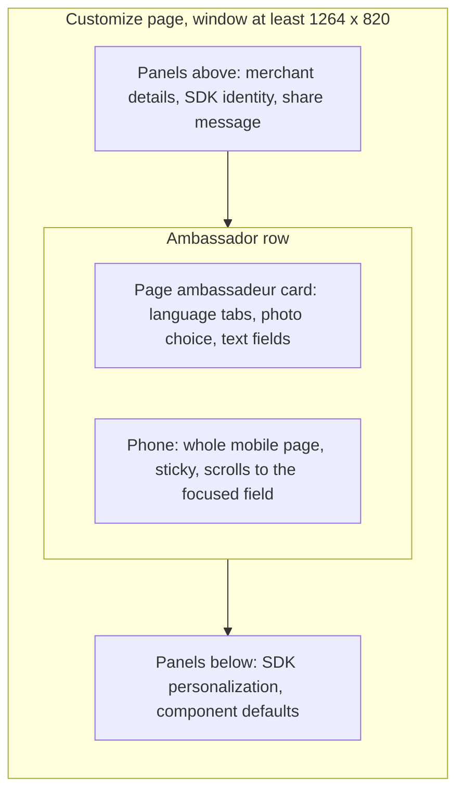
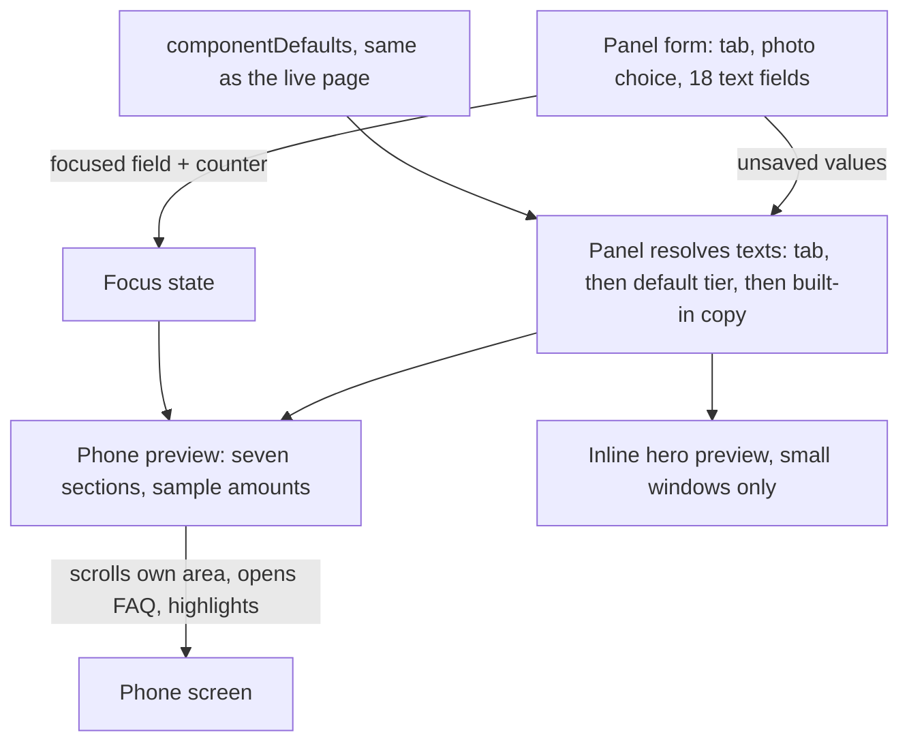

# Ambassador Page Phone Preview - Plan

## Goal Capsule

- **Objective:** A merchant editing the ambassador page in the business dashboard sees every text they edit in the context of the whole mobile page, before saving.
- **Product authority:** This Product Contract. It builds on `docs/plans/2026-09-24-1746-feat-ambassador-page-customization-plan.md` and supersedes that plan's hero-only preview decision (R12 there) and its "A full-page preview" scope boundary.
- **Means:** A phone drawn by the preview package, attached to the right of the ambassador card (KTD1, KTD3).
- **Delivery:** On branch `feat/ambassador-page-component`, in the same unreleased release as the Ambassador page panel. One path-limited commit per unit, nothing pushed without the user's approval.
- **Stop conditions:** Stop and ask if the phone cannot sit beside the card without changing the other Customize panels, or if a requirement turns out to need the real `<frak-ambassador>`.
- **Open blockers:** None.

---

## Product Contract

### Summary

The Ambassador page panel gains a phone beside it that shows the whole ambassador page as a visitor sees it on mobile. The phone uses sample amounts, follows every unsaved edit in the selected language tab, and scrolls to the section of the field being edited, briefly highlighting the text.

### Problem Frame

The panel edits 18 texts and a photo, but its preview shows only the top of the page: the photo, headline, intro, reward caption and top button. The reward heading and intro, the other two button labels and the ten FAQ texts are edited without seeing them in place. Today a merchant checks them by saving and opening their storefront page, which may not exist yet or may sit behind a storefront password.

### Key Decisions

- **The phone shows all seven sections, including those merchants cannot edit.** The page's flow is what a merchant judges. (session-settled: user-directed — chosen over showing only sections with editable text, and over drawing non-editable sections as grey placeholders: the merchant should see the page as a visitor does.) Governs R4, R6.
- **Amounts are fixed samples.** (session-settled: user-directed — chosen over reading the merchant's real campaign rewards, and over samples plus a no-amount switch: predictable, and the same as the other dashboard previews.) Governs R7.
- **The phone follows the field being edited.** (session-settled: user-directed — chosen over free scrolling only, over section chips above the phone, and over follow-plus-chips: the merchant never hunts for the text they are typing.) Governs R11-R13.
- **The page is drawn by the preview package, not rendered by the real component.** (session-settled: user-directed — chosen over rendering the real `<frak-ambassador>` in an isolated frame: without a Frak connection it shows no reward, hides the friends section and disables its buttons, and the dashboard would have to pick an SDK build to load.) The drawn copy must be kept in step with the page's layout.
- **The phone sits beside the ambassador card only, with the small hero preview kept for small windows.** (session-settled: user-approved — chosen over a phone pinned to the window: a pinned phone would stay on screen while the merchant edits the other Customize panels.) Governs R1-R3.

### Requirements

**Placement**

- R1. On windows of at least 1264 × 820, a phone appears beside the "Page ambassadeur" card, follows the page scroll, and stops at the bottom of the card.
- R2. While the phone is shown, the card no longer shows its inline hero preview.
- R3. On smaller windows the phone is hidden beside the card, which keeps its inline hero preview. Under that preview a "Voir la page entière" button opens the same phone in a sheet (a dialog on tablets, a bottom drawer on phones), showing the unsaved texts of the selected tab and opening at the section last edited. (Amended 2026-09-25 after the user's mobile check: other dashboard pages only hide their phone; chosen over placing the phone above or below the card, where it could not stay in view while editing.)

**Content**

- R4. The phone shows the page's seven sections in the page's mobile layout and order: hero, reward, how it works, friends, referral link, app, FAQ.
- R5. Each editable text shows the merchant's unsaved value for the selected language tab, else the "all languages" value, else the built-in copy for that language, never another language's value.
- R6. Texts merchants cannot edit show the built-in copy for the selected language.
- R7. Amounts are samples in the shop's currency: 42 for the ambassador and 10 for the friend (42 € and 10 € for a euro shop). The friends section and the friend mention in the hero are always shown.
- R8. `{BRAND}` shows the shop name the panel already uses, and `{REWARD}` shows the sample amount of the slot it sits in.
- R9. The hero photo follows the panel's photo choice: the Explorer main image by default, the chosen image, or no photo, in which case the frame collapses as on the page.
- R10. Buttons, links and store badges in the phone do nothing when clicked.

**Following the edit**

- R11. Focusing a field scrolls the phone to the section holding that text and briefly highlights it. The highlight runs on focus, not on every keystroke.
- R12. Focusing an FAQ question or answer opens that question in the phone. Focusing the photo choice scrolls to the hero.
- R13. The merchant can still scroll the phone by hand. Switching the language tab updates the whole phone without moving it.

### Layout

On smaller windows the row holds only the card, with its inline hero preview (R3).

### Acceptance Examples

- AE1. **Covers R11, R12.** **Given** a wide window and the phone showing the hero, **when** the merchant clicks into "Réponse 4", **then** the phone scrolls to the FAQ, opens question 4 and briefly highlights its answer.
- AE2. **Covers R1, R2, R3.** **Given** a window 1200 px wide, **when** the merchant opens Customize, **then** no phone appears and the card shows the inline hero preview.
- AE3. **Covers R9.** **Given** an Explorer main image, **when** the merchant picks "Pas de photo", **then** the phone's hero frame collapses around the reward card.
- AE4. **Covers R5, R6.** **Given** a headline typed only in the "Default" tab, **when** the merchant switches to "English", **then** the phone shows that headline and English built-in copy everywhere else.
- AE5. **Covers R7, R8.** **Given** any merchant, **when** the phone renders, **then** the reward reads 42 in the shop's currency, the friends section shows 10 for the friend, and the hero names the shop.

### Scope Boundaries

- A desktop view of the page.
- Real campaign rewards, and a switch to preview the no-fixed-amount wording.
- Section chips or other navigation above the phone.
- The storefront theme's fonts, colours and buttons, which the live page adopts: the phone uses a neutral look and checks wording and layout only.
- Making the non-editable texts editable.

### Dependencies / Assumptions

- Changes to the page's layout or sections must be mirrored in the drawn preview, as with the other dashboard previews.
- The Explorer tab's phone frame is assumed to be reusable for a scrolling page.

### Sources / Research

- `docs/plans/2026-09-24-1746-feat-ambassador-page-customization-plan.md`: the panel, text resolution (AE4 there) and the hero-only preview this supersedes.
- `apps/business/src/module/common/component/FloatingPhonePreview/index.tsx`: the `fixed` and `sticky` phone modes and the 1264 × 820 threshold.
- `apps/business/src/module/members/component/CreatePush/PushCreateLayout.tsx`: an existing sticky phone beside a form.
- `packages/ui-preview/src/explorer-phone/index.tsx`: the Explorer phone frame.
- `sdk/components/src/components/Ambassador/Ambassador.tsx`: the page's seven sections, and the FAQ, where only the first question starts open.
- `apps/business/src/module/merchant/component/Customize/AmbassadorPagePanel.tsx`: the panel and its current hero preview.

---

## Planning Contract

Product Contract preservation: unchanged, except that its two "Deferred to Planning" questions (where the phone sits, and how the drawn page keeps the live page's wording) are answered by KTD1 and KTD4 and were removed from the Product Contract.

### Key Technical Decisions

- KTD1. **The phone hangs off the right edge of the ambassador card.** The card gets a positioned wrapper; a rail absolutely positioned just past the card's right edge spans the card's height, and the phone inside it uses the existing sticky phone style. The 720 px Customize column is left-aligned and no ancestor clips overflow, so the rail has room from 1264 px up. Chosen over turning the whole Customize page into two columns, which would change every panel's layout. (session-settled: user-approved — chosen over a two-column Customize page: only the ambassador card should change.) Governs R1.
- KTD2. **One media query decides which preview shows, in CSS only.** The window-size condition already in `FloatingPhonePreview`'s styles becomes an exported constant; the rail shows and the inline hero preview hides under it. Both previews stay mounted, which avoids a JS size listener. Governs R2, R3.
- KTD3. **The drawing is a new preview component in `packages/ui-preview`, framed by the Explorer phone artwork.** As in the Explorer preview, the frame image sits underneath with pointer events off, and the scroll area is clipped to the frame's screen window and painted above it, covering the artwork's placeholder screen and built-in button, so the page scrolls inside the phone. It takes already-resolved strings: the preview package does not depend on `@frak-labs/components`, and the panel already imports the built-in copy. Governs R4, R9, R10.
- KTD4. **The panel resolves every text; the live page's defaults are the single wording source.** Built-in copy comes from the same `componentDefaults` the page uses, taking the reward variants because samples always exist, and the panel overlays the 18 editable fields with its existing tab resolution. Only the layout is drawn twice, which the Dependencies accept. Governs R5, R6.
- KTD5. **Friend slots get their own sample.** `replaceVariables` gains an optional amount so every slot the live page fills with the friend's amount (the hero's friend mention, the friend card's amount and text, and the FAQ 3 answer) fills `{REWARD}` with 10, while every other slot keeps 42. Governs R7, R8.
- KTD6. **Store badges are neutral placeholders.** The content spec forbids redrawing Apple's and Google's badges, and the official art is Preact markup this React package cannot reuse. (session-settled: user-approved — chosen over redrawn badge art: vendor rules forbid it.) Governs R10.
- KTD7. **Focus is a slot name plus a counter, owned by the panel.** Each text input reports its field on focus and the photo choice reports the hero; the counter bumps on every focus, so refocusing the same field highlights again while typing never does. The preview scrolls only its own scroll area, never the window. Governs R11, R12, R13.

### High-Level Technical Design

### Assumptions

- The Explorer phone frame's screen window can hold a scroll area; if its geometry does not fit, a plain CSS phone outline of the same size is an acceptable substitute (KTD3).

---

## Implementation Units

### U1. Phone preview of the whole ambassador page

- **Goal:** `packages/ui-preview` can draw the whole mobile ambassador page in a phone, from resolved texts, with sample amounts and focus-driven scrolling.
- **Requirements:** R4, R6, R7, R8, R9, R10, R11, R12, R13; KTD3, KTD5, KTD6, KTD7.
- **Dependencies:** None.
- **Files:**
  - `packages/ui-preview/src/ambassador-phone/index.tsx` (new)
  - `packages/ui-preview/src/ambassador-phone/ambassador-phone.css.ts` (new)
  - `packages/ui-preview/src/ambassador-phone/index.test.tsx` (new)
  - `packages/ui-preview/src/index.ts`
  - `packages/ui-preview/src/utils/variables.tsx`
  - `packages/ui-preview/src/utils/variables.test.tsx`
- **Approach:**
  1. Props: a record of resolved strings keyed like the page's copy keys, the shop name, the currency, an optional photo URL, and an optional focus `{ slot, counter }`.
  2. Draw the seven sections in the page's order and mobile single-column layout, reading `sdk/components/src/components/Ambassador/Ambassador.tsx` for which texts each section shows. The hero photo keeps the 4:5 frame and reward card of `AmbassadorHeroPreview`, and collapses without a photo.
  3. Mark each text with its slot name. On a new focus counter, open the focused FAQ item, scroll the phone's scroll area to the slot, and apply a highlight that fades.
  4. Buttons, links and badges are plain elements with no handlers; badges are grey placeholders labelled with the store names.
  5. Extend `replaceVariables` with an optional amount, defaulting to today's 42.
- **Patterns to follow:** `packages/ui-preview/src/explorer-phone/index.tsx` (frame artwork and screen overlay), `AmbassadorHeroPreview` in `packages/ui-preview/src/sdk-components/index.tsx`, Vanilla Extract `style()` only.
- **Test scenarios:**
  - Covers AE5. Rendering with default texts shows all seven section headings, 42 € in the reward section and 10 € on the friend card.
  - An FAQ 3 answer containing `{REWARD}` shows 10 €, and a `usd` currency shows the amounts in dollars.
  - The headline fills `{BRAND}` with the shop name.
  - Covers AE3. Without a photo URL no image renders and the reward card still shows.
  - Only the first FAQ question is open when nothing is focused.
  - Covers AE1. A focus on the fourth FAQ answer opens question 4, highlights its answer, and scrolls the phone's scroll area while the window does not scroll.
  - A new counter on the same slot highlights again; a re-render with the same counter does not.
  - Badges and buttons are not links and carry no click behaviour.
  - `replaceVariables` fills `{REWARD}` with a given amount, and with 42 when none is given.
- **Verification:** The ui-preview tests and typecheck pass, and the component is exported from the package entry.

### U2. Wire the phone into the Ambassador page panel

- **Goal:** The panel shows the phone beside its card on large windows, fed with its unsaved texts and the field being edited, and keeps the inline hero preview on small windows.
- **Requirements:** R1, R2, R3, R5, R6, R11, R12, R13; KTD1, KTD2, KTD4, KTD7.
- **Dependencies:** U1.
- **Files:**
  - `apps/business/src/module/merchant/component/Customize/AmbassadorPagePanel.tsx`
  - `apps/business/src/module/merchant/component/Customize/AmbassadorPagePanel.test.tsx`
  - `apps/business/src/module/merchant/component/Customize/customize.css.ts`
  - `apps/business/src/module/common/component/FloatingPhonePreview/floating-phone-preview.css.ts`
- **Approach:**
  1. Replace the per-field `builtInText` lookup with one function that builds the full resolved record: built-in reward-variant copy for the tab's language, overlaid by the tab wording of the 18 editable fields. The field placeholders keep using the same built-in values.
  2. Track focus: each text input reports its field on focus, the photo choice reports the hero through a focus-within handler, and each report bumps the counter.
  3. Wrap the card in a positioned container with the rail beside it; the phone sits in `FloatingPhonePreview` with the sticky variant.
  4. Export the window-size condition from the phone preview styles, and use it to hide the inline hero preview when the phone shows.
- **Patterns to follow:** `apps/business/src/module/members/component/CreatePush/PushCreateLayout.tsx` (sticky phone beside a form), the existing `HeroPreview` in the panel for watched values.
- **Test scenarios:**
  - A typed FAQ 2 answer appears in the phone before saving.
  - Covers AE4. A headline typed only in the "Default" tab shows in the phone on the "English" tab, with English built-in copy for untouched texts.
  - Covers AE1. Focusing "Réponse 4" opens question 4 in the phone and highlights its answer.
  - Focusing the photo choice highlights the hero.
  - Covers AE3. Choosing "Pas de photo" removes the image from both previews.
  - Saving still sends only the ambassador entry over the stored components (existing save tests stay green).
- **Verification:** Customize tests and the business typecheck pass; the browser check in the Verification Contract passes.

---

### U3. Open the whole page from small windows

- **Goal:** Below the phone's window size, a "Voir la page entière" button under the inline hero preview opens the phone in a sheet.
- **Requirements:** R3; KTD2, KTD7.
- **Dependencies:** U2.
- **Files:**
  - `apps/business/src/module/merchant/component/Customize/AmbassadorPagePanel.tsx`
  - `apps/business/src/module/merchant/component/Customize/AmbassadorPagePanel.test.tsx`
  - `apps/business/src/module/merchant/component/Customize/customize.css.ts`
  - `apps/business/src/i18n/locales/{en,fr}/translation.json`, `apps/business/src/types/i18n/resources.d.ts`
- **Approach:** The button sits inside the inline-hero wrapper, so the same CSS query hides it on large windows. It opens the design system's `ResponsiveModal` holding the panel's existing phone preview with the same texts, photo and last focus, so the sheet opens at the section last edited. On narrow phones the phone is scaled down to fit the width, and the sheet scrolls when the screen is short.
- **Patterns to follow:** `ResponsiveModal` consumers in `apps/business/src/module`.
- **Test scenarios:**
  - The button opens the sheet, and the sheet's phone shows the unsaved headline.
  - After focusing "Réponse 4", opening the sheet shows question 4 open and highlighted.
- **Verification:** Customize tests and the business typecheck pass; the small-window browser check passes.

## Verification Contract

| Check | Command or step | Proves |
|---|---|---|
| Preview tests | `bun run test -- --project ui-preview-unit packages/ui-preview/src` | U1 |
| Panel tests | `bun run test -- --project business-unit apps/business/src/module/merchant/component/Customize` | U2 |
| Types | `bun run build:sdk`, then `bun run --cwd packages/ui-preview typecheck` and `bun run --cwd apps/business typecheck` | U1, U2 |
| Lint | `bunx biome check` and `bun run lint:comments --` on the changed files | U1, U2 |
| Browser, wide window | Customize at 1440 × 900: the phone sits beside the card, sticks while scrolling, stops at the card's bottom; AE1, AE3, AE4 and AE5 hold; the phone scrolls by hand, and switching the language tab leaves its scroll position unchanged | R1, R4-R13 |
| Browser, small window | Customize at 1200 × 900 and on an iPhone-sized window: no phone beside the card, inline hero preview shown (AE2); "Voir la page entière" opens the whole phone, which fits the screen and scrolls | R2, R3 |

## Definition of Done

- Every unit's test scenarios exist and pass, and both typechecks pass.
- The browser checks pass on both window sizes.
- No experimental or abandoned code remains in the diff, and the comment budget is clean.
- Each unit is one path-limited commit on `feat/ambassador-page-component`; nothing is pushed.
