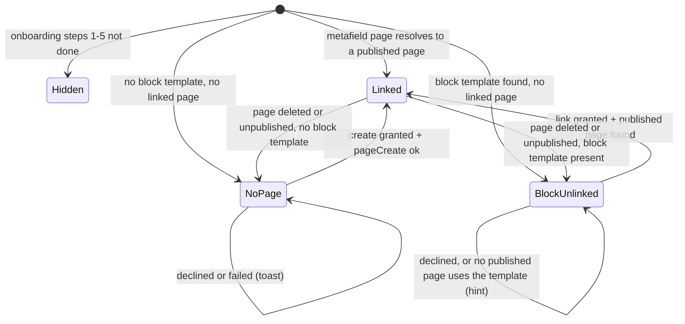
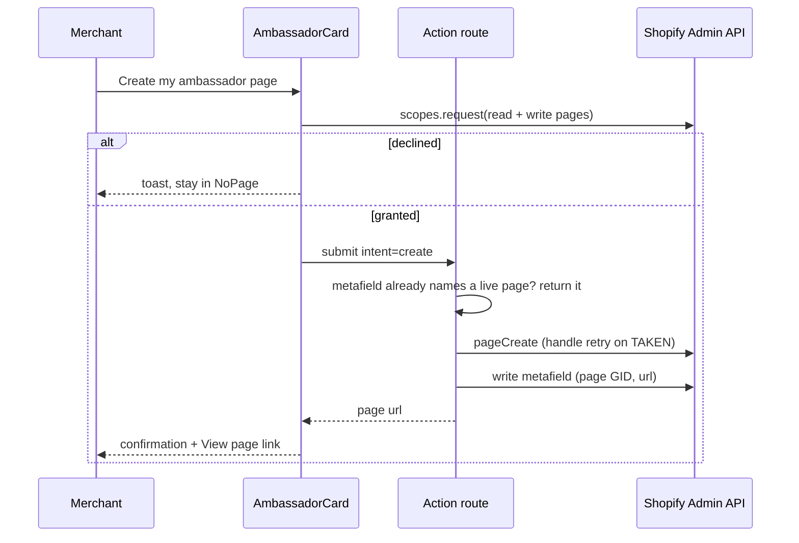

# Shopify One-Click Ambassador Page - Plan

## Goal Capsule

- **Objective:** A Shopify merchant gets a live ambassador page in their own shop from one click in the Frak app, and the app's setup card recognises that page afterwards.
- **Means:** an optional page permission asked at click time, then `pageCreate` with `<frak-ambassador></frak-ambassador>` as the page body (KD1, KD3, KTD1, KTD3).
- **Authority:** this plan's Product Contract, then Linear FRA-329, then `docs/plans/2026-09-24-1005-feat-shopify-ambassador-block-plan.md` for everything about the manual block route this plan does not change.
- **Stop conditions:** stop and report if, on the dev store, a granted optional scope is not usable by the app's existing access token, or if `pageCreate` through the app does not keep the `<frak-ambassador>` tag in the page body.
- **Execution profile:** code in `apps/shopify` only. No backend or SDK change: the rich-text image fix `49e1c8a9f` already shipped to the dev beta.
- **Finishing:** `ce-work` implements and verifies locally. The user pushes and deploys.

---

## Product Contract

### Summary

Add a "Create my ambassador page" action to the Shopify app's setup card. It asks for page access only when clicked, creates and publishes a page whose body is the ambassador component, and records that page in the shop. Merchants who built their page with the block can grant the same access so the app finds and records that page too.

### Problem Frame

Today a Shopify merchant publishes the ambassador page in three manual admin steps: create a page, create a custom page template holding the Frak Ambassador block, assign the template. Each step loses merchants.

An app cannot create a theme template without `write_themes` and a Shopify exemption Frak does not qualify for (Built for Shopify §3.2.2). A page, however, can be created with the ordinary `write_online_store_pages` scope. On frak-dev-08 (2026-09-29) a page whose body is only `<frak-ambassador></frak-ambassador>` rendered all seven sections through the listener embed, both when created in the admin and through `pageCreate` with only that scope. The cost is the theme's narrow default page column on desktop and the page title shown above the hero headline.

A new required scope would force every installed merchant to re-approve the app. Shopify's optional scopes remove that cost: only merchants who click are asked.

### Requirements

**Page creation**

- R1. From the setup card, one action creates a published page in the merchant's shop whose body is the ambassador component, on the store's default page template.
- R2. Page access is asked only when the merchant takes that action; merchants who never use it are never asked to re-approve the app.
- R3. When the merchant declines access or creation fails, the card says why and offers the action again; nothing is created.
- R4. The action never creates a second ambassador page for a store whose ambassador page the app already knows.
- R5. The page title is "Become an ambassador" or "Devenir ambassadeur", following the merchant's admin language; the merchant can rename it afterwards.

**Recognition in the setup card**

- R6. Right after creation the card confirms it with a link to the live page; on later loads the card no longer shows once the store has a known ambassador page.
- R7. A merchant whose theme already has the block in a custom page template can grant the same access so the app finds the published page using that template and records it. Without that access, the card offers this link step instead of the three manual steps.
- R8. The manual block steps stay available in the card as the full-width option whenever the card offers page creation; in the block-present state of R7 the link step replaces them, and page creation stays offered as a secondary action, because the template can exist with no published page using it.

**Page record**

- R9. The app keeps at most one ambassador page record per shop, stored in the shop itself.
- R10. The record follows the page: when the app sees on load that the page was renamed, unpublished or deleted, or that the shop's primary domain changed, it updates or clears the recorded URL.
- R11. Dropped (KD5): backend validation of the page URL.
- R12. Dropped (KD5): the page URL on the public Explorer data frak.id reads.

### Key Decisions

- KD1. **Page body, created through `pageCreate`.** (session-settled: user-directed — chosen over an app proxy page at `/apps/...`, which is not a real page in the merchant's shop, and over a template created with `themeFilesUpsert`, which needs `write_themes` plus a Shopify exemption Frak does not qualify for.) Governs R1.
- KD2. **The manual block stays as the full-width option.** (session-settled: user-approved — chosen over removing the block, which would leave no full-width route.) Governs R7, R8.
- KD3. **Page access is an optional scope asked at click time.** (session-settled: user-approved — chosen over a required scope that forces every installed merchant to re-approve the app.) Governs R2, R7.
- KD4. **Block-route pages get recorded too.** (session-settled: user-approved — chosen over recording only pages the app created.) Governs R7.
- KD5. **No backend storage of the page URL.** (session-settled: user-directed, 2026-09-29 — chosen over storing the URL on the backend and exposing it on the Explorer data so the frak.id button could link the page. Nothing read it yet, it needed a db migration ahead of the backend deploy, and frak.id does not need to send visitors straight to the ambassador page.) Governs R9, R11, R12.

### Scope Boundaries

- The frak.id brand-page button keeps sending visitors to the homepage share flow; Frak does not learn the page URL (KD5).
- No full-width automatic page: it would need a template, which KD1 rules out.
- No change to the Frak Ambassador block or to how `getThemeBlockPresence` treats the default page template.
- Considered and not built: warning when the listener embed is disabled. Onboarding already requires the embed before the setup card shows; a disabled embed is caught there.
- Considered and not built: picking among several published pages that use the block's template. The most recently updated one wins (KTD5); a merchant with several can unpublish the extras.
- Considered and not built: a `pages/*` webhook to catch changes between app loads. Shopify has no such topic; R10 runs on each app home load.

#### Deferred to Follow-Up Work

- None. If frak.id should link the page later, the app can send the recorded URL then; `explorer_config` would hold it without a migration, provided the dashboard's Explorer save carries it over.

### Dependencies

- Production needs a stable `@frak-labs/components` release containing `<frak-ambassador>` and `49e1c8a9f` before `shopify:deploy:prod`, as for the block.

### Sources

- Linear FRA-329, including its dev-store findings and the exemption research.
- Optional scopes: https://shopify.dev/docs/apps/build/authentication-authorization/manage-access-scopes and the App Home Scopes API https://shopify.dev/docs/api/app-home/latest/apis/authentication-and-data/scopes-api (API 2024-10+; the app is on 2026-04).
- `pageCreate` and its `TAKEN` error code: https://shopify.dev/docs/api/admin-graphql/latest/mutations/pageCreate, https://shopify.dev/docs/api/admin-graphql/2026-07/enums/PageCreateUserErrorCode.
- Scope table (page reads need `read_online_store_pages` or `read_content`): https://shopify.dev/docs/api/usage/access-scopes.
- No page webhooks, Shopify staff answer: https://community.shopify.dev/t/webhooks-for-pages/11590.

---

## Planning Contract

### Key Technical Decisions

- KTD1. **Ask for `read_online_store_pages` and `write_online_store_pages` together, from the client with App Bridge `shopify.scopes.request`.** Reading pages is needed for R7 and R10, and Shopify does not document that the write scope grants page reads, so asking for both in one prompt avoids a second prompt later. The App Bridge call opens a modal over the app instead of redirecting out of it. Governs R2 via KD3.
- KTD2. **Both scopes go under `optional_scopes` in both `shopify.app.*.toml` files; `scopes` stays unchanged.** `infra/gcp/shopify.ts` feeds `SCOPES` from the `^scopes =` line only, and `shopifyApp` treats `SCOPES` as required: adding the page scopes there would force re-approval, which KD3 rules out.
- KTD3. **The app records its page in a shop metafield `frak.ambassador_page` holding the page GID and its last known storefront URL.** It reuses `metafields.ts`, survives reinstall, and is what R4 checks before creating. The URL is always derived, never trusted from storage: shop `primaryDomain.url` plus `/pages/` plus the page's current handle.
- KTD4. **Reconciliation runs in the onboarding data fetch on app home load, only when the page scopes are granted.** It resolves the recorded page, derives its URL (null when missing or unpublished) and writes it back only when it differs from the one recorded (R10). A failed page read writes nothing. No scope, no reconciliation: the recorded URL stays as last seen.
- KTD5. **Block-route discovery lists published pages and matches `templateSuffix` against the custom page templates that hold the block.** `getThemeBlockPresence` returns those suffixes instead of a bare boolean. The `pages` query documents no `template_suffix` filter, so matching happens in code over a capped listing; the most recently updated match is adopted into the metafield exactly like an app-created page.
- KTD6. **Handle: a slug of the localized title; on `TAKEN`, retry with `-2` to `-5`, then report failure.** `pageCreate` does not auto-suffix. The retry never adopts a page by handle. R4 relies on the metafield first; without a live record, create adopts a published page whose body is exactly the component tag, so a lost record write never leads to a second page.
- KTD7. Dropped with KD5 (backend `ambassador_page_url` column and its Shopify-session-only PUT). Its review also found that a primary domain connected after registration would be refused by the domain check; that problem leaves with it.
- KTD8. Dropped with KD5 (`ambassadorPageUrl` on `ExplorerMerchantItemSchema`).
- KTD9. **One intent-based action route drives both card actions** (`create`, `link`), as `app.settings.pixel.tsx` does. The client requests the scopes first, submits only when they were granted, and disables the buttons while the fetcher is busy (R3, R4).

### High-Level Technical Design

Card states on app home load:

`Linked` shows the confirmation only in the session that created or linked the page; on later loads it renders nothing (R6).

Create action:

### Assumptions

- A scope granted through `shopify.scopes.request` is usable by the app's existing offline token on the next Admin API call, with no re-authentication. U1 checks this on the dev store first (Goal Capsule stop condition).
- `read_online_store_pages` is accepted as an optional scope name alongside `write_online_store_pages`.

### Deferred to Implementation

- The exact result shape of `shopify.scopes.request` on decline and on partial grant.
- Whether `Page` exposes a usable storefront URL field; KTD3 derives it regardless.
- The page-listing cap for KTD5 (first 250 published pages is the starting point).

---

## Implementation Units

### U1. Optional page scopes and the client request helper

- **Goal:** the app can ask for page access at click time and the server can tell whether it is granted.
- **Requirements:** R2, R3 (KTD1, KTD2).
- **Dependencies:** none.
- **Files:** `apps/shopify/shopify.app.development.toml`, `apps/shopify/shopify.app.production.toml`, `apps/shopify/app/hooks/usePageScopes.ts` (new), `apps/shopify/app/services.server/pageScopes.ts` (new), `apps/shopify/app/services.server/pageScopes.test.ts` (new).
- **Approach:**
  1. Add `optional_scopes = [ "read_online_store_pages", "write_online_store_pages" ]` (a TOML array) to both toml files; leave `scopes` untouched.
  2. Client hook wraps `shopify.scopes.request` for both scopes and resolves to granted or declined.
  3. Server helper reports whether page read and write access are granted, via the React Router library's scopes query, failing closed to "not granted". It checks with `AuthScopes.has` from `@shopify/shopify-api`, which counts a `write_` scope as covering its `read_` twin, so the answer does not depend on which handles Shopify lists.
- **Patterns to follow:** `window.shopify?.toast.show` usage in `app/components/Pixel/index.tsx`; never-throw services per `app/services.server/AGENTS.md`.
- **Test scenarios:**
  - Granted scopes list containing both page scopes reports granted.
  - List containing only the write scope reports granted.
  - List containing only the read scope reports not granted.
  - Scopes query throwing reports not granted and logs.
- **Verification:** after `shopify:deploy` with the dev config, clicking a temporary trigger on frak-dev-08 shows Shopify's grant modal; granting then running a `pages(first: 1)` query from the app succeeds without re-auth, and the raw granted list is logged once; declining leaves both scopes absent. Restore `listener.liquid` and `frakStage.gen.ts` after the deploy.
- **Execution note:** verify the first Assumption on the dev store before building U3 on it.

### U2. Dropped: backend storage of the page URL

Dropped by KD5 on 2026-09-29, before merge. No `services/backend` or `apps/wallet` change ships with this plan.

### U3. Shopify services: create, find and record the page

- **Goal:** server-side building blocks for creating the page, finding a block-route page, deriving its URL and recording it.
- **Requirements:** R1, R4, R5, R7, R9 (KTD3, KTD5, KTD6).
- **Dependencies:** U1.
- **Files:** `apps/shopify/app/services.server/ambassadorPage.ts` (new), `apps/shopify/app/services.server/ambassadorPage.test.ts` (new), `apps/shopify/app/services.server/theme.ts`, `apps/shopify/app/services.server/theme.test.ts`, `apps/shopify/app/services.server/metafields.ts` (only if a JSON metafield helper is missing).
- **Approach:**
  1. `getThemeBlockPresence` returns the suffixes of custom page templates holding an enabled block; callers derive the old boolean from a non-empty list.
  2. Page service: create (localized title, handle retry per KTD6, published, default template), resolve a recorded page to its current URL or null, find the most recently updated published page for a set of suffixes.
  3. Record helpers read and write the `frak.ambassador_page` metafield.
- **Patterns to follow:** `webPixel.ts` for mutations and `userErrors`; `theme.ts` for paginated reads.
- **Test scenarios:**
  - Create sends the component tag as body, `isPublished: true`, no template suffix, and the French title when the language is `fr`.
  - `TAKEN` on the first handle retries with `-2` and succeeds.
  - `TAKEN` on every handle up to `-5` returns a failure without throwing.
  - A recorded page that is published resolves to `{primaryDomain}/pages/{current handle}`.
  - A recorded page that is unpublished or missing resolves to null.
  - Two published pages on the `ambassador` suffix pick the most recently updated; an unpublished match is ignored.
  - Theme presence returns `["ambassador"]` for `templates/page.ambassador.json` and still ignores `templates/page.json`.
- **Verification:** shopify unit tests pass; existing theme presence tests still pass with the new return shape.

### U4. Reconcile the recorded page on app home load

- **Goal:** the onboarding data tells the card which state it is in, and keeps the recorded URL current.
- **Requirements:** R6, R7, R10 (KTD4).
- **Dependencies:** U3.
- **Files:** `apps/shopify/app/utils/onboarding.server.ts`, `apps/shopify/app/utils/onboarding.ts`, `apps/shopify/app/utils/onboarding.test.ts`.
- **Approach:**
  1. Add optional ambassador fields to `OnboardingStepData` in `fetchAllOnboardingData`, not to `stepValidations`, so `MAX_STEP` is unchanged.
  2. With page scopes granted: resolve the recorded page; when its derived URL differs from the recorded one, write it back to the record.
  3. Report the card state: linked, block present but unlinked, or no page.
- **Patterns to follow:** the existing step 7 fetch around `getThemeBlockPresence` in `onboarding.server.ts`.
- **Test scenarios:**
  - Scopes not granted and block template present reports block-unlinked and makes no page call.
  - Scopes granted, recorded page renamed: the record is written once with the new URL.
  - Scopes granted, recorded page deleted, no block template: the record's URL becomes null and the state is no-page.
  - A failed page read writes nothing and keeps the recorded URL as linked.
  - Recorded URL unchanged: nothing is written.
- **Verification:** onboarding tests pass; `MAX_STEP` and `validateCompleteOnboarding` behave as before.

### U5. Setup card actions and copy

- **Goal:** the merchant can create or link the page from the card and sees the outcome.
- **Requirements:** R1, R3, R4, R6, R7, R8 (KTD9).
- **Dependencies:** U1, U3, U4.
- **Files:** `apps/shopify/app/components/OptionalSetup/index.tsx`, `apps/shopify/app/routes/app.ambassador-page.tsx` (new), `apps/shopify/app/i18n/locales/en/translation.json`, `apps/shopify/app/i18n/locales/fr/translation.json`.
- **Approach:**
  1. Action route handles `create` (refuses to create when the record names a live page, returning it instead) and `link` (KTD5 discovery, adopt), always returning the page URL or a message. Both write the record once with the page GID and its URL.
  2. The client sends its current i18n language with `create`: the server's `findLocale` reads only the iframe URL's `locale` parameter, which a fetcher submission does not carry, so R5 would otherwise always get English.
  3. The card shows, per state: the create button plus the manual steps; the link button plus a hint when no published page uses the template; the confirmation with a "View page" link right after success.
  4. The fetcher is keyed and read in `OptionalSetup`, which keeps the ambassador card mounted while that fetcher holds a successful result. Without this, the loader revalidation that follows the action reports the store as linked, unmounts the card and loses the confirmation.
  5. French copy uses vouvoiement, matching the existing card.
- **Patterns to follow:** `app/routes/app.settings.pixel.tsx` intent switch and `components/Pixel/index.tsx` fetcher usage; `ExternalButton` in the existing card; the toast convention in `app/components/AGENTS.md`.
- **Test scenarios:** Test expectation: none -- `apps/shopify` has no component tests (vitest runs node-only `*.test.ts`); the action's decisions live in U3 and U4 services, and the card is checked by the dev-store pass below.
- **Verification:** on frak-dev-08:
  - A store with no ambassador page: create, grant, and the new page renders the component.
  - The confirmation and its "View page" link stay visible after the post-action revalidation and after returning from the opened tab.
  - With the admin in French, the created page is titled "Devenir ambassadeur".
  - Declining the grant shows the reason and leaves no page.
  - A second click after success creates nothing new.
  - A store with the block in `page.ambassador.json` assigned to a published page: link, grant, and the card confirms it with a View page link.
  - Renaming the page handle in the admin, then reopening the app, updates the recorded URL (visible as the metafield value).

---

## Verification Contract

| Gate | Command or check | Applies to |
|---|---|---|
| Format | `bun run format` | all units |
| Lint (biome, comment budget, `check:shopify-stage`) | `bun run lint` | all units |
| Types | `bun run typecheck` | all units |
| Tests | `bun run test` (never `bun test`) | U1-U4 |
| Dev-store deploy of the toml change | `bun run --cwd apps/shopify shopify:deploy` with the dev config, then restore `listener.liquid` and `frakStage.gen.ts` with `git checkout --` | U1, U5 |
| Dev-store behaviour | the U1 and U5 verification lists on frak-dev-08 | U1, U5 |

Root `bun run lint` also fails on the untracked `.agents/skills` files; that failure is pre-existing and not part of this work.

---

## Definition of Done

- R1-R10 hold, each covered by a U3-U4 test or a U1/U5 dev-store check; R11-R12 are dropped (KD5).
- Every gate in the Verification Contract passes.
- `listener.liquid` and `frakStage.gen.ts` are unmodified in the working tree.
- No temporary triggers, debug logging or abandoned-approach code remain in the diff.
