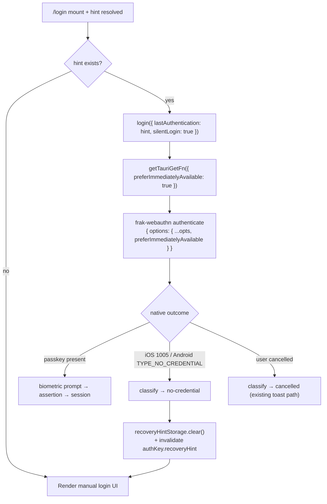

# feat: WebAuthn preferImmediatelyAvailableCredentials fail-fast quick-login

## Summary

Adopt the native WebAuthn `preferImmediatelyAvailableCredentials` flag (iOS 16+ /
Android Credential Manager) in the Tauri wallet app so the app can distinguish
"no passkey on this device" from "user cancelled" — a distinction that today
collapses onto `NotAllowedError` → `cancelled`. Threading the flag through the
`frak-webauthn` bridge and mapping the resulting native signals to the existing
`no-credential` error kind unlocks an automatic **quick-login** on the `/login`
screen: when a device hint exists, fire a silent assertion — a present passkey
shows only the biometric prompt and logs the user in; a missing passkey fails
instantly with zero UI, falls through to the existing manual login UI, and
self-heals the stale cloud hint.

This resolves the two `TODO(prefer-immediate)` markers left in the codebase
(`packages/wallet-shared/src/authentication/hook/useLogin.ts:84`,
`apps/wallet/src-tauri/plugins/tauri-plugin-frak-webauthn/ios/Sources/FrakWebauthnPlugin.swift:212`).

---

## Implementation Notes (post-verification, 2026-07-02)

The plan below is preserved as written. Device verification (Pixel 7 Pro, iPad
Pro) surfaced four deviations — all landed on the branch; where a section below
contradicts this list, this list is authoritative.

1. **iOS emits flagged `.canceled` (1001), not `.notInteractive` (1005).**
   On a real device, `preferImmediatelyAvailableCredentials` + no local passkey
   fires `ASAuthorizationError.canceled` (1001) instantly with zero UI — 1005
   never fires for assertions (it appears to be AutoFill/conditional-mediation
   territory). Since 1001 is also the user-cancel code, the plugin now tracks
   the flag per-request (`preferImmediateInFlight`) and maps **flagged 1001**
   → `TYPE_NO_CREDENTIAL` envelope; unflagged 1001 stays `cancelled`. The
   planned `case 1005` mapping is kept defensively. Documented trade-off:
   cancelling the flag-initiated biometric prompt (passkey present) also
   classifies `no-credential` and clears the hint — accepted; the next
   successful login rewrites it.
2. **Android: the flag lives on `GetCredentialRequest`, not
   `GetPublicKeyCredentialOption`.** The U3 construction as planned does not
   compile — androidx.credentials exposes `preferImmediatelyAvailableCredentials`
   on the request. Fixed:
   `GetCredentialRequest(credentialOptions = listOf(getOption), preferImmediatelyAvailableCredentials = preferImmediate)`.
   The strip-before-`toString()` guidance stands.
3. **Auto-fire is additionally gated to `IS_TAURI`.** R8 ("web unaffected")
   held for the flag but not the UX: on web the flag is inert, so a stale hint
   would auto-open a full browser passkey modal and fail as `cancelled` (toast,
   no self-heal). The `AuthActions` effect now requires `IS_TAURI`.
4. **U6 pending-state hardening (dev-only bugs found on device):**
   - The silent attempt's spinner state is tracked locally
     (`isSilentPending` around the mutation promise), not via `useLogin`'s
     observer `isLoading`: React StrictMode's simulated unmount permanently
     detaches TanStack's mutation observer from the in-flight auto-fired
     mutation (no re-attach on resubscribe), freezing `isPending: true`.
   - The silent `onError` handler is synchronous; the cloud-hint wipe + query
     invalidation are fire-and-forget. TanStack awaits `onError` before
     settling the mutation, so awaiting native cleanup there pins the spinner.

Device verification completed both platforms: happy-path quick-login,
stale-hint self-heal (no sheet, no toast), silent-cancel toast + hint kept,
manual full-sheet flow (R7), register untouched, reinstall quick-login via
cloud hint (Block Store / iCloud KV — note: testing reinstall requires
uninstalling *while logged in*; explicit logout wipes the cloud hint by design).

Follow-ups discovered (in addition to §Deferred):

- After a no-credential self-heal the user stays on `/login` with only the
  back-arrow path to `/register?new=1`; consider a more explicit "create a new
  wallet" affordance. The proper routing fix is the already-deferred Android
  `prepareGetCredential` presence check.
- Warm foreground-resume does not re-arm the fire-once guard (by design, KTD5);
  only a cold start re-attempts. Revisit only if users report confusion.

---

## Problem Frame

Today the app cannot reliably tell, in advance, whether a device holds a passkey.
It relies on two weak heuristics (IndexedDB `authenticatorStorage`, wiped on
uninstall; and `recoveryHintStorage`, an iCloud-KV / Block-Store hint that can be
stale after a passkey is deleted or synced to a device that never had the
credential). When the app calls `WebAuthnP256.sign()` and the ceremony fails, iOS
deliberately collapses everything into `NotAllowedError` (ASAuthorizationError
`1001`) for privacy, so "cancelled" and "no credential here" are indistinguishable.
Consequences:

- No reliable signal to drive an automatic quick-login (a blind `sign()` on a
  device with no passkey drops the user into an OS sheet / QR fallback, then an
  opaque `NotAllowedError`).
- A stale cloud hint keeps redirecting fresh installs to `/login` where auth
  cannot succeed, with no way to detect and clear it.
- Analytics and the `WebauthnErrorToast` bucket genuine no-credential failures
  as user cancellations.

The native flag exists on both platforms and the app owns the plugin, so exposing
it is purely additive.

---

## Requirements

- **R1** — A `preferImmediatelyAvailable` option can be threaded from JS through
  the `frak-webauthn` `authenticate` command to both native plugins.
- **R2** — iOS: when the flag is set, the assertion uses
  `preferImmediatelyAvailableCredentials`; the resulting `.notInteractive` (1005)
  error is surfaced as a `no-credential`-classifying reject.
- **R3** — Android: when the flag is set, the assertion passes
  `preferImmediatelyAvailableCredentials = true`; `TYPE_NO_CREDENTIAL` continues
  to classify as `no-credential` (already works).
- **R4** — `useLogin` exposes a `silentLogin` argument that enables the flag for
  that login attempt only.
- **R5** — On `/login`, when a device hint exists, a silent quick-login fires
  automatically; a present passkey logs the user in with only a biometric prompt.
- **R6** — On a `no-credential` outcome from the silent quick-login, the app
  silently falls through to the existing manual login UI (no error toast) and
  invalidates the stale hint.
- **R7** — The manual "Connect another account" / no-hint "Use biometrics" button
  is unchanged and does **not** use the flag (preserves the cross-device / QR
  hybrid flow).
- **R8** — Web and non-Tauri builds are unaffected (the flag is inert; Tauri
  imports stub to no-op).

**Success criteria:** on a Tauri device with a valid hint and a live passkey,
opening `/login` shows only the biometric prompt and authenticates; on a device
with a stale hint and no passkey, `/login` shows the manual UI within a beat with
no OS sheet, no error toast, and the hint cleared.

---

## Key Technical Decisions

**KTD1 — Pass the flag as an extra option field on the existing `authenticate`
command, not a new command.** `capabilities/default.json` already grants
`frak-webauthn:default`; reusing `authenticate` needs no new permission/capability
files. `ox`'s `getFn` signature cannot carry custom options, so the flag is
captured in the `getTauriGetFn` closure and merged into the plugin invoke args
(`{ origin, options: { ...pluginOptions, preferImmediatelyAvailable } }`).

**KTD2 — iOS → reuse the Android `TYPE_NO_CREDENTIAL` token, not prose.**
*(Amended — see Implementation Notes #1: the real device signal is flagged 1001,
not 1005; the token strategy below is unchanged.)*
`errors.ts` treats prose as a fallback signal and keys locale-stable buckets on
`TYPE_*` tokens. In `kindFromSignals`, the `no-credential` branch
(`haystack.includes("type_no_credential")`) is evaluated **before** the
`NotAllowedError → cancelled` branch, so a Swift reject of
`webauthnError("NotAllowedError", "[1005] TYPE_NO_CREDENTIAL notInteractive")`
classifies as `no-credential` with no classifier change. This keeps iOS and
Android emitting the same locale-stable token. The 4-digit `[1005]` cannot be
mistaken for the 5-digit `[5xxxx]` GPS code regex.

**KTD3 — Auto-fire quick-login lives in `AuthActions`, gated to hint-exists.**
`AuthActions` already reads `useLastAuthenticatorHint()` and owns the
`handleUseExisting` (hint) vs `handleAnother` (no flag) split. Gating auto-fire to
the hint path means fresh installs never see an unexpected prompt (R7), and the
manual "another account" path keeps the full sheet.

**KTD4 — Stale-hint self-heal = clear cloud hint + invalidate the query.** On a
`no-credential` result from the silent attempt, call `recoveryHintStorage.clear()`
and invalidate `authKey.recoveryHint` so `useLastAuthenticatorHint` re-resolves to
`null` and the UI settles on the no-hint manual layout. Classification uses the
existing `classifyWebauthnError(err).kind === "no-credential"` from `errors.ts`.

**KTD5 — Fire-once guard for the auto-attempt.** The silent login must fire at most
once per `/login` mount and only after the hint query resolves, to avoid a
prompt loop or double-firing across re-renders. Guard with a ref, keyed on hint
availability.

---

## High-Level Technical Design

Data flow for a silent quick-login attempt and the no-credential fall-through:

The manual "Use biometrics" / "Connect another account" button (`handleAnother`)
bypasses this flow entirely — no `silentLogin`, full OS sheet, cross-device QR
preserved.

---

## Implementation Units

### U1. Thread `preferImmediatelyAvailable` through the JS bridge

**Goal:** `getTauriGetFn` accepts an options bag and forwards the flag to the
`authenticate` plugin command.

**Requirements:** R1, R8

**Dependencies:** none

**Files:**

- `packages/wallet-shared/src/authentication/webauthn/tauriBridge.ts`
- `packages/wallet-shared/src/authentication/webauthn/tauriBridge.test.ts`

**Approach:** Change `getTauriGetFn()` to
`getTauriGetFn(opts?: { preferImmediatelyAvailable?: boolean })`. The returned
`getFn` closure captures `opts` and merges `preferImmediatelyAvailable:
opts?.preferImmediatelyAvailable` into the `options` object passed to
`invokeTauriPlugin("authenticate", ...)`. Keep the field off the object when
undefined so existing call sites and the web stub are unaffected. `getTauriCreateFn`
is untouched.

**Patterns to follow:** existing `toPluginRequestOptions` construction and the
`invokeTauriPlugin` call already in `getTauriGetFn`.

**Test scenarios:**

- `Covers R1.` With `preferImmediatelyAvailable: true`, the invoke args include
  `options.preferImmediatelyAvailable === true` (mock `getInvoke`/invoke, assert
  the payload).
- With no options / `undefined`, the invoke payload omits the flag (or leaves it
  undefined) and matches today's shape — regression guard.
- `getTauriGetFn` still returns `undefined` when `IS_TAURI` is false.

**Verification:** unit tests pass; existing bridge tests unchanged.

---

### U2. iOS: honor the flag and map the no-credential signal

*(Amended — see Implementation Notes #1: on device the signal is flagged
`.canceled`/1001, tracked via `preferImmediateInFlight`; 1005 kept defensively.)*

**Goal:** the iOS plugin performs the assertion with
`preferImmediatelyAvailableCredentials` when flagged and rejects a
`no-credential`-classifying envelope on `.notInteractive` (1005).

**Requirements:** R2

**Dependencies:** U1

**Files:**

- `apps/wallet/src-tauri/plugins/tauri-plugin-frak-webauthn/ios/Sources/FrakWebauthnPlugin.swift`

**Approach:** In `authenticate`, read
`options.getBool("preferImmediatelyAvailable")` (default false) and thread it into
`startAuthorization`. Give `startAuthorization` a `preferImmediate: Bool`
parameter; when true and on iOS 16+, call
`controller.performRequests(options: .preferImmediatelyAvailableCredentials)`,
else the current `controller.performRequests()`. The `register` call site passes
`preferImmediate: false`. In `didCompleteWithError`, add a `case 1005:` arm that
rejects `webauthnError("NotAllowedError", "[1005] TYPE_NO_CREDENTIAL notInteractive")`
and returns, replacing the `TODO(prefer-immediate)` note. Leave the `1001`/`1006`
arms and the default `UnknownError` arm intact.

**Technical design (directional):** `case 1005` must precede `default`; the reused
`TYPE_NO_CREDENTIAL` token is what the JS classifier keys on (see KTD2). This is
directional guidance, not final Swift.

**Patterns to follow:** the existing `switch code` block and the `webauthnError`
envelope helper in the same file.

**Test scenarios:** `Test expectation: none -- native Swift; no unit harness in
repo.` Manual device verification is captured in U6. Rationale: the JS-side
classification of the emitted token is covered in U5.

**Verification:** builds for iOS; on a device with no passkey and the flag set, a
1005 reject reaches JS and classifies as `no-credential` (see U6).

---

### U3. Android: pass `preferImmediatelyAvailableCredentials`

*(Amended — see Implementation Notes #2: the flag is a `GetCredentialRequest`
parameter; the `GetPublicKeyCredentialOption` construction below doesn't compile.)*

**Goal:** the Android plugin sets `preferImmediatelyAvailableCredentials` on the
`GetPublicKeyCredentialOption` when flagged.

**Requirements:** R3

**Dependencies:** U1

**Files:**

- `apps/wallet/src-tauri/plugins/tauri-plugin-frak-webauthn/android/src/main/java/id/frak/webauthn/FrakWebauthnPlugin.kt`

**Approach:** In `authenticate`, read
`options.getBoolean("preferImmediatelyAvailable", false)`. Because
`requestJson = options.toString()` would otherwise carry the extra key into the
WebAuthn request JSON, remove the flag from the `options` JSObject before
`.toString()` (or build `requestJson` from a copy without it), then construct
`GetPublicKeyCredentialOption(requestJson = requestJson, preferImmediatelyAvailableCredentials = preferImmediate)`.
Error mapping is unchanged — `TYPE_NO_CREDENTIAL` already forwards verbatim and
classifies correctly. `preferImmediatelyAvailableCredentials` degrades gracefully
below API 34.

**Patterns to follow:** the existing `GetPublicKeyCredentialOption` construction and
`GetCredentialException` catch block in the same file.

**Test scenarios:** `Test expectation: none -- native Kotlin; no unit harness in
repo.` Covered by manual device verification in U6.

**Verification:** builds for Android; on a device with no passkey and the flag set,
a `NoCredentialException`/`TYPE_NO_CREDENTIAL` reaches JS and classifies as
`no-credential`.

---

### U4. `useLogin`: add `silentLogin` argument

**Goal:** callers can request the fail-fast flag for a single login attempt.

**Requirements:** R4

**Dependencies:** U1

**Files:**

- `packages/wallet-shared/src/authentication/hook/useLogin.ts`

**Approach:** Add `silentLogin?: boolean` to `UseLoginArgs`. Replace the
`TODO(prefer-immediate)` block and the bare `getTauriGetFn()` call with
`getTauriGetFn({ preferImmediatelyAvailable: args?.silentLogin === true })`. No
other behavior changes; the rest of the mutation (challenge, backend post, hint
persistence) is untouched.

**Patterns to follow:** existing `UseLoginArgs` optional fields and the
`args?.allowedCredentialIds` access pattern.

**Test scenarios:** `Test expectation: none -- thin arg plumbing; behavior is
exercised via U1 (bridge payload) and U5 (classification). Add a focused test only
if a useLogin test harness already exists.`

**Verification:** type-checks; `silentLogin: true` results in the flag reaching the
bridge (traceable via U1 tests).

---

### U5. Classifier coverage for the iOS 1005 → no-credential mapping

**Goal:** lock in that the iOS 1005 reject envelope classifies as `no-credential`
and never regresses to `cancelled` or `unknown`.

**Requirements:** R2 (verification), R6 (enabling signal)

**Dependencies:** none (pure JS classifier; asserts the contract U2 must emit)

**Files:**

- `packages/wallet-shared/src/authentication/webauthn/errors.test.ts`

**Approach:** Using the existing `nativeError(...)` helper, add a case for the iOS
envelope `{ type: "NotAllowedError", message: "[1005] TYPE_NO_CREDENTIAL notInteractive" }`
and assert `classifyWebauthnError(...).kind === "no-credential"` and
`retryable === false`. Add a companion assertion that a plain cancellation
(`NotAllowedError` with no token) still classifies as `cancelled`, documenting the
branch-ordering contract (KTD2).

**Patterns to follow:** existing `nativeError` / `androidEnvelope` helpers and the
`describe`/`it` structure in `errors.test.ts`.

**Test scenarios:**

- `Covers R2.` iOS 1005 envelope → `no-credential`, `retryable: false`,
  `name === "NotAllowedError"`.
- Bare `NotAllowedError` (no token) → `cancelled` — guards against the
  no-credential branch over-matching.
- `isReportableWebauthnError` is `false` for the 1005 envelope (no Crashlytics
  noise for no-credential).

**Verification:** `errors.test.ts` passes including the new cases.

---

### U6. Auto-fire silent quick-login on `/login` with no-credential fall-through + hint self-heal

**Goal:** on `/login`, when a hint exists, automatically attempt a silent login;
on `no-credential`, silently fall through to the manual UI and clear the stale hint.

**Requirements:** R5, R6, R7, KTD3, KTD4, KTD5

**Dependencies:** U4, U5

**Files:**

- `apps/wallet/app/module/authentication/component/AuthActions.tsx`
- `apps/wallet/app/routes/_wallet/_auth/login.index.tsx` (only if error suppression
  must be coordinated at the route; prefer keeping logic in `AuthActions`)

**Approach:** In `AuthActions`, add a `useEffect` that fires once per mount after
the hint resolves and only when `hint` is truthy. It calls
`login({ lastAuthentication: hint, silentLogin: true })` through a dedicated
`useLogin` instance whose `onError` inspects `classifyWebauthnError(err).kind`:

- `no-credential` → suppress the error (do **not** call the page `onError` toast
  path), call `recoveryHintStorage.clear()`, and invalidate `authKey.recoveryHint`
  via `useQueryClient().invalidateQueries({ queryKey: authKey.recoveryHint })` so
  `useLastAuthenticatorHint` re-resolves to `null` and the manual layout renders.
- any other kind → route through the existing `onError` so the current toast
  behavior (e.g. `cancelled`) is unchanged.

Guard with a `useRef` fire-once flag (KTD5). The manual buttons `handleUseExisting`
and `handleAnother` are unchanged; `handleAnother` never sets `silentLogin` (R7).
`onSuccess` reuses the existing `onSuccess` redirect.

**Execution note:** verify the fire-once guard interacts correctly with the hint
query's `staleTime: Infinity` — the effect must key on the resolved hint, not fire
before the query settles.

**Patterns to follow:** the existing `useLogin` usage and `handleUseExisting`
handler in `AuthActions.tsx`; the auto-skip `useEffect` patterns in `register.tsx`;
`classifyWebauthnError` from `errors.ts`; `useLastAuthenticatorHint`'s query key.

**Test scenarios:**

- `Covers R5.` With a hint present and a mocked successful `login`, the effect
  fires `login` once with `silentLogin: true` and `lastAuthentication: hint`.
- `Covers R6.` With a hint present and `login` rejecting a `no-credential` error:
  `recoveryHintStorage.clear()` is called, `authKey.recoveryHint` is invalidated,
  and the page `onError` toast path is **not** invoked.
- With a hint present and `login` rejecting a `cancelled` error: the existing
  `onError` path **is** invoked and the hint is **not** cleared.
- `Covers R7.` With no hint, the effect does not fire any silent login; the
  no-hint "Use biometrics" button still calls `login({})` with no `silentLogin`.
- Fire-once: re-renders after the first attempt do not re-trigger `login`.

**Verification:** unit tests pass. Manual device check (iOS + Android): device with
live passkey + valid hint → only biometric prompt then logged in; device with no
passkey + stale hint → manual UI within a beat, no OS sheet, no toast, hint cleared.

---

## Scope Boundaries

**In scope:** the flag plumbing (JS bridge, iOS, Android), the iOS 1005 → no-credential
mapping, the `useLogin` `silentLogin` arg, and the auto-fire quick-login UX on
`/login` with no-credential fall-through and stale-hint self-heal.

### Deferred to Follow-Up Work

- **Android truly-silent `has_passkey` check** (`prepareGetCredential` →
  `hasCredentialResults(TYPE_PUBLIC_KEY_CREDENTIAL)`) to replace the hint heuristic
  in `register.tsx` `beforeLoad`. Requires a new plugin command, the
  `CREDENTIAL_MANAGER_QUERY_CANDIDATE_CREDENTIALS` manifest permission, and an
  API-34 runtime gate (minSdk is 28) with fallback to the current hint logic below
  34. iOS has no silent equivalent — the `preferImmediatelyAvailable` auto-login is
  the iOS-idiomatic substitute, so this is Android-only.
- Applying `preferImmediatelyAvailable` to the `register.tsx` `beforeLoad` redirect
  path (beyond the `/login` self-heal). The current `no-credential` self-heal on
  `/login` already removes the stale-hint redirect loop; extending the same signal
  into `beforeLoad` is a separate refinement.
- Analytics/telemetry enrichment now that `no-credential` is distinguishable
  (better `WebauthnErrorToast` copy, quick-login success/fall-through metrics).

**Out of scope:** any change to the manual "Connect another account" full-sheet
flow (R7); the `createFn`/registration path; the web/desktop no-op stub behavior.

---

## Risks & Dependencies

- **iOS behavior nuance:** ~~`1005`/`.notInteractive` only fires when the flag is
  set~~ *Verified wrong on device: the flag's no-credential outcome is `1001`,
  same code as user-cancel — the mapping lives behind a per-request flag
  (`preferImmediateInFlight`) so non-silent logins keep `cancelled`. See
  Implementation Notes #1.*
- **Auto-triggering biometrics on mount** is a product decision; mitigated by
  gating strictly to hint-exists (R7, KTD3) so fresh installs never see it.
- **Kotlin `requestJson` pollution:** the extra flag key must be stripped before
  `options.toString()` so it never leaks into the WebAuthn request JSON (U3).
- **Native build/test gap:** no unit harness for Swift/Kotlin in-repo; correctness
  of U2/U3 is validated by the JS classifier contract (U5) plus manual device
  checks (U6). Accept this rather than adding a native test rig in this plan.
- **Dependency chain:** U1 → {U2, U3, U4}; U5 independent; U6 depends on U4 + U5.

---

## Definition of Done

- All six units landed; U1 and U5 unit tests pass; `useLogin` type-checks with
  `silentLogin`.
- iOS and Android bundles build with the flag plumbed.
- Both `TODO(prefer-immediate)` markers removed.
- Manual device verification (both platforms) confirms: present passkey →
  biometric-only quick-login; absent passkey → instant fall-through to manual UI,
  no OS sheet, no error toast, stale hint cleared.
- Manual "Connect another account" flow verified unchanged (full sheet, cross-device
  QR still offered).

---

## Sources & Research

- Codebase (verified this session): `tauriBridge.ts`, `useLogin.ts:84`,
  `FrakWebauthnPlugin.swift:203-215`, `FrakWebauthnPlugin.kt`, `errors.ts:138,204`,
  `AuthActions.tsx`, `useLastAuthenticatorHint.ts`, `recoveryHint.ts`,
  `capabilities/default.json:16`, `register.tsx` `beforeLoad`.
- Origin: engineering audit "WebAuthn Audit — Wallet Tauri Native App" (the
  `preferImmediatelyAvailableCredentials` proposal), verified against source.
